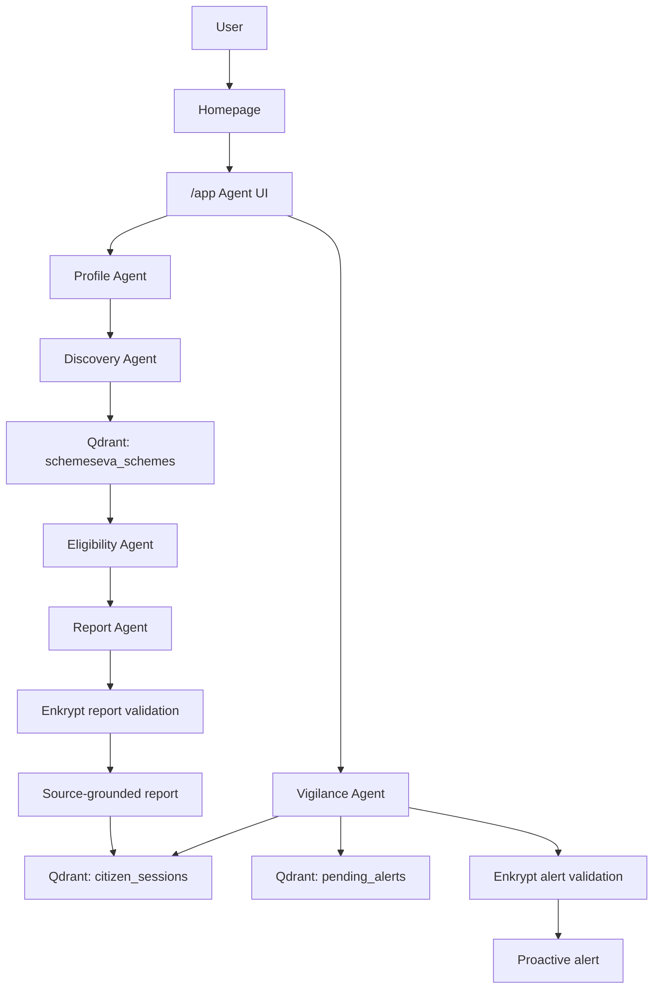

# SchemeSeva

**Find government schemes you may likely qualify for - and get alerted when new matches appear.**

[Live Demo](https://scheme-seva-agent.vercel.app/) | [GitHub Repository](https://github.com/YellankiKaushik/Scheme-Seva-Agent) | [Judge Guide](./docs/JUDGES_GUIDE.md) | [Technical Documentation](./docs/TECHNICAL_DOCUMENTATION.md)

Quick links:

- [Launch agent](https://scheme-seva-agent.vercel.app/app)
- [Browse schemes](https://scheme-seva-agent.vercel.app/schemes)
- [Check integrations](https://scheme-seva-agent.vercel.app/debug/integrations)
- [View architecture](https://scheme-seva-agent.vercel.app/architecture)

## One-Minute Overview

SchemeSeva is a TypeScript-native civic AI agent that helps Indian citizens discover government schemes they may likely qualify for. A user shares basic non-sensitive profile details through a guided form or plain-language input, the agent searches a verified Central + Telangana scheme catalog, checks eligibility rules, validates the citizen-facing output, and returns a source-grounded report with reasons, documents, next steps, official source URLs, and last verified dates.

The differentiator is the **Vigilance Agent**. After a discovery run, SchemeSeva can scan the saved demo session against unseen schemes and show a proactive alert when a new match appears. The project is intentionally honest about civic risk: reports are guidance only, use "likely eligible" language, and direct citizens to official portals for final confirmation.

## Problem Statement

Government welfare schemes are valuable, but discovery is still difficult for many citizens and field workers:

- Schemes are fragmented across central, state, ministry, department, and portal pages.
- Eligibility rules can be hard to interpret because they depend on state, age, gender, category, income, occupation, landholding, documents, and special status.
- Citizens often miss benefits because they do not know what to search for.
- Existing portals are mostly reactive: the user must return and search again when their situation changes or new schemes appear.
- Civic guidance needs to be source-grounded, privacy-conscious, and careful about not implying an official government decision.

## Solution

SchemeSeva turns scheme discovery into a guided, inspectable workflow:

- **Guided profile intake:** Collects only basic eligibility signals such as state, age, category, occupation, income, document status booleans, and optional special status.
- **Verified scheme catalog:** Uses a focused catalog of 28 Central + Telangana schemes, each with source metadata.
- **Agent-based discovery:** Retrieves candidates, checks rules, generates a report, validates output, and stores session memory for later scans.
- **Likely eligibility report:** Explains schemes the user may likely qualify for without claiming final eligibility.
- **Documents and next steps:** Shows document lists and official next-step guidance from the catalog.
- **Official sources:** Keeps `sourceUrl` and `lastVerified` visible in reports and the catalog.
- **Vigilance Agent:** Demonstrates proactive watch-after-search behavior by scanning saved sessions for unseen matches.

## Who It Helps

- **Farmers:** Find agriculture, insurance, irrigation, income support, and Telangana farmer schemes.
- **Students:** Discover scholarships, fee reimbursement, and education support programs.
- **Women entrepreneurs:** Find credit, livelihood, and women-focused enterprise schemes.
- **Elderly citizens:** Check likely pension and social assistance matches.
- **Unemployed youth:** Discover skilling, self-employment, and livelihood programs.
- **NGOs and field workers:** Use a repeatable workflow to guide citizens with visible sources.
- **Civic support teams:** Explain benefits with source-grounded, safety-checked reports.

## Why SchemeSeva Is An AI Agent, Not Just A Chatbot

SchemeSeva is not a single prompt behind a chat box. It coordinates retrieval, reasoning, memory, validation, and action.

| Agent capability | SchemeSeva implementation |
| --- | --- |
| Retrieves | Qdrant semantic retrieval searches the verified scheme catalog. |
| Reasons | OpenRouter-backed report generation and deterministic eligibility rules explain likely matches. |
| Remembers | Qdrant session memory stores profile context and previously found schemes by session key. |
| Evaluates | Enkrypt AI validates reports and Vigilance alerts before citizen-facing display. |
| Acts | The Vigilance Agent scans saved sessions and creates proactive alerts for unseen matches. |

## Key Features

### Guided Citizen Profile

The `/app` route offers a step-by-step intake flow for state, district, age, gender, category, occupation, annual income, landholding when relevant, document status booleans, and optional family or special-status details. It does not ask for Aadhaar numbers, bank account numbers, passwords, or uploads.

### Five Demo Personas

The app includes five demo profiles for fast judging and repeatable testing: Farmer, Student, Woman entrepreneur, Elderly pensioner, and Unemployed youth. The Farmer demo is the primary happy path because it demonstrates source-grounded discovery, Qdrant retrieval, Qdrant memory, Enkrypt validation, and a PM-KUSUM Vigilance alert.

### Verified Scheme Catalog

The `/schemes` route displays 28 verified Central + Telangana schemes. Each scheme includes structured eligibility rules, benefit details, keywords, documents, application steps, `sourceUrl`, `lastVerified`, and state scope.

### Source-Grounded Reports

Discovery reports include likely matches, reasons, document lists, next steps, source links, and last verified dates. The report prompt explicitly requires "likely eligible" wording and a guidance-only disclaimer.

### Likely Eligibility Reasoning

The Eligibility Agent applies deterministic checks for state scope, age, gender, category, income, occupation, landholding, Aadhaar status, bank account status, BPL status, disability, widow status, and minority status where relevant. Missing document-related details can reduce confidence instead of overstating certainty.

### Document And Next-Step Guidance

Each match includes documents and application steps from the verified catalog. The app directs users to official portals rather than pretending to submit applications automatically.

### Qdrant Semantic Retrieval

When Qdrant and Gemini embeddings are configured, SchemeSeva creates profile query angles and performs vector search against `schemeseva_schemes`. If embeddings are unavailable but Qdrant is reachable, it can use a Qdrant payload keyword path. If providers are missing, it falls back to the local catalog for demo resilience.

### Qdrant Persistent Memory

After discovery, SchemeSeva writes safe profile context, found schemes, retrieval provider, safety provider, and summary metadata to Qdrant session memory. The Vigilance Agent can load that session memory later for scanning.

### Enkrypt AI Safety Validation

Citizen-facing discovery reports and Vigilance alerts are validated through Enkrypt AI Guardrails when configured. Visible UI badges show `Safety: enkrypt`, and `/debug/integrations` checks Enkrypt health and detect status without exposing secrets.

### Vigilance Agent Proactive Alerts

The Vigilance Agent scans saved session context against unseen schemes and emits one validated alert when a new likely match appears. In demo mode, the Farmer profile can surface a PM-KUSUM alert with a `Safety: enkrypt` badge when Enkrypt is active.

### Integration Diagnostics Page

The `/debug/integrations` route shows live status for Mastra workflow mode, Qdrant, Enkrypt AI, OpenRouter, Gemini embeddings, Langfuse, Upstash Redis, demo mode, current retrieval provider, current safety provider, memory provider, and optional Supabase fallback. Error messages are sanitized.

### Privacy-Conscious Profile Handling

The app uses a browser-generated session key for the demo flow. It stores profile fields needed for eligibility guidance, not raw Aadhaar numbers or bank account numbers. Document status is represented with booleans such as `hasAadhaar` and `hasBankAccount`.

### Rate Limiting With Upstash

Discovery and Vigilance server functions use Upstash Redis rate limits when configured. Discovery is limited to 10 requests per minute, and Vigilance is limited to 3 requests per minute. Missing or unreachable Upstash falls back to no-op mode so local demo usage remains runnable.

### Observability With Langfuse

Workflow steps create traces and spans for profile handling, retrieval, eligibility checks, report generation, safety validation, memory writes, and Vigilance scans. The Langfuse adapter sanitizes secrets and sensitive profile fields before ingestion.

## User Flow

1. The user opens the homepage.
2. The user browses the project, checks architecture, or launches the agent.
3. In the demo flow, the user selects a demo profile or enters basic non-sensitive profile details.
4. The agent retrieves matching schemes from Qdrant or a visible fallback path.
5. The report shows schemes the user may likely qualify for.
6. The report shows reasons, documents, next steps, `sourceUrl`, and `lastVerified`.
7. The user runs a Vigilance scan.
8. The Vigilance Agent checks the saved session and creates a proactive alert if a new match appears.

There is no full production login system in the current implementation. The demo uses a browser session key and does not require sign-up.

## AI Workflow

| Agent | Responsibility | Input | Output | Role |
| --- | --- | --- | --- | --- |
| Profile Agent | Structure citizen details from text or accept guided form data. | Plain text or form profile. | `CitizenProfile` plus optional follow-up. | Ensures required fields are explicit and avoids guessing sensitive facts. |
| Discovery Agent | Retrieve candidate schemes. | Profile and scheme catalog. | Candidate schemes plus retrieval diagnostics. | Uses Qdrant vector search when available, then Qdrant keyword or local fallback. |
| Eligibility Agent | Apply deterministic eligibility rules. | Candidate schemes and profile. | `EligibilityResult[]` with confidence and reasons. | Filters hard non-matches and labels high/medium confidence. |
| Report Agent | Generate citizen-facing guidance. | Profile, eligible results, scheme metadata. | Markdown report with source data. | Produces plain-language, source-grounded output. |
| Vigilance Agent | Scan saved sessions for unseen matches. | Session key and stored memory. | Validated alert list and diagnostics. | Demonstrates proactive agent action after the initial search. |

## Mandatory Stack Integration

### Mastra - Agent Orchestration Layer

SchemeSeva models its workflow as a Mastra-style TypeScript adapter in `src/mastra`. The adapter exposes typed agents and workflows with `run()` methods:

- `profileAgent`
- `discoveryAgent`
- `eligibilityAgent`
- `reportAgent`
- `vigilanceAgent`
- `schemeDiscoveryWorkflow`
- `vigilanceWorkflow`

This is intentionally documented as an adapter, not as the full Mastra runtime. The repository comments explain that the full Mastra Node runtime has runtime/package constraints for the deployed environment, so the app mirrors the Mastra Agent/Workflow shape around the SchemeSeva server functions. On a compatible Node host, this surface can be swapped toward the full Mastra runtime without changing the UI call pattern.

### Qdrant - Memory And Retrieval Layer

Qdrant is used for retrieval and memory:

- `schemeseva_schemes` stores embedded scheme payloads for vector retrieval.
- `citizen_sessions` stores safe session memory, found schemes, provider metadata, and timestamps.
- `pending_alerts` stores Vigilance alerts when Qdrant alert memory is configured and reachable.

Gemini embeddings create vectors with the configured `QDRANT_VECTOR_SIZE` value, defaulting to 768. Qdrant supports the RAG path by returning relevant scheme payloads and supports long-term memory by storing session and alert context.

### Enkrypt AI - Safety And Evaluation Layer

Enkrypt AI validates generated scheme reports and Vigilance alerts. The validator checks citizen-facing text against guardrail detectors and the SchemeSeva policy: stay respectful, source-grounded, non-discriminatory, avoid guaranteed eligibility claims, avoid unsafe advice, and send users to official sources for final verification.

When active, the UI shows `Safety: enkrypt` badges, and `/debug/integrations` shows Enkrypt health and detect status. If Enkrypt is unavailable, the app uses an OpenRouter fallback validator or passthrough mode and reports that provider honestly.

## Supporting Architecture

- **OpenRouter:** Reasoning provider for natural-language profile extraction and report generation.
- **Gemini embeddings:** Embedding provider for Qdrant semantic retrieval.
- **Langfuse:** Observability/tracing adapter for workflow spans and provider status.
- **Upstash Redis:** Rate limiting for discovery and Vigilance server functions.
- **Vercel:** Hosted production deployment.
- **TanStack Start, Vite, Nitro, React, TypeScript:** Application runtime and frontend/server-function framework.
- **Supabase:** Optional fallback persistence/catalog path only; SchemeSeva does not require Supabase for the demo.

## Technical Architecture

Text flow:

```text
User
  -> Homepage / Agent UI
  -> Mastra-style workflow adapter
  -> Profile Agent
  -> Discovery Agent
  -> Qdrant retrieval or local fallback
  -> Eligibility Agent
  -> Report Agent
  -> Enkrypt validation
  -> Source-grounded report
  -> Qdrant session memory
  -> Vigilance Agent
  -> Enkrypt-validated alert
```

Mermaid diagram:



## Tech Stack

| Layer | Technology | Role in SchemeSeva |
| --- | --- | --- |
| Language | TypeScript | Shared frontend, server functions, adapters, and scripts. |
| Frontend | React | UI for homepage, agent, catalog, architecture, and debug pages. |
| App framework | TanStack Start | File routes, server functions, SSR/runtime integration. |
| Build tool | Vite | Development server and production build. |
| Server runtime | Nitro | Server build/runtime layer; configured with Vercel env and Cloudflare-module default in Vite. |
| Orchestration | Mastra-style adapter | Typed Profile, Discovery, Eligibility, Report, and Vigilance workflow surface. |
| Retrieval | Qdrant | Vector search over verified schemes. |
| Memory | Qdrant | Session memory and pending alert storage. |
| Safety | Enkrypt AI | Report and alert validation. |
| Reasoning | OpenRouter | Profile extraction and report generation. |
| Embeddings | Gemini embeddings | Vector generation for Qdrant retrieval. |
| Observability | Langfuse | Trace and span ingestion with sanitized metadata. |
| Rate limiting | Upstash Redis | Discovery and Vigilance request limits. |
| Deployment | Vercel | Live deployed demo. |
| Optional fallback | Supabase | Optional catalog/session/alert fallback when configured. |

## Data Model And Storage

SchemeSeva stores only the data needed for demo guidance and memory.

### Scheme Catalog

Stored locally in `src/lib/localSchemes.ts` and optionally seeded into Qdrant. Each scheme includes:

```ts
{
  id: "pm-kisan-001",
  schemeName: "PM-KISAN Samman Nidhi",
  ministry: "Ministry of Agriculture & Farmers Welfare",
  benefitType: "income_support",
  benefitAmount: "...",
  eligibility: { occupations: ["farmer"], requiresAadhaar: true },
  documentsRequired: ["Aadhaar", "Bank account", "Land records"],
  applicationSteps: ["Open official portal", "Complete required details"],
  sourceUrl: "https://official-source.example",
  lastVerified: "YYYY-MM-DD",
  stateScope: "central"
}
```

### Citizen Session Memory

Stored in Qdrant `citizen_sessions` when configured, with local fallback for demo use. Safe payload fields include:

```ts
{
  sessionId: "browser-generated-session-key",
  profile: {
    state: "telangana",
    age: 48,
    category: "sc",
    occupation: "farmer",
    hasAadhaar: true,
    hasBankAccount: true
  },
  foundSchemes: ["pm-kisan-001", "rythu-bandhu-ts-019"],
  retrievalProvider: "qdrant-vector",
  safetyProvider: "enkrypt",
  updated_at: "ISO timestamp"
}
```

### Pending Alerts

Stored in Qdrant `pending_alerts` when alert memory succeeds:

```ts
{
  alertId: "local-or-provider-id",
  sessionId: "browser-generated-session-key",
  schemeId: "pm-kusum-004",
  schemeName: "PM-KUSUM",
  reason: "Matches your saved profile.",
  urgency: "high",
  safetyProvider: "enkrypt",
  retrievalProvider: "saved-session+scheme-catalog"
}
```

### What Is Not Stored

- Aadhaar numbers.
- Bank account numbers.
- Passwords.
- Uploaded documents.
- Government decision records.

## API / Server Function Documentation

SchemeSeva mainly uses TanStack Start server functions, not a public REST API. The one raw HTTP route is the privacy delete route.

| Name | Type | Purpose | Input summary | Output summary | Auth requirement | Notes |
| --- | --- | --- | --- | --- | --- | --- |
| `extractProfile` | Server function, POST | Parse plain-language profile text. | `{ text }` | `{ profile, followUp }` | No login; request-bound server function. | Uses OpenRouter when configured, local extraction fallback otherwise. |
| `runDiscovery` | Server function, POST | Run discovery, eligibility, report generation, safety validation, and memory write. | `{ sessionKey, profile }` | `DiscoveryReport` | No login; browser session key. | Rate-limited by Upstash when configured; Qdrant/local retrieval fallback is visible. |
| `runVigilance` | Server function, POST | Scan saved session against unseen schemes and return validated alerts. | `{ sessionKey }` | Scan counts, alerts, diagnostics, workflow metadata. | No login; browser session key. | Demo-triggered from UI; not a scheduled background notification system. |
| `listSchemes` | Server function, GET | Load the scheme catalog. | None | `{ schemes, count }` | Public. | Loads from Qdrant, optional Supabase, then local catalog fallback. |
| `getIntegrationsStatus` | Server function, GET | Return sanitized provider and fallback status. | None | Provider status object. | Public debug route. | Sanitizes hosts and errors; does not expose secret values. |
| `deleteCitizenData` | Server function, POST | Best-effort deletion for a session key. | `{ sessionKey }` | Delete status for Qdrant/local/Supabase paths. | Demo session key required; no production accounts. | Attempts configured Qdrant memory cleanup, clears local session/alerts, and deletes Supabase rows if configured. |
| `/api/privacy/delete` | HTTP DELETE or POST | Browser-compatible privacy delete wrapper. | JSON body `{ sessionKey }` | `{ ok, ...result }` | Demo session key required; no production accounts. | Delegates to `deleteCitizenData`. |

## Installation And Setup

Prerequisites:

- Node.js 22 or compatible modern Node runtime.
- pnpm.
- Provider accounts/keys only if you want the full integrated path.

Clone and install:

```bash
git clone https://github.com/YellankiKaushik/Scheme-Seva-Agent.git
cd Scheme-Seva-Agent
pnpm install
```

Configure environment variables:

```bash
cp .env.example .env.local
```

Run locally:

```bash
pnpm dev
```

Build:

```bash
pnpm typecheck
pnpm build
```

Smoke test and audit:

```bash
pnpm run smoke:local
pnpm audit
```

Optional Qdrant seed:

```bash
pnpm seed:qdrant
```

## Environment Variables

Use `.env.example` as the template. Never commit real secret values.

### OpenRouter

```bash
OPENROUTER_API_KEY=your_openrouter_key
OPENROUTER_MODEL=openrouter/free
SCHEMESEVA_SITE_URL=http://localhost:3000
```

### Gemini

```bash
GEMINI_API_KEY=your_gemini_key
GEMINI_EMBEDDING_MODEL=gemini-embedding-001
```

### Qdrant

```bash
QDRANT_URL=https://your-cluster.qdrant.io
QDRANT_API_KEY=your_qdrant_key
QDRANT_COLLECTION=schemeseva_schemes
QDRANT_MEMORY_COLLECTION=schemeseva_memory
QDRANT_SESSIONS_COLLECTION=citizen_sessions
QDRANT_ALERTS_COLLECTION=pending_alerts
QDRANT_VECTOR_SIZE=768
```

### Enkrypt AI

```bash
ENKRYPT_API_KEY=your_enkrypt_key
ENKRYPT_BASE_URL=https://api.enkryptai.com
```

### Langfuse

```bash
LANGFUSE_PUBLIC_KEY=your_langfuse_public_key
LANGFUSE_SECRET_KEY=your_langfuse_secret_key
LANGFUSE_HOST=https://cloud.langfuse.com
LANGFUSE_BASE_URL=https://cloud.langfuse.com
```

### Upstash Redis

```bash
UPSTASH_REDIS_REST_URL=https://your-db.upstash.io
UPSTASH_REDIS_REST_TOKEN=your_upstash_token
```

### Demo/Public Flags

```bash
NEXT_PUBLIC_DEMO_MODE=true
VITE_DEMO_MODE=true
```

### Optional Supabase Fallback

```bash
SUPABASE_URL=your_optional_supabase_url
SUPABASE_ANON_KEY=your_optional_anon_key
SUPABASE_PUBLISHABLE_KEY=your_optional_publishable_key
SUPABASE_SERVICE_ROLE_KEY=your_optional_service_role_key
VITE_SUPABASE_URL=your_optional_supabase_url
VITE_SUPABASE_PUBLISHABLE_KEY=your_optional_publishable_key
```

## Folder Structure

```text
.
├── README.md
├── docs
│   ├── JUDGES_GUIDE.md
│   ├── TECHNICAL_DOCUMENTATION.md
│   ├── DAVE_Schemeseva_PRD.md
│   └── VERSION FINALSchemeSeva_MASTER_DOC_FINAL
├── .env.example
├── package.json
├── scripts
│   ├── seed-qdrant.ts
│   └── smoke-local.ts
├── src
│   ├── routes
│   │   ├── index.tsx
│   │   ├── app.tsx
│   │   ├── schemes.tsx
│   │   ├── architecture.tsx
│   │   ├── debug.integrations.tsx
│   │   └── api/privacy/delete.ts
│   ├── components
│   │   ├── site-chrome.tsx
│   │   └── ui
│   ├── lib
│   │   ├── schemeseva.functions.ts
│   │   ├── schemeseva-eligibility.ts
│   │   ├── localSchemes.ts
│   │   ├── qdrantSearch.ts
│   │   ├── qdrantMemory.ts
│   │   ├── safetyValidator.ts
│   │   ├── enkrypt.ts
│   │   ├── observability.ts
│   │   └── ratelimit.ts
│   └── mastra
│       ├── index.ts
│       ├── agents
│       ├── workflows
│       └── tools
```

## Demo Guide For Judges

1. Open the [live demo](https://scheme-seva-agent.vercel.app/).
2. Open [`/schemes`](https://scheme-seva-agent.vercel.app/schemes) and confirm 28 verified Central + Telangana schemes.
3. Open [`/debug/integrations`](https://scheme-seva-agent.vercel.app/debug/integrations) and review Mastra, Qdrant, Enkrypt AI, OpenRouter, Gemini, Langfuse, Upstash, and optional Supabase status.
4. Open [`/app`](https://scheme-seva-agent.vercel.app/app).
5. Click the **Farmer** demo profile.
6. Click **Find schemes**.
7. Verify badges such as `Retrieval: qdrant-vector`, `Memory: qdrant`, `Memory write: success`, `Safety: enkrypt`, and `Workflow: adapter` when the live providers are active.
8. Confirm the report includes `sourceUrl` and `lastVerified`.
9. Click **Run vigilance scan**.
10. Verify the PM-KUSUM alert appears with `Safety: enkrypt` when Enkrypt is active.

## Evaluation Criteria Mapping

| Hackathon criterion | Project evidence |
| --- | --- |
| Mastra Integration Depth | Mastra-style TypeScript adapter with Profile, Discovery, Eligibility, Report, and Vigilance agents plus typed workflows. |
| Qdrant Integration Quality | Scheme vector retrieval, session memory, and pending alert memory using `schemeseva_schemes`, `citizen_sessions`, and `pending_alerts`. |
| Enkrypt AI Coverage | Report validation and Vigilance alert validation before display, visible through safety badges and debug status. |
| Agent Output Quality | Plain-language, source-grounded reports with likely eligibility reasons, documents, next steps, source URLs, and last verified dates. |
| Problem Impact & Novelty | Moves civic scheme discovery from one-time reactive search toward proactive watch-after-search alerts. |
| Engineering Quality | TypeScript, TanStack Start, deterministic eligibility rules, provider fallbacks, observability, rate limiting, and smoke tests. |
| User Experience | Polished homepage, guided form, five demo profiles, searchable catalog, architecture page, and transparent debug page. |
| Code Quality | Modular `src/lib`, `src/mastra`, typed server functions, Zod validation, and small provider adapters. |
| Documentation | README, concise judge guide, technical documentation, architecture page, and integration diagnostics. |
| Live Demonstration | Vercel deployment with `/app`, `/schemes`, `/architecture`, and `/debug/integrations`. |

## Security And Privacy

- API keys are environment-only and must not be committed.
- The demo does not collect Aadhaar numbers.
- The demo does not collect bank account numbers.
- Profile handling uses booleans such as `hasAadhaar` and `hasBankAccount`.
- Reports are guidance only, not official government decisions.
- Users must confirm final eligibility and application steps on official portals.
- Enkrypt AI validates reports and alerts when configured.
- Upstash Redis rate limiting protects discovery and Vigilance actions when configured.
- The debug page sanitizes provider errors and avoids exposing secret values.
- Optional Supabase fallback is not required for the core demo.

## Testing And Validation

Recommended checks:

```bash
pnpm typecheck
pnpm build
pnpm run smoke:local
pnpm audit
pnpm run lint
```

The smoke test checks the five demo persona paths against the local catalog and, when a local server is reachable, verifies `/schemes`, `/debug/integrations`, and `/app`.

Lint is useful as a report-only check. If it fails due existing repo-wide formatting or Fast Refresh issues, avoid broad-formatting unrelated files during documentation work.

## Deployment

SchemeSeva is hosted on Vercel at:

https://scheme-seva-agent.vercel.app/

The repository includes `vercel.json` with:

- `installCommand`: `pnpm install --frozen-lockfile`
- `buildCommand`: `pnpm build`
- `NITRO_PRESET`: `vercel`

Provider credentials for Qdrant, Enkrypt AI, OpenRouter, Gemini, Langfuse, and Upstash are configured as Vercel environment variables. These external services remain separate from the application repository.

## Challenges Faced

- **Mastra runtime/package constraints:** The project uses a Mastra-style TypeScript workflow adapter around SchemeSeva server functions instead of overclaiming that the full Mastra runtime is running in production.
- **Qdrant vector size and collection setup:** Scheme retrieval, session memory, and pending alerts needed separate collection handling and a consistent default vector size.
- **Enkrypt schema/response handling:** The Enkrypt adapter tries multiple known Guardrails payload shapes and sanitizes failures.
- **Preventing safety overclaims:** The report prompt and docs consistently use likely eligibility language and require official portal confirmation.
- **Deployment runtime differences:** Provider fallbacks keep the app runnable locally and on the live demo even when an external service is missing or temporarily unreachable.
- **Resilient integration debug page:** The debug route checks provider health while sanitizing hosts, tokens, and error messages.
- **Privacy-conscious profile modeling:** The profile model uses eligibility booleans instead of collecting identity or bank details.
- **Mobile/navigation polish:** The app includes a polished homepage, guided workflow, catalog, architecture page, and debug page suitable for judges and mentors.

## Limitations

- The current catalog is 28 verified Central + Telangana schemes.
- SchemeSeva is not a government decision system.
- It does not submit applications automatically.
- It does not include production user accounts.
- It does not provide multilingual support yet.
- The Vigilance Agent is demo-triggered from the UI rather than a scheduled background notification system in the current implementation.
- Final eligibility must be confirmed on official portals or with the relevant government office.

## Future Improvements

- Add more Indian states.
- Expand the verified catalog.
- Add multilingual support for Indian languages.
- Add WhatsApp/SMS alerts.
- Build an NGO or field-worker dashboard.
- Add scheduled Vigilance scans.
- Add human-in-the-loop review for scheme verification.
- Add PDF report export.
- Build an assisted application workflow while keeping official portal confirmation.
- Add an admin scheme verification dashboard.

## Contributors

- **Kaushik / YellankiKaushik** - Full-stack developer and AI agent builder.

## License

See [LICENSE](./LICENSE).
