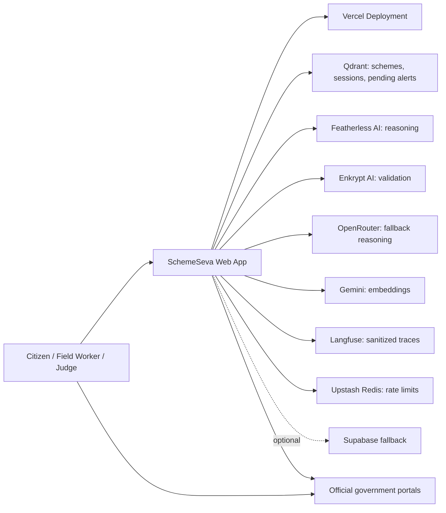
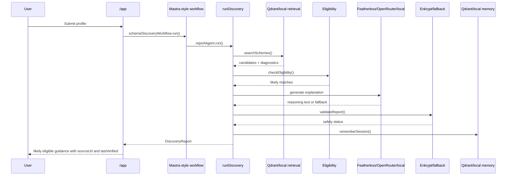
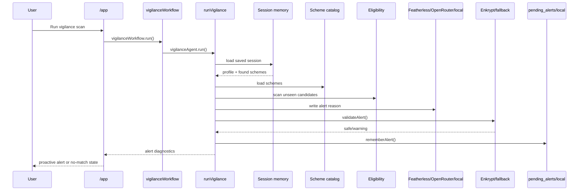
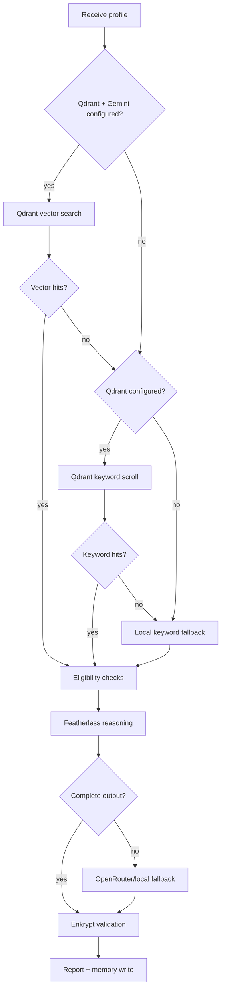
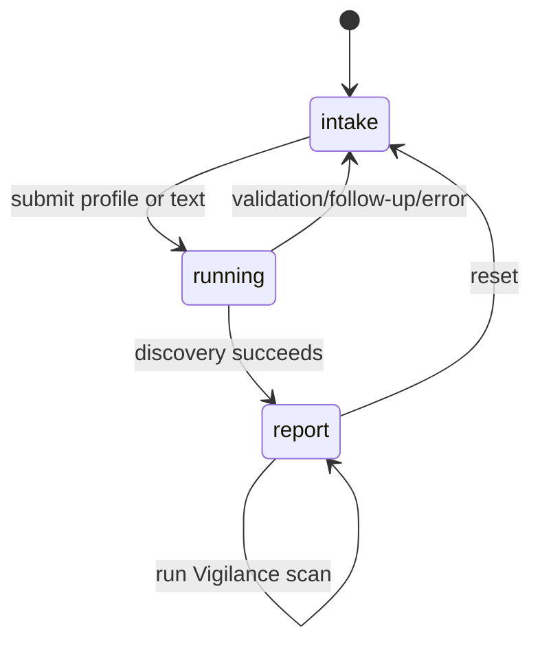
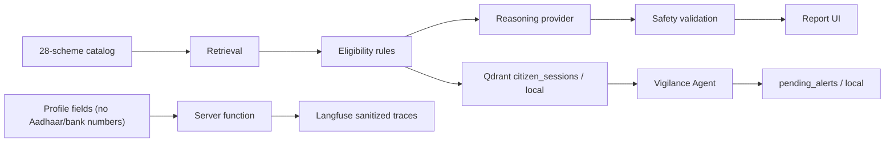

# SchemeSeva Deep Technical Design

Source-grounded technical design document for the current SchemeSeva implementation.

This document preserves the enterprise documentation structure supplied by the project owner. It separates current implementation facts from future improvements and marks unavailable information as `TBD`, `UNKNOWN`, or `NOT APPLICABLE` rather than inventing details.

---

## Tag Legend

| Tag | Meaning |
| --- | --- |
| `[M]` | Mandatory for almost every project |
| `[C]` | Conditional; include when relevant |
| `[R]` | Required for regulated or high-risk systems |
| `[O]` | Optional supporting material |
| `[AUTO]` | Preferably generated from source code or tooling |
| `[EVIDENCE]` | Must contain verifiable proof, reports, or links |
| `[OWNER]` | Must identify an accountable person or team |

---

# 00. DOCUMENT GOVERNANCE AND CONTROL

## `DOC-001 [M] Document Identity`

| Field | Value |
| --- | --- |
| Document title | SchemeSeva Deep Technical Design |
| Project or product name | SchemeSeva |
| System name | SchemeSeva civic AI agent |
| Repository name | Scheme-Seva-Agent |
| Document identifier | `SCHEMESEVA-DEEP-TECH-DESIGN` |
| Document category | Deep technical design / architecture description |
| System version | Current repository implementation as inspected on 2026-07-11 |
| Documentation version | `0.1.0-draft` |
| Publication date | 2026-07-11 |
| Last updated date | 2026-07-11 |

Section closeout: Open questions: final release tag is `TBD`. Risks: document may drift as code changes. Decisions required: choose approval owner. Evidence required: repository commit SHA for future approved versions. Responsible owner: Kaushik / YellankiKaushik.

## `DOC-002 [M] Document Purpose`

This document exists to provide an implementation-grounded technical design for SchemeSeva, a TypeScript-native civic AI agent that helps Indian citizens discover government schemes they may likely qualify for and demonstrates proactive Vigilance Agent alerts.

It supports decisions about architecture, provider fallback behavior, privacy posture, operational readiness, hackathon evaluation, future production hardening, and content reuse for LinkedIn, Medium, Dev.to, portfolio pages, YouTube scripts, and Twitter/X threads.

It is authoritative for current implementation behavior, documented limitations, and architecture intent. It deliberately excludes API keys, production secrets, private deployment credentials, guaranteed eligibility claims, official government approval claims, automatic application submission, and any assertion that SchemeSeva has full national coverage.

Section closeout: Open questions: whether this becomes the primary architecture document after review. Risks: future marketing copy may overclaim beyond this document. Decisions required: review cadence. Evidence required: links to README and source files. Responsible owner: Kaushik / YellankiKaushik.

## `DOC-003 [M] Document Scope`

Systems covered: SchemeSeva web application, TanStack Start server functions, Mastra-style adapter, Qdrant retrieval and memory, Featherless AI reasoning, Enkrypt AI validation, OpenRouter fallback, Gemini embeddings, Langfuse tracing, Upstash rate limiting, optional Supabase fallback, and Vercel deployment.

Components covered: `/`, `/app`, `/schemes`, `/architecture`, `/debug/integrations`, `/api/privacy/delete`, `src/lib`, `src/mastra`, `scripts`, local scheme catalog, and documentation.

Environments covered: local development, demo fallback mode, and Vercel production deployment. Geographic scope: current catalog coverage is 28 verified Central + Telangana schemes. Regulatory scope: civic guidance and privacy-aware demo handling; not a regulated government decision system.

Explicit exclusions: real login/authentication, Aadhaar number collection, bank account number collection, automatic government application submission, production notification delivery, full national scheme coverage, guaranteed eligibility, and Supabase as a required dependency.

Section closeout: Open questions: production compliance requirements if deployed beyond demo. Risks: user misunderstanding of guidance-only output. Decisions required: expansion states and data-governance process. Evidence required: `src/lib/localSchemes.ts`, `/schemes`, `/app`. Responsible owner: Kaushik / YellankiKaushik.

## `DOC-004 [M] Intended Audience`

| Audience | Expected knowledge | Relevant sections | Required actions | Decisions they may make |
| --- | --- | --- | --- | --- |
| Software engineers | TypeScript, React, server functions | `VIEW`, `ARCH`, `INT`, `DEV`, `TEST` | Maintain implementation accurately | Module design and tests |
| Architects | C4, system decomposition, integrations | `DRV`, `VIEW`, `ARCH`, `GOV` | Review trade-offs and boundaries | Architecture acceptance |
| DevOps engineers | Vercel, env vars, build pipelines | `DEP`, `REL`, `OPS`, `RES` | Configure deployment safely | Deployment and rollback |
| SRE teams | Observability, SLOs, failure handling | `OPS`, `RES`, `SUP` | Define operational readiness | Alerting and support model |
| QA engineers | Test strategy and evidence | `REQ`, `TEST`, `APP` | Verify flows and regressions | Test scope |
| Security engineers | Secrets, privacy, validation | `SEC`, `PRIV`, `AI` | Review controls and risks | Security gates |
| Data engineers | Qdrant, embeddings, catalog data | `DATA`, `DP`, `AI` | Validate schema and lineage | Data quality gates |
| Support teams | Diagnostics and user impact | `OPS`, `SUP` | Triage failures | Escalations |
| Product managers | User flows and scope | `CTX`, `REQ`, `GOV` | Prioritize roadmap | Feature boundaries |
| Auditors | Evidence and controls | `DOC`, `SEC`, `GOV`, `APP` | Review documented controls | Compliance findings |
| External integrators | Interfaces and limits | `INT`, `API`, `LIFE` | Understand integration boundaries | Integration feasibility |

Section closeout: Open questions: external audit role is `TBD`. Risks: audiences may treat planned items as implemented unless current/future labels are preserved. Decisions required: nominate reviewers. Evidence required: source references in this document. Responsible owner: Kaushik / YellankiKaushik.

## `DOC-005 [M] Document Status`

Status: Draft.

Reason: created as documentation-only work on `main`; not approved, committed, or tagged yet.

Allowed status values retained: Proposed, Draft, Under Review, Approved, Active, Superseded, Deprecated, Archived.

Section closeout: Open questions: approval date. Risks: unapproved document may be cited externally. Decisions required: move to Under Review or Active. Evidence required: reviewer sign-off. Responsible owner: Kaushik / YellankiKaushik.

## `DOC-006 [M] Ownership and Accountability [OWNER]`

| Role | Owner |
| --- | --- |
| Document owner | Kaushik / YellankiKaushik |
| Technical owner | Kaushik / YellankiKaushik |
| Business owner | Kaushik / YellankiKaushik |
| Security owner | Kaushik / YellankiKaushik |
| Data owner | Kaushik / YellankiKaushik |
| Operations owner | Kaushik / YellankiKaushik |
| Reviewers | TBD |
| Approvers | TBD |
| Maintainers | Kaushik / YellankiKaushik |
| Escalation contact | Repository owner |

Section closeout: Open questions: independent security reviewer. Risks: single-owner project limits segregation of duties. Decisions required: add reviewers before production use. Evidence required: approval record. Responsible owner: Kaushik / YellankiKaushik.

## `DOC-007 [M] Approval Record`

| Approver | Role | Approval date | Approved version | Approval conditions | Electronic approval reference |
| --- | --- | --- | --- | --- | --- |
| TBD | TBD | TBD | TBD | TBD | TBD |

Current implementation: no approval record exists in the repository.

Section closeout: Open questions: approval authority. Risks: document remains draft. Decisions required: record approvals after review. Evidence required: commit, issue, or signed note. Responsible owner: Kaushik / YellankiKaushik.

## `DOC-008 [M] Revision History`

| Version | Date | Author | Change summary | Reason | Related ticket | Reviewer | Approval status |
| --- | --- | --- | --- | --- | --- | --- | --- |
| `0.1.0-draft` | 2026-07-11 | Codex, under user direction | Initial deep technical design | Documentation-only task | TBD | TBD | Draft |

Section closeout: Open questions: repository issue ID. Risks: future edits without revision entry. Decisions required: enforce revision history updates. Evidence required: git diff. Responsible owner: Kaushik / YellankiKaushik.

## `DOC-009 [M] Review and Expiration Policy`

Review frequency: every major architecture change, provider change, scheme catalog expansion, deployment model change, or every 30 days while the project is active. Next review date: 2026-08-10. Expiration conditions: document conflicts with code, catalog count changes, auth is added, or external provider behavior changes. Deprecation procedure: mark status as Superseded and link to replacement. Archival procedure: retain in `docs/` with revision history.

Section closeout: Open questions: exact review calendar. Risks: stale provider details. Decisions required: assign reviewer. Evidence required: broken-link check and build logs. Responsible owner: Kaushik / YellankiKaushik.

## `DOC-010 [R] Information Classification`

Classification: Internal by default; public-safe excerpts may be derived if they preserve guidance-only wording and do not expose secrets.

Permitted readers: repository collaborators and reviewers. Storage restrictions: source-controlled markdown only; no `.env` values or credentials. Sharing restrictions: do not share private deployment secrets, API keys, or logs containing session keys. Retention period: repository lifetime unless superseded.

Section closeout: Open questions: public publication approval. Risks: accidental inclusion of credentials from local environment. Decisions required: secret scanning before publication. Evidence required: grep checks for key-like strings. Responsible owner: Kaushik / YellankiKaushik.

## `DOC-011 [M] Normative Language`

`MUST`, `MUST NOT`, `SHOULD`, `SHOULD NOT`, and `MAY` follow the IETF BCP 14 meaning when uppercase. Lowercase forms are descriptive, not normative.

Project-specific normative rules: SchemeSeva MUST use guidance-only language; MUST say likely eligible or may likely qualify; MUST direct citizens to official portals for final confirmation; MUST NOT claim guaranteed eligibility; MUST NOT claim official approval; MUST NOT collect Aadhaar numbers or bank account numbers in the current demo.

Section closeout: Open questions: none. Risks: downstream content ignores normative wording. Decisions required: none. Evidence required: report prompt and UI copy review. Responsible owner: Kaushik / YellankiKaushik.

## `DOC-012 [M] Documentation Conventions`

Naming conventions: source paths use repository-relative paths. Diagram conventions: Mermaid diagrams are source-controlled in markdown. Dates use ISO `YYYY-MM-DD` unless copied from provider output. Time zone: Asia/Calcutta for documentation activity; runtime timestamps use ISO strings. Code formatting: inline code with backticks. Example data: synthetic unless explicitly marked as current catalog data. Placeholder conventions: `TBD`, `UNKNOWN`, `NOT APPLICABLE`. Secret redaction: `[redacted]`; never include real API keys.

Section closeout: Open questions: diagram rendering target. Risks: non-ASCII artifacts from pasted source can appear in existing docs. Decisions required: run markdown lint in future. Evidence required: manual markdown preview. Responsible owner: Kaushik / YellankiKaushik.

## `DOC-013 [M] Glossary`

| Term | Meaning |
| --- | --- |
| SchemeSeva | Civic AI agent for Indian government scheme discovery guidance |
| likely eligible | Non-final guidance term used for possible scheme matches |
| may likely qualify | Non-final guidance term used for possible matches |
| Mastra-style workflow adapter | TypeScript adapter that mirrors Mastra Agent/Workflow shape around SchemeSeva server functions |
| Qdrant | Vector retrieval and memory store |
| Featherless AI | Primary open-source reasoning provider |
| Enkrypt AI | Safety validation provider for reports and alerts |
| Vigilance Agent | Proactive demo agent that scans saved sessions for unseen likely matches |
| sourceUrl | Official source URL stored on each scheme |
| lastVerified | Catalog verification date stored on each scheme |

Section closeout: Open questions: add glossary owner. Risks: terminology drift. Decisions required: update with new providers. Evidence required: code references. Responsible owner: Kaushik / YellankiKaushik.

## `DOC-014 [M] References and Related Documents`

| Reference | Purpose |
| --- | --- |
| `README.md` | Current project overview and judge path |
| `docs/JUDGES_GUIDE.md` | Evaluation walkthrough |
| `docs/TECHNICAL_DOCUMENTATION.md` | Existing technical report |
| `docs/DAVE_Schemeseva_PRD.md` | Archive notice and current snapshot |
| `.env.example` | Environment variable reference with placeholders |
| `package.json` | Scripts and dependencies |
| `src/lib/*` | Server functions, provider adapters, data logic |
| `src/mastra/*` | Mastra-style agents and workflows |
| `src/routes/*` | Application routes |
| `scripts/seed-qdrant.ts` | Qdrant seeding |
| `scripts/smoke-local.ts` | Local smoke validation |

Section closeout: Open questions: ADR documents are not present. Risks: duplicated docs diverge. Decisions required: choose primary source after this doc. Evidence required: repository file list. Responsible owner: Kaushik / YellankiKaushik.

## `DOC-015 [M] Documentation Navigation Map`

| Category | Location | Authoritative? | Generated? | Maintenance |
| --- | --- | --- | --- | --- |
| Overview | `README.md` | Yes for public summary | Manual | Keep concise |
| Judge path | `docs/JUDGES_GUIDE.md` | Yes for demo judging | Manual | Update when flow changes |
| Technical design | `docs/SCHEMESEVA_DEEP_TECHNICAL_DESIGN.md` | Yes for deep architecture after review | Manual | Update with architecture changes |
| Existing tech doc | `docs/TECHNICAL_DOCUMENTATION.md` | Secondary | Manual | May be superseded |
| Route docs | `src/routes/README.md` | Local route reference | Manual | Update with routes |
| API/schema | Source TypeScript | Authoritative for runtime | Source | Generated docs not implemented |

Section closeout: Open questions: whether to deprecate older technical doc. Risks: multiple docs with overlapping claims. Decisions required: documentation source-of-truth policy. Evidence required: link checks. Responsible owner: Kaushik / YellankiKaushik.

---

# 01. EXECUTIVE, BUSINESS, AND PRODUCT CONTEXT

## `CTX-001 [M] Executive Summary`

SchemeSeva is a TypeScript-native civic AI agent that helps Indian citizens discover government schemes they may likely qualify for. It combines a guided profile flow, a focused catalog of 28 verified Central + Telangana schemes, deterministic eligibility rules, Qdrant retrieval and memory, Featherless AI reasoning, Enkrypt AI validation, Langfuse observability, Upstash rate limiting, and a Vercel deployment.

Primary users are citizens, field workers, judges, mentors, and civic support teams. The business value is reducing scheme discovery friction while keeping civic guidance source-grounded and honest. The current lifecycle stage is production demo / hackathon submission, not a regulated government decision system.

Major risks: external provider outages, scheme data staleness, user over-trust in AI output, and limited catalog coverage.

Section closeout: Open questions: production roadmap. Risks: overclaiming eligibility. Decisions required: catalog expansion governance. Evidence required: `/app`, `/schemes`, `/debug/integrations`. Responsible owner: Kaushik / YellankiKaushik.

## `CTX-002 [M] Problem Statement`

Government schemes can help citizens, but discovery is fragmented across central portals, state portals, departments, and local processes. Eligibility rules depend on state, age, gender, category, income, occupation, landholding, document status, disability status, widow status, minority status, and scheme-specific rules. Citizens often miss benefits because they do not know what to search for or when new matching schemes appear.

The system change is needed because a static catalog alone does not normalize user context, retrieve likely matches, explain why a match may apply, validate civic wording, or proactively scan saved context for unseen opportunities.

Section closeout: Open questions: validated user research volume is `TBD`. Risks: incomplete scheme data. Decisions required: human verification process. Evidence required: local scheme catalog and PRD snapshot. Responsible owner: Kaushik / YellankiKaushik.

## `CTX-003 [M] Proposed Solution Summary`

SchemeSeva provides a guided no-login demo where the user shares basic non-sensitive eligibility signals or chooses a demo persona. The system retrieves candidate schemes, applies deterministic eligibility checks, generates source-grounded guidance, validates output, stores safe session memory, and allows a Vigilance Agent scan for unseen matches.

Core technologies: TypeScript, React, TanStack Start, Vite, Nitro, Mastra-style adapter, Qdrant, Featherless AI, Enkrypt AI, OpenRouter, Gemini embeddings, Langfuse, Upstash Redis, Vercel, and optional Supabase fallback.

Trade-offs: the current catalog is intentionally focused rather than broad; demo session keys are simpler than real authentication; provider fallbacks preserve demo resilience but can reduce live AI integration visibility.

Section closeout: Open questions: notification channel roadmap. Risks: fallback outputs may be less rich. Decisions required: production auth strategy. Evidence required: `src/lib/schemeseva.functions.ts`. Responsible owner: Kaushik / YellankiKaushik.

## `CTX-004 [M] Business Objectives`

| Objective ID | Objective statement | Owner | Baseline | Target | Measurement method | Target date | Related requirements |
| --- | --- | --- | --- | --- | --- | --- | --- |
| `BO-001` | Help users discover schemes they may likely qualify for | Product owner | Manual search | One guided report per profile | Demo flow success | 2026-07-11 | `FR-001`, `FR-003` |
| `BO-002` | Keep civic output source-grounded | Technical owner | AI may hallucinate | Every report match includes `sourceUrl` and `lastVerified` | Report inspection | 2026-07-11 | `FR-004`, `SEC-006` |
| `BO-003` | Demonstrate proactive agent behavior | Product owner | Reactive search only | Vigilance scan can show new likely alert | Farmer PM-KUSUM path | 2026-07-11 | `FR-006` |
| `BO-004` | Preserve local/demo resilience | Technical owner | Provider outage breaks demo | Local fallback returns useful guidance | Build/smoke/manual test | 2026-07-11 | `NFR-005` |

Section closeout: Open questions: long-term adoption targets. Risks: demo metrics are not production metrics. Decisions required: define analytics. Evidence required: smoke script and manual judge path. Responsible owner: Kaushik / YellankiKaushik.

## `CTX-005 [M] Success Metrics`

| Metric | Current implementation | Target / future improvement |
| --- | --- | --- |
| Catalog coverage | 28 verified Central + Telangana schemes | Expand with human verification |
| Demo persona coverage | 5 personas | Add multilingual/persona variants |
| Report correctness | Deterministic eligibility plus sources | Add human-reviewed evaluation set |
| Availability | Vercel-hosted demo with fallbacks | Define SLO after production scope |
| Safety validation | Enkrypt when configured, fallback otherwise | Require Enkrypt for production |
| Operational visibility | `/debug/integrations`, Langfuse when configured | Dashboards and alerts |

Section closeout: Open questions: production SLOs. Risks: current metrics are qualitative. Decisions required: analytics policy. Evidence required: `/debug/integrations`. Responsible owner: Kaushik / YellankiKaushik.

## `CTX-006 [M] Product Capabilities`

| Capability ID | Capability name | Description | Users | Inputs | Outputs | Limitations | Related components |
| --- | --- | --- | --- | --- | --- | --- | --- |
| `CAP-001` | Guided profile intake | Collects basic eligibility signals | Citizens, judges | State, age, gender, category, occupation, income, booleans | `CitizenProfile` | No real auth | `/app` |
| `CAP-002` | Plain-language intake | Extracts profile from text | Citizens | Free text | Profile plus follow-up | Uses OpenRouter/local extraction | `extractProfile` |
| `CAP-003` | Scheme catalog browsing | Shows 28 verified schemes | All users | Search/filter | Scheme cards with sources | Central + Telangana only | `/schemes`, `localSchemes` |
| `CAP-004` | Likely eligibility report | Generates guidance report | Citizens | Profile | Markdown report | Guidance only | `runDiscovery` |
| `CAP-005` | Safety validation | Validates reports/alerts | System | Citizen-facing text | Safety status | Fallback may be passthrough | `safetyValidator`, `enkrypt` |
| `CAP-006` | Vigilance alert scan | Finds unseen likely matches | Citizens | Session key | One alert | Demo-triggered, not scheduled | `runVigilance` |
| `CAP-007` | Integration diagnostics | Shows provider health safely | Engineers, judges | None | Sanitized status | Public debug page | `/debug/integrations` |
| `CAP-008` | Privacy deletion | Best-effort session cleanup | Users | Session key | Delete result | Demo session key, best-effort | `privacy.functions.ts` |

Business rules: output MUST say likely eligible or may likely qualify; final eligibility MUST be confirmed on official portals; Aadhaar numbers and bank account numbers MUST NOT be collected.

Section closeout: Open questions: scheduled notification capability. Risks: users may expect application submission. Decisions required: capability roadmap. Evidence required: UI and server function code. Responsible owner: Kaushik / YellankiKaushik.

## `CTX-007 [M] User and Actor Catalogue`

| Actor | Type | Role |
| --- | --- | --- |
| Citizen | Human user | Provides profile details and reads guidance |
| Field worker / NGO | Human user | Helps citizens run discovery |
| Judge / mentor | Human evaluator | Verifies mandatory stack and demo flow |
| Developer | Human operator | Maintains code and configuration |
| Mastra-style adapter | Internal service layer | Coordinates agent/workflow calls |
| Qdrant | External system | Retrieval and memory |
| Featherless AI | External system | Reasoning provider |
| Enkrypt AI | External system | Safety validator |
| OpenRouter | External system | Fallback reasoning and extraction |
| Gemini | External system | Embeddings |
| Langfuse | External system | Tracing |
| Upstash Redis | External system | Rate limiting |
| Vercel | External platform | Deployment |
| Supabase | Optional external system | Fallback persistence/catalog |
| Threat actor | External adversary | Attempts abuse, prompt injection, scraping, or secret leakage |

Section closeout: Open questions: support role definition. Risks: public debug surface misuse. Decisions required: production access controls. Evidence required: routes and provider adapters. Responsible owner: Kaushik / YellankiKaushik.

## `CTX-008 [C] Personas`

| Persona | Goals | Technical ability | Main workflows | Permissions | Constraints | Failure impact |
| --- | --- | --- | --- | --- | --- | --- |
| Farmer | Discover agriculture/income/irrigation schemes | Low to medium | Farmer demo, report, Vigilance | Public demo | Must confirm official portal | Missed or misleading guidance |
| Student | Find scholarships or fee reimbursement | Medium | Student demo | Public demo | Catalog limited | Missed education support |
| Woman entrepreneur | Find credit and livelihood support | Medium | Demo, report | Public demo | Business details simplified | Missed loan/support info |
| Elderly pensioner | Find pension/social assistance | Low | Guided demo | Public demo | Bank account boolean only | Confusion about final eligibility |
| Unemployed youth | Find skilling/self-employment options | Medium | Demo, report | Public demo | No job matching | Missed training path |
| Field worker | Assist citizen with source-grounded guidance | Medium | Form intake, report sharing | Public demo | No admin dashboard | Operational friction |

Section closeout: Open questions: multilingual persona needs. Risks: demo personas may be mistaken for exhaustive coverage. Decisions required: additional field-worker workflows. Evidence required: `demoProfiles` in `/app`. Responsible owner: Kaushik / YellankiKaushik.

## `CTX-009 [M] Primary Use Cases`

| Use-case ID | Title | Actor | Trigger | Main flow | Failure flows | Postconditions | Security considerations |
| --- | --- | --- | --- | --- | --- | --- | --- |
| `UC-001` | Browse scheme catalog | User | Opens `/schemes` | Load schemes, search/filter, inspect sources | Catalog load fails, retry UI | User sees 28 schemes | Public data only |
| `UC-002` | Run guided discovery | Citizen | Completes form | Profile -> retrieval -> eligibility -> reasoning -> validation -> memory | Rate limited, provider fallback, no matches | Report displayed | No Aadhaar/bank numbers |
| `UC-003` | Run text discovery | Citizen | Enters text | Extract profile, ask follow-up or run report | Extraction incomplete | Profile/report | Avoid inferring missing facts |
| `UC-004` | Run Vigilance scan | Citizen | Clicks scan | Load session, scan unseen schemes, validate alert, store alert | No session, no match, provider fallback | Alert or no-match message | Session key only |
| `UC-005` | Check integrations | Judge/engineer | Opens debug page | Parallel health checks, sanitize status | Timeout/unreachable | Status visible | No secret exposure |
| `UC-006` | Delete demo data | User | Calls privacy route | Delete local/Qdrant/Supabase best effort | Qdrant failure | Result returned | Requires session key |

Performance expectations: user-facing flows should complete within provider timeout windows; Featherless report timeout is 20000 ms and Vigilance timeout is 12000 ms in code. Rate limits are 10 discovery/minute and 3 Vigilance/minute when Upstash is configured.

Section closeout: Open questions: production SLA. Risks: provider latency. Decisions required: timeout tuning. Evidence required: server functions and rate limiter. Responsible owner: Kaushik / YellankiKaushik.

## `CTX-010 [C] User Journeys`

Journey: homepage -> `/app` -> choose demo or form -> run discovery -> read likely eligible report -> inspect `sourceUrl` and `lastVerified` -> run Vigilance scan -> read PM-KUSUM or other alert -> confirm final eligibility on official portals.

Failure points: missing fields, provider unavailable, Qdrant not configured, Enkrypt unavailable, rate limit exceeded, no saved session. Recovery paths: follow-up question, local catalog fallback, OpenRouter/local reasoning fallback, passthrough safety fallback, retry later.

Section closeout: Open questions: analytics instrumentation. Risks: user ignores final-confirmation disclaimer. Decisions required: stronger disclaimer placement for production. Evidence required: `/app` UI. Responsible owner: Kaushik / YellankiKaushik.

## `CTX-011 [M] Scope Definition`

### In Scope

Guided profile flow, free-text profile extraction, 28 verified Central + Telangana schemes, source-grounded likely eligibility report, deterministic eligibility checks, Mastra-style workflow adapter, Qdrant retrieval/memory/alerts, Featherless reasoning, Enkrypt validation, OpenRouter fallback, Gemini embeddings, Langfuse tracing, Upstash rate limiting, integration diagnostics, privacy deletion wrapper, Vercel deployment.

### Out of Scope

Guaranteed eligibility, official approval, automatic application submission, 1000+ schemes, full national coverage, real login/authentication, Aadhaar number collection, bank account number collection, required Supabase dependency, scheduled background notifications, multilingual production experience, field-worker admin console, government portal integration.

Section closeout: Open questions: future state coverage. Risks: scope creep. Decisions required: phase roadmap. Evidence required: README and docs. Responsible owner: Kaushik / YellankiKaushik.

## `CTX-012 [M] Assumptions`

| Assumption ID | Description | Owner | Validation method | Deadline | Impact if false | Status |
| --- | --- | --- | --- | --- | --- | --- |
| `ASM-001` | Users understand reports are guidance only | Product owner | Usability review | TBD | Overtrust | Open |
| `ASM-002` | 28-scheme catalog is enough for demo | Product owner | Judge path | 2026-07-11 | Weak demo coverage | Valid for demo |
| `ASM-003` | Provider fallbacks are acceptable for local use | Technical owner | Build/smoke/manual test | 2026-07-11 | Demo breaks | Valid |
| `ASM-004` | Official source URLs remain reachable | Data owner | Link check | Monthly | Stale guidance | Open |

Section closeout: Open questions: link-check automation. Risks: assumptions age quickly. Decisions required: assign validation tasks. Evidence required: test logs and manual review. Responsible owner: Kaushik / YellankiKaushik.

## `CTX-013 [M] Constraints`

Technical: TanStack Start/React/Vite/Nitro runtime, TypeScript, server functions, external provider APIs. Business: hackathon demo scope. Financial: provider usage should remain lightweight. Legal/regulatory: guidance-only civic information, not official government decisioning. Schedule: documentation created without code changes. Technology: Mastra full runtime not used because current deployed runtime constraints favor adapter. Data residency: external providers may process data depending on configuration; production policy is `TBD`. Licensing: dependencies from `package.json`.

Section closeout: Open questions: production data residency. Risks: external provider policy changes. Decisions required: provider DPA review before production. Evidence required: `.env.example` and package inventory. Responsible owner: Kaushik / YellankiKaushik.

## `CTX-014 [M] External Dependencies`

| Dependency | Provider | Purpose | Contract | Rate limits | Data exchanged | Authentication | Failure impact | Fallback | Owner |
| --- | --- | --- | --- | --- | --- | --- | --- | --- | --- |
| Qdrant | Qdrant | Vector retrieval and memory | REST API | Provider-defined | Scheme payloads, profile/session metadata | API key | Retrieval/memory degraded | Local catalog/session | Technical owner |
| Featherless AI | Featherless | Primary reasoning | OpenAI-compatible chat completions | Provider-defined | Profile and scheme context | API key | Reasoning fallback | OpenRouter/local | Technical owner |
| Enkrypt AI | Enkrypt | Safety validation | Guardrails REST | Provider-defined | Report/alert text and context | API key | Safety fallback | OpenRouter/passthrough | Security owner |
| OpenRouter | OpenRouter | Fallback extraction/reasoning | AI SDK provider | Provider-defined | Text/profile/report context | API key | Local fallback | Local extraction/report | Technical owner |
| Gemini | Google | Embeddings | REST embedContent | Provider-defined | Query text | API key | Qdrant vector unavailable | Qdrant keyword/local | Data owner |
| Langfuse | Langfuse | Observability | REST ingestion | Provider-defined | Sanitized traces | Basic auth keys | Observability no-op | No-op tracer | Operations owner |
| Upstash Redis | Upstash | Rate limiting | REST Redis | Provider-defined | Rate limit identities | REST token | No active rate limit | No-op allow | Operations owner |
| Vercel | Vercel | Hosting | Platform | Platform-defined | App build/runtime env | Account/env vars | Site outage | Redeploy/rollback | Operations owner |
| Supabase | Supabase | Optional fallback | JS client | Provider-defined | Optional sessions/alerts/catalog | Env keys | Fallback unavailable | Qdrant/local | Technical owner |

Section closeout: Open questions: vendor SLAs. Risks: no formal availability commitments in repo. Decisions required: production vendor plan. Evidence required: integration status page. Responsible owner: Kaushik / YellankiKaushik.

## `CTX-015 [C] Existing System or Current-State Analysis`

Current architecture: a modular TypeScript app with React routes and TanStack Start server functions. Workflows are exposed through `src/mastra` as an adapter. The local catalog is authoritative for fallback and contains 28 schemes. External providers are optional/configurable, with visible diagnostics and graceful fallback.

Current pain points: no production auth, no scheduled notifications, no admin verification workflow, no broad catalog, limited automated tests, optional providers may be unavailable, and privacy deletion targets `QDRANT_MEMORY_COLLECTION` while main session memory defaults to `citizen_sessions`, which should be reviewed before relying on deletion semantics.

Section closeout: Open questions: Qdrant deletion collection alignment. Risks: fallback mode hiding provider misconfiguration. Decisions required: production readiness backlog. Evidence required: `src/lib/privacy.functions.ts`, `qdrantMemory.ts`. Responsible owner: Kaushik / YellankiKaushik.

## `CTX-016 [M] System Lifecycle Status`

Lifecycle status: Production demo / hackathon submission. The Vercel deployment is live, but the current system should be treated as a demo-grade civic assistant, not a production government service.

Section closeout: Open questions: production launch criteria. Risks: public users may treat live demo as official. Decisions required: production hardening plan. Evidence required: live demo and README disclaimers. Responsible owner: Kaushik / YellankiKaushik.

---

# 02. STAKEHOLDERS, CONCERNS, AND ARCHITECTURE DRIVERS

## `DRV-001 [M] System of Interest`

The system of interest is SchemeSeva: a web-based civic AI agent that collects basic non-sensitive profile signals, retrieves and checks relevant government schemes, generates source-grounded likely eligibility guidance, validates citizen-facing output, stores safe session memory, and demonstrates proactive Vigilance Agent alerts.

Included subsystems: React UI, TanStack Start server functions, Mastra-style adapter, eligibility engine, local scheme catalog, Qdrant adapters, Featherless adapter, Enkrypt adapter, OpenRouter fallback, Gemini embeddings, Langfuse tracing, Upstash rate limiting, optional Supabase fallback, Vercel deployment.

Excluded systems: official government portals, payment systems, real identity verification, Aadhaar/bank account number handling, application submission systems, production login/authentication.

Section closeout: Open questions: official integration roadmap. Risks: unclear external boundaries in future content. Decisions required: keep system boundary diagram current. Evidence required: route and lib source. Responsible owner: Kaushik / YellankiKaushik.

## `DRV-002 [M] Stakeholder Register`

| Role | Organization | Interests | Concerns | Decision authority | Required views | Approval responsibility |
| --- | --- | --- | --- | --- | --- | --- |
| Project owner | Independent | Demo success, accuracy | Overclaims, maintainability | High | All | Final |
| Citizen | Public | Find support | Trust, privacy | Low | Journey, privacy | None |
| Field worker | NGO/civic | Repeatable guidance | Explainability | Medium | Use cases, data | None |
| Judge/mentor | Hackathon | Stack proof | Honest implementation | Medium | Architecture, integration | Evaluation |
| Security reviewer | TBD | Secret/privacy safety | PII, prompt risks | Medium | Security, AI | Security sign-off |
| Operator | Project owner | Uptime | Provider failures | High | Ops, reliability | Deployment |

Section closeout: Open questions: external reviewers. Risks: stakeholder gaps. Decisions required: add security reviewer. Evidence required: ownership matrix. Responsible owner: Kaushik / YellankiKaushik.

## `DRV-003 [M] Stakeholder Concerns`

Key concerns: cost, privacy, safety, source grounding, maintainability, demo reliability, provider fallback behavior, catalog freshness, accessibility, mobile usability, observability, testability, interoperability, deployment repeatability, and clarity that guidance is not official approval.

Section closeout: Open questions: accessibility audit. Risks: safety and privacy concerns grow with usage. Decisions required: production controls. Evidence required: UI and security review. Responsible owner: Kaushik / YellankiKaushik.

## `DRV-004 [M] Architecture Drivers`

Functional drivers: guided profile intake, catalog browsing, retrieval, eligibility evaluation, report generation, validation, session memory, Vigilance alert scan, diagnostics.

Quality drivers: guidance-only safety, source grounding, local demo resilience, graceful degradation, no secret exposure, TypeScript maintainability, provider observability, low-friction deployment.

Compliance obligations: data minimization and privacy-conscious handling; not currently mapped to a specific statutory control set.

Section closeout: Open questions: formal compliance profile. Risks: expanding beyond demo without controls. Decisions required: add regulatory review before production. Evidence required: source code and `.env.example`. Responsible owner: Kaushik / YellankiKaushik.

## `DRV-005 [M] Architecture Principles`

| Principle ID | Statement | Rationale | Implications | Exceptions | Enforcement method |
| --- | --- | --- | --- | --- | --- |
| `AP-001` | Guidance-only civic output | Avoid false government authority | Use likely language | None | Prompts, docs, UI |
| `AP-002` | Source-grounded recommendations | Build trust | Include `sourceUrl` and `lastVerified` | No-match reports | Data model/tests |
| `AP-003` | Data minimization | Reduce privacy risk | Booleans for document status | Optional notes | UI/code review |
| `AP-004` | Provider fallback resilience | Keep demo runnable | Local fallback paths | Production may require stricter gates | Debug/status badges |
| `AP-005` | Honest architecture description | Avoid stack overclaim | Mastra-style adapter wording | None | Documentation review |
| `AP-006` | Observability must not break flows | User flow continuity | Langfuse no-op fallback | Production critical telemetry TBD | Adapter design |

Section closeout: Open questions: production exception policy. Risks: principle drift. Decisions required: formal ADRs. Evidence required: code comments and prompts. Responsible owner: Kaushik / YellankiKaushik.

## `DRV-006 [M] Quality Attribute Scenarios`

| Attribute | Source | Stimulus | Environment | Artifact | Expected response | Response measure |
| --- | --- | --- | --- | --- | --- | --- |
| Availability | Provider outage | Qdrant missing | Local/demo | Discovery | Use local catalog | Report still possible |
| Performance | User | Run discovery | Vercel | Server function | Respect provider timeouts | Featherless report timeout 20000 ms |
| Security | Attacker | Attempts secret extraction | Debug page | Status output | Sanitize errors/hosts | No keys in response |
| Privacy | User | Shares profile | `/app` | Data model | No Aadhaar/bank numbers collected | Only booleans |
| Recoverability | Provider failure | Enkrypt fails | Server | Safety validator | Fallback validator/passthrough | Provider badge visible |
| Modifiability | Developer | Add provider | `src/lib` | Adapter | Isolated module changes | Minimal route impact |
| Testability | Developer | Run checks | Local | Scripts | Typecheck/build/smoke | Pass/fail output |

Section closeout: Open questions: formal latency targets. Risks: fallback may hide partial failures. Decisions required: production SLOs. Evidence required: verification logs. Responsible owner: Kaushik / YellankiKaushik.

## `DRV-007 [M] Architecture Acceptance Criteria`

Required reviews before production: architecture review, security/privacy review, data catalog review, provider failure-mode review, accessibility review, operational-readiness review, and content wording review.

Current demo acceptance criteria: `/schemes` shows 28 schemes; `/app` runs Farmer demo; report says likely eligible/may likely qualify and guidance only; `sourceUrl` and `lastVerified` are visible; Vigilance can show PM-KUSUM alert; debug page shows mandatory provider status without secrets; `pnpm typecheck` and `pnpm build` complete.

Section closeout: Open questions: acceptance sign-off owner. Risks: criteria not automated. Decisions required: CI setup. Evidence required: build results. Responsible owner: Kaushik / YellankiKaushik.

## `DRV-008 [M] Architecture Viewpoint Catalogue`

| Viewpoint | Purpose | Stakeholders | Concerns | Model types | Notation | Required views | Consistency rules |
| --- | --- | --- | --- | --- | --- | --- | --- |
| Context | Show system boundaries | All | Ownership/trust | C4 L1 | Mermaid | `VIEW-002` | Actors match routes/providers |
| Container | Show deployable units | Engineers/Ops | Runtime/deploy | C4 L2 | Mermaid/table | `VIEW-004` | Containers match implementation |
| Component | Show modules | Engineers | Responsibilities | C4 L3 | Table | `VIEW-005` | Components match source |
| Runtime | Show workflows | Engineers/QA | Failure paths | Sequence/activity | Mermaid | `VIEW-007` to `VIEW-009` | Steps match code |
| Security | Show trust/data boundaries | Security | Secrets/privacy | DFD | Mermaid/table | `VIEW-014` | Controls match security doc |
| Operations | Show support model | Ops | Health/alerts | Table | Markdown | `VIEW-016` | Metrics match code |

Section closeout: Open questions: formal C4 export. Risks: diagrams drift. Decisions required: diagram validation tool. Evidence required: Mermaid syntax checks. Responsible owner: Kaushik / YellankiKaushik.

---

# 03. REQUIREMENTS BASELINE

## `REQ-001 [M] Requirements Management Method`

Requirements sources: user-provided task constraints, README, existing technical documentation, judge guide, codebase, and `.env.example`. Identification convention: `FR-*`, `NFR-*`, `IF-*`, `DR-*`, `SEC-*`, `PRIV-*`, `OPS-*`. Prioritization: demo-critical requirements first, then production-hardening requirements. Change process: update code, tests, docs, and traceability together. Status values: Implemented, Partially implemented, Not implemented in the current version, Future improvement.

Section closeout: Open questions: issue tracker process. Risks: requirements live only in docs. Decisions required: create ADR/requirements folder. Evidence required: this document and source references. Responsible owner: Kaushik / YellankiKaushik.

## `REQ-002 [M] Functional Requirements`

| ID | Title | Normative statement | Source | Priority | Owner | Inputs | Expected behavior | Outputs | Failure behavior | Related design | Related tests | Status |
| --- | --- | --- | --- | --- | --- | --- | --- | --- | --- | --- | --- | --- |
| `FR-001` | Guided profile intake | The system MUST collect basic non-sensitive eligibility signals | `/app` | High | Product | Form fields | Build `CitizenProfile` | Profile | Validation errors | `ARCH-003` | Build/manual | Implemented |
| `FR-002` | Text profile extraction | The system MAY extract profile from plain text | Code | Medium | Technical | Text | Return profile/follow-up | Profile/follow-up | Local fallback or error | `ARCH-003` | Typecheck | Implemented |
| `FR-003` | Scheme retrieval | The system MUST retrieve candidate schemes | Code | High | Technical | Profile | Qdrant vector, keyword, or local fallback | Candidates | Fallback local | `ARCH-004` | Smoke | Implemented |
| `FR-004` | Eligibility report | The system MUST generate likely eligibility guidance | User request | High | Product | Profile/candidates | Report with sources | Markdown | No-match report | `AI-018` | Manual | Implemented |
| `FR-005` | Safety validation | The system SHOULD validate reports and alerts | User request | High | Security | Text/context | Enkrypt preferred | Safety status | Fallback provider | `SEC-006` | Manual/debug | Implemented with fallback |
| `FR-006` | Vigilance alerts | The system MUST demonstrate proactive alert scan | User request | High | Product | Session key | Scan unseen schemes, emit alert | Alert | No session/no match | `VIEW-008` | Manual | Implemented as demo-triggered |
| `FR-007` | Integration status | The system MUST show sanitized provider status | Judge guide | High | Technical | None | Status cards | JSON/UI | Timeout fallback | `OPS-010` | Smoke/manual | Implemented |
| `FR-008` | Privacy deletion | The system SHOULD offer best-effort session deletion | Code | Medium | Security | Session key | Delete local/Qdrant/Supabase paths | Result | Partial failure | `PRIV-007` | Typecheck | Partially implemented |

Section closeout: Open questions: formal acceptance tests. Risks: deletion collection mismatch review needed. Decisions required: CI test matrix. Evidence required: source and verification logs. Responsible owner: Kaushik / YellankiKaushik.

## `REQ-003 [M] Non-Functional Requirements`

| ID | Category | Requirement | Threshold | Status |
| --- | --- | --- | --- | --- |
| `NFR-001` | Performance | Featherless health check SHOULD timeout | 8000 ms | Implemented |
| `NFR-002` | Performance | Featherless report generation SHOULD timeout | 20000 ms | Implemented |
| `NFR-003` | Performance | Vigilance reasoning SHOULD timeout | 12000 ms | Implemented |
| `NFR-004` | Rate limiting | Discovery SHOULD be rate-limited when Upstash configured | 10/min/session-or-IP | Implemented |
| `NFR-005` | Rate limiting | Vigilance SHOULD be rate-limited when Upstash configured | 3/min/session-or-IP | Implemented |
| `NFR-006` | Availability | Missing providers SHOULD not break local demo | Local fallback available | Implemented |
| `NFR-007` | Privacy | Aadhaar and bank account numbers MUST NOT be collected | 0 numeric identity/account fields | Implemented |
| `NFR-008` | Observability | Traces MUST redact secrets | Secret-like keys redacted | Implemented |
| `NFR-009` | Accessibility | UI SHOULD be usable on modern browsers | Formal audit TBD | Partially implemented |
| `NFR-010` | Security | Debug output MUST NOT expose API keys | 0 secrets | Implemented by sanitizers |

Section closeout: Open questions: measured latency in production. Risks: thresholds not enforced by CI. Decisions required: monitoring targets. Evidence required: code and production telemetry. Responsible owner: Kaushik / YellankiKaushik.

## `REQ-004 [M] Interface Requirements`

Supported interfaces: browser routes, TanStack Start server functions, and `/api/privacy/delete`. Protocols: HTTPS in production, HTTP local dev. Data formats: JSON for server functions/provider APIs, Markdown for reports, HTML/React for UI. Authentication: no production login; browser demo session key only. Request limits: Upstash 10/min discovery, 3/min Vigilance when configured. Error semantics: user-facing errors are strings; debug errors are sanitized.

Section closeout: Open questions: public API versioning. Risks: server function interface changes without docs. Decisions required: OpenAPI only if REST API is introduced. Evidence required: `schemeseva.functions.ts`. Responsible owner: Kaushik / YellankiKaushik.

## `REQ-005 [M] Data Requirements`

Data collected: state, district, age, gender, category, annual income, occupation, land acres, family size, document-status booleans, BPL/disability/widow/minority booleans, optional notes, browser session key. Data generated: eligibility results, report markdown, provider metadata, traces, alerts. Data consumed: 28-scheme catalog, provider responses. Data not collected: Aadhaar numbers, bank account numbers, passwords, document uploads.

Retention: local browser/session and Qdrant/Supabase retention are not formally specified. Deletion: best-effort session deletion exists. Ownership: project owner. Lineage: scheme catalog -> retrieval -> eligibility -> report/alert -> memory.

Section closeout: Open questions: formal retention policy. Risks: notes field may contain user-entered sensitive text. Decisions required: input redaction for production. Evidence required: data model source. Responsible owner: Kaushik / YellankiKaushik.

## `REQ-006 [M] Security Requirements`

Authentication: not implemented in current version. Authorization: not implemented beyond session key possession. Encryption: HTTPS via deployment platform; provider API HTTPS. Audit: Langfuse traces when configured; no formal audit log. Session management: browser-generated `schemeseva.session`. Secrets: environment variables only. Input validation: Zod for server function inputs; form validation in UI. Vulnerability management: `pnpm audit` recommended but not run by this task. Incident response: not implemented in current version.

Section closeout: Open questions: production auth model. Risks: session key is not strong auth. Decisions required: security model before real users. Evidence required: code review. Responsible owner: Kaushik / YellankiKaushik.

## `REQ-007 [R] Privacy Requirements`

Lawful processing basis: Not formally defined; current demo uses user-provided data for guidance only. Data minimization: implemented by avoiding Aadhaar numbers, bank account numbers, passwords, and uploads. Purpose limitation: scheme discovery and Vigilance demo. Consent: implied by user entering profile; formal consent is not implemented in current version. Data-subject rights: best-effort deletion endpoint exists. Cross-border transfer: depends on configured external providers and is not formally assessed.

Section closeout: Open questions: privacy notice and lawful basis. Risks: external provider processing of profile data. Decisions required: privacy policy before production. Evidence required: `.env.example`, provider adapters. Responsible owner: Kaushik / YellankiKaushik.

## `REQ-008 [R] Regulatory and Compliance Requirements`

| Control ID | Source | Requirement | Scope | Implementation | Owner | Evidence | Test method | Review |
| --- | --- | --- | --- | --- | --- | --- | --- | --- |
| `COMP-001` | Project policy | Do not claim official approval | Reports/docs | Prompts/docs/UI wording | Product | Report text | Manual grep | Each release |
| `COMP-002` | Project policy | Do not collect Aadhaar/bank account numbers | UI/data | Booleans only | Security | Profile model | Code review | Each release |
| `COMP-003` | Privacy best practice | Allow deletion | Session data | Best-effort delete function | Security | `privacy.functions.ts` | Manual/API | Quarterly |

Formal regulated-system compliance is not implemented in the current version.

Section closeout: Open questions: applicable Indian privacy/legal review. Risks: civic domain sensitivity. Decisions required: legal review before production. Evidence required: compliance evidence index. Responsible owner: Kaushik / YellankiKaushik.

## `REQ-009 [M] Operational Requirements`

Monitoring: `/debug/integrations`, Langfuse when configured. Alerting: not implemented in current version. Backups: not implemented for Qdrant/Supabase in repo. Restore: not implemented. On-call: not implemented. Maintenance windows: not defined. Incident handling: not defined. Capacity management: not measured. Deployment frequency: manual via Vercel/Git workflow.

Section closeout: Open questions: production support model. Risks: no alerting. Decisions required: ops plan. Evidence required: Vercel/monitoring configuration. Responsible owner: Kaushik / YellankiKaushik.

## `REQ-010 [C] Migration Requirements`

Not implemented in the current version. There is no source legacy system migration. Future migrations may include moving from local catalog to governed catalog storage, moving from demo sessions to authenticated accounts, or migrating Mastra-style adapter calls to a full Mastra runtime on a compatible Node host.

Section closeout: Open questions: target persistence architecture. Risks: migration complexity increases with stored user data. Decisions required: migration plan before production auth. Evidence required: ADRs. Responsible owner: Kaushik / YellankiKaushik.

## `REQ-011 [M] Compatibility Requirements`

Browser compatibility: modern browsers supported by React/Vite output; formal browser matrix not implemented. Node compatibility: project uses Node type definitions `^22.16.5`; package scripts use pnpm. API compatibility: server functions are internal to app. Schema compatibility: TypeScript interfaces define current schema. Device compatibility: responsive UI present; formal mobile QA is not recorded.

Section closeout: Open questions: supported browser matrix. Risks: mobile layout regressions. Decisions required: add Playwright/e2e. Evidence required: build and manual UI checks. Responsible owner: Kaushik / YellankiKaushik.

## `REQ-012 [M] Requirements Traceability Matrix [EVIDENCE]`

```text
BO-001 -> FR-001/FR-003/FR-004 -> AP-002/AP-004 -> /app + runDiscovery -> CitizenProfile/Scheme -> SEC-006 -> smoke/manual -> Vercel build -> report success
BO-002 -> FR-004/FR-005 -> AP-001/AP-002 -> reportAgent/safetyValidator -> EligibilityResult -> SEC-006/COMP-001 -> manual grep -> build logs -> safety provider badge
BO-003 -> FR-006 -> AP-004 -> vigilanceWorkflow/runVigilance -> pending alert -> SEC-006 -> manual Farmer PM-KUSUM test -> Vercel demo -> alert count
BO-004 -> NFR-006 -> AP-004 -> qdrantSearch/fallbacks -> localSchemes -> SEC-010 -> smoke-local -> build logs -> fallback provider badge
```

Section closeout: Open questions: automated evidence capture. Risks: trace matrix may lag code. Decisions required: test IDs in code/tests. Evidence required: verification results at end of this task. Responsible owner: Kaushik / YellankiKaushik.

---

# 04. ARCHITECTURE VIEW PACKAGE

## `VIEW-001 [M] Architecture Overview`

SchemeSeva is a modular, server-function-based web application. The frontend is React over TanStack Start routes. The backend is composed of TanStack Start server functions and provider adapters. The orchestration layer is a Mastra-style TypeScript workflow adapter, not the full Mastra Node runtime. Qdrant owns retrieval and memory when configured; local in-memory/static fallbacks preserve demo behavior.

Major architecture decisions: use a focused verified catalog; keep provider adapters isolated; prefer Qdrant vector retrieval with Gemini embeddings; use deterministic eligibility before AI wording; validate citizen-facing output with Enkrypt; display provider badges honestly.

Section closeout: Open questions: future full Mastra runtime host. Risks: adapter misunderstood as runtime. Decisions required: ADR for adapter. Evidence required: `src/mastra/index.ts`. Responsible owner: Kaushik / YellankiKaushik.

## `VIEW-002 [M] System Context View`



Trust boundaries: user browser, SchemeSeva server runtime, external AI/vector/observability providers, and official government portals. SchemeSeva does not submit applications to official portals.

Section closeout: Open questions: provider data residency. Risks: external trust boundaries. Decisions required: production vendor review. Evidence required: `.env.example`. Responsible owner: Kaushik / YellankiKaushik.

## `VIEW-003 [M] System Landscape View`

| System | Capability | Owner | Integration | Lifecycle | Criticality |
| --- | --- | --- | --- | --- | --- |
| SchemeSeva | Civic guidance | Project owner | Central app | Production demo | High for demo |
| Government portals | Official confirmation/application | Government departments | Source links only | External | High for users |
| Qdrant | Retrieval/memory | Provider/project config | REST | Optional live | High for full stack demo |
| Featherless AI | Reasoning | Provider/project config | REST | Optional live | High for AI demo |
| Enkrypt AI | Safety | Provider/project config | REST | Optional live | High for safety demo |
| Vercel | Hosting | Project owner | Platform | Live | High |

Section closeout: Open questions: provider SLAs. Risks: external outages. Decisions required: fallback policy per provider. Evidence required: debug page. Responsible owner: Kaushik / YellankiKaushik.

## `VIEW-004 [M] Container View`

| Container | Responsibility | Technology | Interfaces | Data owned | Deployment unit | Scaling | Owner |
| --- | --- | --- | --- | --- | --- | --- | --- |
| Web UI | Routes and user interaction | React, TanStack Router | Browser | Local session key | Vercel app | Vercel | Project owner |
| Server functions | Discovery/Vigilance/catalog/debug/privacy | TanStack Start, TypeScript | Server functions/HTTP privacy route | Transient processing | Vercel server runtime | Vercel | Project owner |
| Mastra adapter | Agent/workflow surface | TypeScript | `.run()` methods | None | App bundle | App scaling | Project owner |
| Local catalog | Fallback scheme data | TypeScript array | Imports | 28 scheme records | App bundle | Static | Data owner |
| Qdrant | Retrieval and memory | Qdrant REST | HTTPS API | Collections | External | Provider | Data owner |
| Provider adapters | AI/safety/embedding/tracing/rate limit | TypeScript modules | HTTPS APIs | No durable data except providers | App bundle | App scaling | Technical owner |

Section closeout: Open questions: worker/job container for scheduled Vigilance. Risks: serverless timeout constraints. Decisions required: background job architecture. Evidence required: source tree. Responsible owner: Kaushik / YellankiKaushik.

## `VIEW-005 [M] Component View`

| Component | Responsibility | Dependencies | Interfaces | Data access | Technology |
| --- | --- | --- | --- | --- | --- |
| `src/routes/app.tsx` | Profile UI, report rendering, Vigilance trigger | Workflows | React | Browser localStorage session | React |
| `src/lib/schemeseva.functions.ts` | Main server actions | Qdrant, AI, safety, memory | Server functions | Profiles, schemes, reports | TypeScript |
| `src/lib/schemeseva-eligibility.ts` | Deterministic matching | Scheme/profile types | Functions | Scheme/profile | TypeScript |
| `src/lib/qdrantSearch.ts` | Retrieval | Qdrant, Gemini, local scoring | Functions | Scheme payloads | TypeScript/fetch |
| `src/lib/qdrantMemory.ts` | Session and alert memory | Qdrant, embeddings | Functions | Safe session/alert payloads | TypeScript/fetch |
| `src/lib/featherless.ts` | Primary reasoning | Featherless API | Functions | Prompt context | TypeScript/fetch |
| `src/lib/safetyValidator.ts` | Report/alert validation | Enkrypt/OpenRouter | Functions | Text/context | TypeScript |
| `src/mastra/*` | Adapter agents/workflows | Server functions | `.run()` | None durable | TypeScript |

Section closeout: Open questions: component ownership split. Risks: large `schemeseva.functions.ts` centralizes many responsibilities. Decisions required: refactor threshold. Evidence required: file inspection. Responsible owner: Kaushik / YellankiKaushik.

## `VIEW-006 [C] Code or Module View`

```text
src/routes
  app.tsx                 -> uses schemeDiscoveryWorkflow and vigilanceWorkflow
  schemes.tsx             -> uses listSchemes
  debug.integrations.tsx  -> uses getIntegrationsStatus

src/mastra
  agents/*                -> thin run() wrappers
  workflows/*             -> adapter workflow composition

src/lib
  schemeseva.functions.ts -> server functions and workflow core
  schemeseva-eligibility.ts -> deterministic checks
  qdrant*.ts              -> retrieval, status, memory
  featherless.ts          -> reasoning provider
  enkrypt.ts + safetyValidator.ts -> validation
  observability.ts        -> Langfuse/no-op tracing
  ratelimit.ts            -> Upstash/no-op limiting
  localSchemes.ts         -> 28-scheme fallback catalog
```

Section closeout: Open questions: split server functions by domain. Risks: module size. Decisions required: future refactor after tests. Evidence required: source files. Responsible owner: Kaushik / YellankiKaushik.

## `VIEW-007 [M] Runtime View`

Startup: Vite/TanStack Start initializes routes; server functions load env configuration lazily. Normal processing: route calls workflow adapter, adapter calls server function, server function calls provider adapters and returns typed result. Asynchronous processing: provider calls are awaited inside request flow; no background queue. Scheduled operations: not implemented in current version. Shutdown: handled by Vercel/runtime. Failover/recovery: provider fallbacks to local or alternate providers; no multi-region failover documented.

Section closeout: Open questions: scheduled worker architecture. Risks: request-bound Vigilance only. Decisions required: queue/cron provider. Evidence required: code path. Responsible owner: Kaushik / YellankiKaushik.

## `VIEW-008 [M] Sequence Diagrams`

Discovery:



Vigilance:



Authentication and registration are not implemented in the current version. Payment/financial transactions are not implemented. Data synchronization is provider-call based, not batch sync.

Section closeout: Open questions: auth sequence if added. Risks: sequence diagrams drift. Decisions required: add generated diagrams in CI. Evidence required: Mermaid parse/manual preview. Responsible owner: Kaushik / YellankiKaushik.

## `VIEW-009 [C] Activity and Workflow Diagrams`



Section closeout: Open questions: compensation actions for failed memory writes. Risks: fallback complexity. Decisions required: alerting on fallback. Evidence required: retrieval diagnostics. Responsible owner: Kaushik / YellankiKaushik.

## `VIEW-010 [C] State-Machine Diagrams`

Client UI state in `/app`:



Business state for final government eligibility is not modeled; SchemeSeva does not make official decisions.

Section closeout: Open questions: persistent session lifecycle states. Risks: browser state only. Decisions required: auth/session model. Evidence required: `/app` source. Responsible owner: Kaushik / YellankiKaushik.

## `VIEW-011 [M] Data-Flow View`



Sensitive data: demographic and eligibility signals may be sensitive, even without identity numbers. Encryption boundaries: HTTPS to providers; at-rest settings depend on provider configuration and are not defined in repo. Retention points: browser localStorage session key, local in-memory session, Qdrant session memory, optional Supabase rows, Langfuse traces.

Section closeout: Open questions: retention and deletion completeness. Risks: notes field sensitivity. Decisions required: privacy review. Evidence required: `observability.ts`, `qdrantMemory.ts`. Responsible owner: Kaushik / YellankiKaushik.

## `VIEW-012 [M] Deployment View`

Current deployment: Vercel production at `https://scheme-seva-agent.vercel.app/`. Build command: `pnpm build`. Install command: `pnpm install --frozen-lockfile`. `vercel.json` sets `NITRO_PRESET=vercel`. External services are configured through environment variables.

Regions, availability zones, private networks, and load balancers are managed by Vercel/providers and not specified in the repository.

Section closeout: Open questions: Vercel region and rollback policy. Risks: platform opacity. Decisions required: production deployment runbook. Evidence required: `vercel.json`. Responsible owner: Kaushik / YellankiKaushik.

## `VIEW-013 [M] Network View`

Network model: browser communicates with Vercel-hosted app over HTTPS. Server runtime makes outbound HTTPS calls to Qdrant, Featherless AI, Enkrypt AI, OpenRouter, Gemini, Langfuse, Upstash, and optional Supabase. No inbound private endpoints, custom VPCs, subnets, security groups, or firewalls are defined in repo.

Ports/protocols: HTTPS 443 for production user traffic and provider APIs; local dev uses Vite dev port selected by `pnpm dev`.

Section closeout: Open questions: egress allowlist. Risks: provider endpoint changes. Decisions required: network controls before enterprise deployment. Evidence required: `.env.example` and adapters. Responsible owner: Kaushik / YellankiKaushik.

## `VIEW-014 [M] Security Architecture View`

Trust boundaries: user browser, Vercel runtime, external providers, optional data stores. Authentication points: none for users in current demo. Authorization points: not implemented beyond session-key possession. Secrets boundaries: environment variables; debug output sanitizes messages and hosts. Encryption: HTTPS in transit; provider at-rest encryption unknown. Audit path: Langfuse traces when configured, sanitized; no formal audit log. Privileged interfaces: Vercel/provider dashboards outside repo.

Section closeout: Open questions: production auth/authorization. Risks: no real user identity separation. Decisions required: security architecture before real users. Evidence required: `integrations-status.functions.ts`, `observability.ts`. Responsible owner: Kaushik / YellankiKaushik.

## `VIEW-015 [C] Integration View`

| Integration | Direction | Protocol | Format | Failure behavior |
| --- | --- | --- | --- | --- |
| Qdrant schemes | App -> Qdrant | HTTPS REST | JSON/vector | Keyword/local fallback |
| Qdrant sessions | App -> Qdrant | HTTPS REST | JSON/vector | Local memory fallback |
| Qdrant alerts | App -> Qdrant | HTTPS REST | JSON/vector | Local alert fallback |
| Featherless | App -> Featherless | HTTPS REST | OpenAI-compatible JSON | OpenRouter/local fallback |
| Enkrypt | App -> Enkrypt | HTTPS REST | Guardrails JSON | OpenRouter/passthrough |
| Gemini | App -> Google | HTTPS REST | JSON embeddings | Qdrant keyword/local |
| Langfuse | App -> Langfuse | HTTPS REST | JSON batch | No-op |
| Upstash | App -> Upstash | HTTPS REST | Redis API | Allow-all no-op |

Section closeout: Open questions: reconciliation for failed writes. Risks: no queued retries. Decisions required: retry/circuit policy. Evidence required: provider adapters. Responsible owner: Kaushik / YellankiKaushik.

## `VIEW-016 [M] Operational View`

Monitoring systems: `/debug/integrations`; Langfuse traces when configured. Logging: development console logs in some adapters; platform logs via Vercel. Alerting: not implemented in current version. Incident systems: not implemented. Backup systems: not documented. Operational access: Vercel/provider dashboards outside repo.

Section closeout: Open questions: dashboard ownership. Risks: no proactive alerting. Decisions required: SRE runbooks. Evidence required: debug route. Responsible owner: Kaushik / YellankiKaushik.

## `VIEW-017 [M] Architecture Diagram Catalogue`

| Diagram ID | Name | Viewpoint | Audience | Scope | Level | Version | Last reviewed | Source file | Owner |
| --- | --- | --- | --- | --- | --- | --- | --- | --- | --- |
| `DIA-001` | System Context | Context | All | External systems | C4 L1 | 0.1 | 2026-07-11 | This doc | Project owner |
| `DIA-002` | Discovery Sequence | Runtime | Engineers | Discovery | Sequence | 0.1 | 2026-07-11 | This doc | Technical owner |
| `DIA-003` | Vigilance Sequence | Runtime | Engineers | Vigilance | Sequence | 0.1 | 2026-07-11 | This doc | Technical owner |
| `DIA-004` | Retrieval Workflow | Activity | Engineers | Fallbacks | Flowchart | 0.1 | 2026-07-11 | This doc | Technical owner |
| `DIA-005` | Data Flow | Security/data | Security/data | Profile/report/memory | DFD | 0.1 | 2026-07-11 | This doc | Data owner |

Section closeout: Open questions: export diagrams to images. Risks: Mermaid compatibility. Decisions required: validation tool. Evidence required: markdown preview. Responsible owner: Kaushik / YellankiKaushik.

## `VIEW-018 [M] Cross-View Consistency Rules`

Component names MUST match source file/module names. Interfaces MUST match TypeScript function names and route names. Data stores MUST use the configured collection names: `schemeseva_schemes`, `citizen_sessions`, and `pending_alerts`. Deployment units MUST match Vercel app plus external providers. Trust boundaries MUST preserve no-auth/no-application-submission constraints. Dependencies MUST match `.env.example` and `package.json`.

Section closeout: Open questions: automated consistency checks. Risks: manual drift. Decisions required: doc lint. Evidence required: `rg` checks. Responsible owner: Kaushik / YellankiKaushik.

---

# 05. SOLUTION ARCHITECTURE AND CORE TECHNICAL MECHANISMS

## `ARCH-001 [M] Architecture Style`

SchemeSeva is a modular monolith deployed as a serverless-style web application. It uses layered and pipeline-based architecture: UI -> workflow adapter -> server functions -> retrieval/eligibility/reasoning/validation/memory. It is not microservices; provider integrations are external services, not owned deployable microservices.

This style fits the hackathon/demo requirements because it keeps the codebase small, TypeScript-native, deployable on Vercel, and easy to run locally with fallback mode.

Section closeout: Open questions: future worker split. Risks: server function size. Decisions required: split only when complexity requires it. Evidence required: `src/lib`, `src/mastra`. Responsible owner: Kaushik / YellankiKaushik.

## `ARCH-002 [M] System Decomposition`

Domain boundaries: profile intake, scheme discovery, eligibility evaluation, report generation, safety validation, memory, vigilance, diagnostics, privacy deletion. Service boundaries: app server functions vs external provider APIs. Module boundaries: `routes`, `components`, `lib`, `mastra`, `integrations`, `scripts`. Data boundaries: local catalog, Qdrant collections, local session store, optional Supabase.

Section closeout: Open questions: domain package split. Risks: central server function file grows. Decisions required: modularization after tests. Evidence required: source tree. Responsible owner: Kaushik / YellankiKaushik.

## `ARCH-003 [M] Responsibility Allocation`

| Responsibility | Owning component | Supporting components | Data source | Interface | Failure owner |
| --- | --- | --- | --- | --- | --- |
| Profile intake | `/app` | `extractProfile` | User input | React/server function | UI/technical owner |
| Candidate retrieval | `qdrantSearch` | Gemini, Qdrant, local scoring | Qdrant/local catalog | Function | Technical owner |
| Eligibility | `schemeseva-eligibility` | local catalog | Rules/profile | Function | Technical owner |
| Report reasoning | `featherless` + `runDiscovery` | OpenRouter/local | Eligibility results | REST/function | Technical owner |
| Safety validation | `safetyValidator` | Enkrypt/OpenRouter | Report/alert text | REST/function | Security owner |
| Session memory | `qdrantMemory` | local/Supabase | Profile/results | REST/function | Data owner |
| Vigilance | `runVigilance` | memory/catalog/eligibility | Session/catalog | Server function | Product owner |
| Diagnostics | `integrations-status` | providers | Config/status | Server function | Operations owner |

Section closeout: Open questions: owner delegation. Risks: single maintainer. Decisions required: add code owners if team grows. Evidence required: component code. Responsible owner: Kaushik / YellankiKaushik.

## `ARCH-004 [M] Communication Architecture`

Synchronous request-response dominates current implementation. Browser calls server functions through TanStack Start. Server functions make outbound HTTPS calls to providers and await results. There is no queue, event stream, command bus, file exchange, or batch transfer in the current version. The Vigilance Agent is manually triggered, not scheduled.

Section closeout: Open questions: async queue for scheduled alerts. Risks: provider latency in request path. Decisions required: background jobs for production. Evidence required: workflow code. Responsible owner: Kaushik / YellankiKaushik.

## `ARCH-005 [M] Dependency Architecture`

Internal dependencies flow from routes to workflows to server functions/provider adapters. External runtime dependencies are optional/configured through env vars. Build dependencies are declared in `package.json`. Optional dependencies include Supabase and all live providers because local fallback exists for demo.

Circular dependency prevention: routes import workflows; workflows import agents/server-function wrappers; provider adapters do not import UI. Dependency-health handling is centralized in `/debug/integrations`.

Section closeout: Open questions: dependency graph automation. Risks: provider version/API changes. Decisions required: lock update cadence. Evidence required: `pnpm-lock.yaml`. Responsible owner: Kaushik / YellankiKaushik.

## `ARCH-006 [M] Data Ownership Model`

System of record for scheme data in fallback mode: `src/lib/localSchemes.ts`. System of record for live vector retrieval: Qdrant `schemeseva_schemes` seeded from catalog. Session memory owner: SchemeSeva app writing Qdrant `citizen_sessions` or local store. Pending alert owner: SchemeSeva app writing Qdrant `pending_alerts` or local store. Derived data: eligibility results, report markdown, provider metadata, traces.

Section closeout: Open questions: catalog governance workflow. Risks: duplicated catalog in Qdrant can drift from source. Decisions required: seeding/versioning policy. Evidence required: `scripts/seed-qdrant.ts`. Responsible owner: Kaushik / YellankiKaushik.

## `ARCH-007 [M] Transaction Model`

Current implementation uses local request-level operations, not distributed transactions. Discovery can succeed even if memory write fails. Alert generation can succeed with local storage if Qdrant pending alert write fails. There is no saga, outbox, inbox, or distributed atomicity. Consistency guarantee is best-effort for memory side effects.

Section closeout: Open questions: whether alerts require durable delivery in future. Risks: partial memory writes. Decisions required: outbox if notifications are added. Evidence required: memory write diagnostics. Responsible owner: Kaushik / YellankiKaushik.

## `ARCH-008 [M] Consistency Model`

Catalog consistency: local catalog is static in code; Qdrant collection may be eventually consistent with local data after seeding. Session consistency: best-effort write after report generation. Read-your-writes usually holds for local memory and successful Qdrant writes, but not guaranteed across provider failures. Conflict resolution: latest upsert by hashed session key in Qdrant.

Section closeout: Open questions: catalog version IDs. Risks: stale Qdrant data. Decisions required: seed verification. Evidence required: seeding logs. Responsible owner: Kaushik / YellankiKaushik.

## `ARCH-009 [M] Concurrency Model`

JavaScript event loop and serverless request concurrency handle parallel users. No explicit locks are implemented. Qdrant upserts use deterministic point IDs from session/alert hashes, so repeated writes overwrite by ID. Race conditions may occur if multiple tabs run discovery/Vigilance for the same session key simultaneously; current impact is limited to last-write-wins memory.

Section closeout: Open questions: idempotency keys for alerts. Risks: duplicate local alerts. Decisions required: idempotent alert model. Evidence required: qdrantMemory code. Responsible owner: Kaushik / YellankiKaushik.

## `ARCH-010 [M] Time and Ordering Model`

Current implementation uses request-time ordering: profile normalization, retrieval, eligibility, reasoning, validation, memory write, then UI response. Runtime timestamps are ISO strings generated with `new Date().toISOString()`. There is no event-time ordering, clock synchronization design, or distributed ordering guarantee.

Section closeout: Open questions: scheduled Vigilance ordering if background jobs are added. Risks: last-write-wins session memory. Decisions required: event IDs if async alerts are added. Evidence required: `schemeseva.functions.ts`, `qdrantMemory.ts`. Responsible owner: Kaushik / YellankiKaushik.

## `ARCH-011 [C] Cache Architecture`

Current implementation has no formal cache tier. Browser localStorage stores only the demo session key. Local in-memory session storage is a fallback memory mechanism, not a production cache. Qdrant stores retrieval and memory data, not a transient cache.

Section closeout: Open questions: whether catalog caching is needed. Risks: stale cached provider status if added later. Decisions required: cache invalidation policy before adding cache. Evidence required: local session code. Responsible owner: Kaushik / YellankiKaushik.

## `ARCH-012 [M] Scalability Model`

Scaling is primarily platform/provider-managed: Vercel scales serverless request handling; Qdrant, Featherless, Enkrypt, OpenRouter, Gemini, Langfuse, and Upstash scale according to provider plans. Current app-level controls are lightweight fallbacks and Upstash rate limiting. No load test evidence exists.

Section closeout: Open questions: maximum tested load. Risks: provider rate limits and serverless timeouts. Decisions required: load testing before production. Evidence required: future performance report. Responsible owner: Kaushik / YellankiKaushik.

## `ARCH-013 [M] Resilience Model`

Resilience is implemented through graceful degradation: Qdrant vector -> Qdrant keyword -> local retrieval; Featherless -> OpenRouter -> local reasoning; Enkrypt -> OpenRouter -> passthrough; Langfuse -> no-op; Upstash -> allow-all. This is demo-friendly but should be tightened for production safety.

Section closeout: Open questions: fail-open vs fail-closed production policy. Risks: passthrough validation. Decisions required: production safety gate. Evidence required: provider adapters. Responsible owner: Kaushik / YellankiKaushik.

## `ARCH-014 [C] Multi-Tenancy Model`

Not implemented in the current version. SchemeSeva has no tenant model, tenant provisioning, tenant isolation, or subscription model.

Section closeout: Open questions: field-worker/NGO tenant roadmap. Risks: no isolation if organizations are added. Decisions required: tenant model before SaaS use. Evidence required: not applicable. Responsible owner: Kaushik / YellankiKaushik.

## `ARCH-015 [C] Internationalization and Localization`

Not implemented in the current version. UI and reports are English. Future improvement: multilingual Indian-language support with source-grounded translations and safety validation.

Section closeout: Open questions: target languages. Risks: translation errors in civic guidance. Decisions required: i18n architecture. Evidence required: future localization tests. Responsible owner: Kaushik / YellankiKaushik.

## `ARCH-016 [M] Technology Stack`

| Layer | Current technology |
| --- | --- |
| Language | TypeScript |
| UI | React 19, TanStack Router/Start |
| Build/runtime | Vite 8, Nitro beta, Vercel |
| Orchestration | Mastra-style TypeScript workflow adapter |
| Retrieval/memory | Qdrant REST |
| Reasoning | Featherless AI primary, OpenRouter/local fallback |
| Embeddings | Gemini direct REST |
| Safety | Enkrypt AI primary, OpenRouter/passthrough fallback |
| Observability | Langfuse REST/no-op |
| Rate limiting | Upstash Redis/no-op |
| Optional fallback | Supabase |

Section closeout: Open questions: exact deployed Node/runtime version. Risks: beta Nitro/runtime constraints. Decisions required: runtime pinning. Evidence required: `package.json`, `vercel.json`, `.env.example`. Responsible owner: Kaushik / YellankiKaushik.

## `ARCH-017 [M] Architecture Trade-Offs`

| Trade-off | Decision | Benefit | Cost |
| --- | --- | --- | --- |
| Mastra adapter vs full runtime | Use adapter | Vercel/runtime compatibility | Must document honestly |
| Focused catalog vs broad coverage | 28 Central + Telangana schemes | Higher source quality | Limited coverage |
| Fallbacks vs fail-closed | Demo fallbacks | Runnable locally | Lower assurance when providers missing |
| No auth vs account system | No-login demo | Low friction | Not production account-safe |

Section closeout: Open questions: production trade-off changes. Risks: demo choices persist too long. Decisions required: ADRs. Evidence required: code comments/docs. Responsible owner: Kaushik / YellankiKaushik.

### Implementation Note: Error-Handling Architecture

Errors are handled through provider-specific fallbacks, sanitized debug messages, and user-facing error strings. Qdrant retrieval falls back to keyword/local. Featherless returns categorized errors. Enkrypt falls back to OpenRouter/passthrough. Upstash failures allow requests. Langfuse failures should not break user flows. Server function errors may surface to UI.

Section closeout: Open questions: structured error codes. Risks: too-permissive fallbacks in production. Decisions required: stricter production mode. Evidence required: adapter error handling. Responsible owner: Kaushik / YellankiKaushik.

### Implementation Note: Configuration Architecture

Configuration is environment-variable based. `.env.example` contains placeholder variables for Featherless, OpenRouter, Gemini, Qdrant, Enkrypt, Langfuse, Upstash, demo flags, and optional Supabase. No secrets are committed. Provider status uses sanitized hosts/errors.

Section closeout: Open questions: environment schema validation. Risks: missing envs silently trigger fallback. Decisions required: production-required env list. Evidence required: `.env.example`. Responsible owner: Kaushik / YellankiKaushik.

### Implementation Note: Extensibility Architecture

Extension points: add schemes to `localSchemes.ts` and seed Qdrant; add provider adapters in `src/lib`; add agents/workflows under `src/mastra`; add routes under `src/routes`; add diagnostics in `integrations-status.functions.ts`.

Future improvements: multilingual report layer, scheduled Vigilance scans, field-worker dashboard, authenticated accounts, PDF export, human verification admin workflow.

Section closeout: Open questions: plugin/provider interface. Risks: extension without tests. Decisions required: extension checklist. Evidence required: code module boundaries. Responsible owner: Kaushik / YellankiKaushik.

### Implementation Note: Configuration and Secret Management

Secrets are loaded from environment variables only. The repository includes `.env.example` with empty placeholders. Debug and observability code redacts secret-like fields. No API keys, tokens, private URLs, or credentials are included in this document.

Section closeout: Open questions: secret rotation runbook. Risks: accidental local `.env` commit. Decisions required: add secret scanning. Evidence required: grep check. Responsible owner: Kaushik / YellankiKaushik.

### Implementation Note: Fallback and Degraded Modes

| Capability | Primary | Fallback |
| --- | --- | --- |
| Retrieval | Qdrant vector + Gemini | Qdrant keyword, then local keyword |
| Reasoning | Featherless AI | OpenRouter, then local grounded report/reason |
| Safety | Enkrypt AI | OpenRouter validator, then passthrough/unavailable |
| Memory | Qdrant | Local session store, optional Supabase in some paths |
| Rate limiting | Upstash | No-op allow-all |
| Observability | Langfuse | No-op tracer |

Degraded modes are visible through badges and diagnostics.

Section closeout: Open questions: production fallback strictness. Risks: passthrough safety may be unacceptable for real deployment. Decisions required: fail-closed vs fail-open policy. Evidence required: `/debug/integrations`. Responsible owner: Kaushik / YellankiKaushik.

---

# 06. DETAILED COMPONENT OR SERVICE DESIGN

## `CMP-001 [M] Component Identity`

Primary components: `CMP-WEB` SchemeSeva web app, `CMP-WORKFLOW` Mastra-style adapter, `CMP-DISCOVERY` discovery server functions, `CMP-QDRANT` retrieval/memory adapters, `CMP-REASONING` Featherless/OpenRouter/local reasoning, `CMP-SAFETY` Enkrypt/fallback validation, `CMP-VIGILANCE` proactive alert workflow.

## `CMP-002 [M] Purpose`

The components together turn a non-sensitive citizen profile into guidance-only scheme matches and optional proactive alerts.

## `CMP-003 [M] Responsibilities`

UI handles intake/display; workflows coordinate agents; retrieval finds candidates; eligibility applies deterministic rules; reasoning writes explanation text; safety validates output; memory stores safe session/alert metadata; diagnostics expose sanitized provider status.

## `CMP-004 [M] Non-Responsibilities`

Components do not perform official eligibility decisions, official approval, automatic application submission, real authentication, Aadhaar number collection, bank account number collection, or full national coverage.

## `CMP-005 [M] Boundaries`

Internal boundary: routes -> Mastra-style adapter -> server functions -> provider adapters. External boundary: Qdrant, Featherless, Enkrypt, OpenRouter, Gemini, Langfuse, Upstash, Vercel, optional Supabase, and official portals.

## `CMP-006 [M] Inputs`

Inputs are profile fields, free-text profile descriptions, session key, scheme catalog records, provider configuration, and optional stored memory.

## `CMP-007 [M] Outputs`

Outputs are `CitizenProfile`, `DiscoveryReport`, eligibility results, markdown reports, safety status, provider diagnostics, and Vigilance alert objects.

## `CMP-008 [M] Public Interfaces`

User-facing interfaces: `/`, `/app`, `/schemes`, `/architecture`, `/debug/integrations`, `/api/privacy/delete`. Server-function interfaces: `extractProfile`, `runDiscovery`, `runVigilance`, `listSchemes`, `getIntegrationsStatus`, `deleteCitizenData`.

## `CMP-009 [M] Dependencies`

Dependencies are listed in `CTX-014` and `INFRA-017`; all external live providers have fallback or degraded behavior in current demo mode.

## `CMP-010 [M] Internal Design`

The app is a modular monolith. Important internal modules are `src/routes`, `src/mastra`, `src/lib`, `src/components`, `scripts`, and optional `src/integrations/supabase`.

## `CMP-011 [M] Processing Logic`

Processing order: profile -> retrieval -> eligibility -> reasoning -> safety -> report -> memory -> Vigilance session scan -> alert reasoning -> alert safety -> pending alert memory.

## `CMP-012 [M] State Management`

Client state is React state plus browser localStorage session key. Server-side durable/demo state is Qdrant/local memory and optional Supabase.

## `CMP-013 [M] Configuration`

Configuration is environment-variable based through `.env.example`. Real secrets remain outside the repository.

## `CMP-014 [M] Error Model`

Provider failures return fallback metadata or sanitized errors. Fatal user-facing errors include validation failures and rate-limit errors.

## `CMP-015 [M] Concurrency and Thread Safety`

The app relies on JavaScript request concurrency and last-write-wins Qdrant upserts. No explicit locks are implemented.

## `CMP-016 [M] Idempotency and Duplicate Handling`

Session memory is deterministic by session-key hash. Alert IDs are timestamp-based local IDs; stronger idempotency is a future improvement.

## `CMP-017 [M] Resource Limits`

Discovery is 10/minute and Vigilance is 3/minute when Upstash is active. Featherless timeouts are 8000 ms health, 20000 ms report, and 12000 ms Vigilance.

## `CMP-018 [M] Security Considerations`

No raw Aadhaar numbers or bank account numbers are collected. Outputs must remain guidance only. Debug and trace paths sanitize secrets and sensitive fields.

## `CMP-019 [M] Observability`

Langfuse traces are generated when configured; otherwise tracing is no-op. `/debug/integrations` shows provider and fallback status.

## `CMP-020 [M] Failure and Recovery`

Failure recovery is fallback-based. Production recovery runbooks are not implemented in the current version.

## `CMP-021 [M] Testing`

Current tests are typecheck/build and `smoke-local.ts`; formal unit/e2e tests are future improvements.

## `CMP-022 [M] Deployment`

Deployment target is Vercel. No deployment is performed by this documentation task.

## `CMP-023 [M] Operational Ownership [OWNER]`

Owner: Kaushik / YellankiKaushik for product, code, data, security, operations, and documentation.

## `CMP-024 [M] Known Limitations`

Known limitations: no real auth, 28-scheme scope, no automatic application submission, no scheduled notifications, optional providers can fall back, no formal compliance package.

Section closeout: Open questions: split per-component specs. Risks: component table may lag code. Decisions required: deeper per-service docs if system grows. Evidence required: source files. Responsible owner: Kaushik / YellankiKaushik.

---

# 07. INTERFACE AND CONTRACT SPECIFICATIONS

## `INT-001 [M] Interface Catalogue`

See interface catalogue later in the implementation notes; key interfaces are server functions, user routes, Qdrant REST, Featherless chat completions, Enkrypt Guardrails, Gemini embeddings, Langfuse ingestion, Upstash Redis, and optional Supabase.

## `INT-002 [C] HTTP API Specification`

Only `/api/privacy/delete` is a raw HTTP route in current implementation. Discovery and Vigilance are TanStack Start server functions, not a public REST API. OpenAPI is not implemented.

## `INT-003 [C] GraphQL Specification`

Not implemented in the current version.

## `INT-004 [C] gRPC Specification`

Not implemented in the current version.

## `INT-005 [C] Event Contract`

Not implemented. There is no event bus or queue.

## `INT-006 [C] Command Contract`

Not implemented beyond internal function calls and pnpm scripts.

## `INT-007 [C] Webhook Contract`

Not implemented in the current version.

## `INT-008 [C] Batch and File Interface`

Not implemented for runtime. `scripts/seed-qdrant.ts` is a manual data seeding script.

## `INT-009 [C] CLI Contract`

CLI commands are pnpm scripts: `dev`, `typecheck`, `build`, `smoke:local`, `seed:qdrant`, `lint`, `format`.

## `INT-010 [C] SDK Contract`

Not implemented. No public SDK exists.

## `INT-011 [M] Standard Error Model`

No formal error envelope exists. Current errors are server-function thrown errors, fallback reasons, provider status categories, and sanitized debug messages.

## `INT-012 [M] Versioning Strategy`

No public API versioning is implemented. Future APIs should use explicit versions.

## `INT-013 [M] Compatibility Policy`

Internal compatibility is source-controlled TypeScript compatibility. Public compatibility policy is not implemented.

## `INT-014 [M] Rate-Limit Policy`

Discovery: 10/minute. Vigilance: 3/minute. Applies when Upstash is configured; otherwise demo fallback is allow-all.

## `INT-015 [M] Timeout and Retry Contract`

Featherless and debug checks have explicit timeouts. Enkrypt retries schema variants; Qdrant tries alternate vector endpoint paths. Global retry policy is not implemented.

## `INT-016 [M] Contract Testing [EVIDENCE]`

Formal contract tests are not implemented. Evidence is TypeScript types, Zod validators, build/typecheck, and manual/smoke validation.

Section closeout: Open questions: public API roadmap. Risks: internal server functions mistaken for stable APIs. Decisions required: OpenAPI if externalized. Evidence required: TypeScript source. Responsible owner: Kaushik / YellankiKaushik.

---

# 08. DATA ARCHITECTURE AND GOVERNANCE

## `DATA-001 [M] Data Domain Catalogue`

SchemeSeva data architecture is small and purpose-built. The catalog is a typed scheme array with official source metadata. Retrieval mirrors catalog payloads to Qdrant. Session memory stores safe profile context and found schemes. Pending alert memory stores alert metadata. Observability stores sanitized traces.

Section closeout: Open questions: long-term database choice. Risks: catalog/manual seed drift. Decisions required: data governance process. Evidence required: `localSchemes.ts`, `qdrantMemory.ts`. Responsible owner: Kaushik / YellankiKaushik.

## `DATA-002 [M] Data Ownership`

SchemeSeva owns generated profile/session/report/alert data. Official government portals own final scheme eligibility and application decisions. Qdrant owns persisted vector/session/alert storage when configured; local catalog source remains in Git.

Section closeout: Open questions: data steward role. Risks: Qdrant/local drift. Decisions required: catalog governance. Evidence required: `localSchemes.ts`, seed script. Responsible owner: Kaushik / YellankiKaushik.

## `DATA-003 [M] Conceptual Data Model`

Core entities: CitizenProfile, Scheme, SchemeEligibilityRules, EligibilityResult, DiscoveryReport, SessionMemory, PendingAlert, ProviderStatus, Trace.

Relationships: one session has one latest profile and many found schemes; a report references many schemes; a pending alert references one session and one scheme; Qdrant scheme points mirror Scheme payloads.

Section closeout: Open questions: ERD if persistent DB expands. Risks: optional Supabase schema divergence. Decisions required: schema contract. Evidence required: TypeScript interfaces. Responsible owner: Kaushik / YellankiKaushik.

## `DATA-004 [M] Logical Data Model`

`CitizenProfile` includes optional `state`, `district`, `age`, `gender`, `category`, `annualIncome`, `occupation`, `landAcres`, document-status booleans, `familySize`, and optional `notes`. `Scheme` includes `id`, `schemeName`, `ministry`, `benefitType`, `benefitAmount`, `description`, `eligibility`, `keywords`, `documentsRequired`, `applicationSteps`, `applicationUrl`, `sourceUrl`, `lastVerified`, `lastUpdated`, and `stateScope`. `EligibilityResult` includes confidence, reasons, missing documents, benefit amount, `sourceUrl`, and `lastVerified`.

Section closeout: Open questions: JSON schema generation. Risks: schema changes without migration. Decisions required: generated schema docs. Evidence required: `schemeseva-types.ts`. Responsible owner: Kaushik / YellankiKaushik.

## `DATA-005 [M] Physical Data Model`

Physical stores:

| Store | Physical form | Current data |
| --- | --- | --- |
| Local catalog | TypeScript array | 28 scheme objects |
| Qdrant `schemeseva_schemes` | Vector points with payload | Scheme vectors/payloads |
| Qdrant `citizen_sessions` | Vector points with payload | Safe profile, found schemes, provider metadata |
| Qdrant `pending_alerts` | Vector points with payload | Alert metadata |
| Browser localStorage | Key/value | `schemeseva.session` |
| Local in-memory store | Process memory | Demo sessions/alerts |
| Optional Supabase | SQL tables | Optional schemes/sessions/alerts |
| Langfuse | Provider storage | Sanitized traces |

Section closeout: Open questions: production persistence. Risks: in-memory data loss. Decisions required: choose durable store for production. Evidence required: adapters and migrations. Responsible owner: Kaushik / YellankiKaushik.

## `DATA-006 [M] Data Dictionary`

| Field | Entity | Type | Meaning | Sensitive? |
| --- | --- | --- | --- | --- |
| `state` | CitizenProfile | string | User state | Moderate |
| `age` | CitizenProfile | number | User age | Moderate |
| `category` | CitizenProfile | enum | Social category | Sensitive |
| `annualIncome` | CitizenProfile | number | Approx annual income | Sensitive |
| `hasAadhaar` | CitizenProfile | boolean | Document possession status only | Sensitive metadata |
| `hasBankAccount` | CitizenProfile | boolean | Bank account possession status only | Sensitive metadata |
| `sourceUrl` | Scheme/EligibilityResult | string | Official source URL | Public |
| `lastVerified` | Scheme/EligibilityResult | string | Verification date | Public |
| `reasoningProvider` | Report/Alert | string | Provider used | Operational |
| `safetyProvider` | Report/Alert | string | Validator used | Operational |

Section closeout: Open questions: classification per field. Risks: notes field free text. Decisions required: restrict/sanitize notes. Evidence required: data model review. Responsible owner: Kaushik / YellankiKaushik.

## `DATA-007 [M] Data Lineage`

`localSchemes.ts` -> optional `seed-qdrant.ts` -> Qdrant `schemeseva_schemes` -> retrieval candidates -> deterministic eligibility -> Featherless/OpenRouter/local reasoning -> Enkrypt/fallback safety -> user report -> Qdrant/local session memory -> Vigilance scan -> pending alert memory.

Section closeout: Open questions: source verification history. Risks: manual catalog updates lack audit trail. Decisions required: data review workflow. Evidence required: commit history. Responsible owner: Kaushik / YellankiKaushik.

## `DATA-008 [M] Data Classification`

Public data: scheme catalog, `sourceUrl`, `lastVerified`. Sensitive metadata: age, category, income, disability, widow/minority status, document-status booleans, notes, session key. Restricted data: provider secrets, not stored in repo.

Section closeout: Open questions: formal privacy classification. Risks: free-text notes. Decisions required: privacy policy. Evidence required: data model review. Responsible owner: Kaushik / YellankiKaushik.

## `DATA-009 [M] Data Lifecycle`

Lifecycle: user submits profile -> request processing -> optional session memory -> optional Vigilance alert memory -> best-effort deletion. Formal retention duration is not implemented.

Section closeout: Open questions: retention period. Risks: unbounded provider retention. Decisions required: retention schedule. Evidence required: provider configuration. Responsible owner: Kaushik / YellankiKaushik.

## `DATA-010 [M] Data Quality`

Scheme records should have non-empty `id`, `schemeName`, `benefitAmount`, `description`, `sourceUrl`, `lastVerified`, `keywords`, and application guidance. Reports should include official source metadata. Eligibility checks should hard-fail explicit non-matches and mark missing soft evidence as medium confidence.

Section closeout: Open questions: automated schema validation for catalog. Risks: broken URLs. Decisions required: add catalog tests/link checks. Evidence required: smoke tests. Responsible owner: Kaushik / YellankiKaushik.

### Master and Reference Data Note

Master/reference data: 28 verified Central + Telangana schemes in `src/lib/localSchemes.ts`. Current verification date constant in source: `2026-07-09`. Qdrant is a retrieval/memory mirror, not the only source of truth. Supabase is optional fallback only.

Section closeout: Open questions: verification owner per scheme. Risks: government pages change. Decisions required: recurring verification. Evidence required: link-check logs. Responsible owner: Kaushik / YellankiKaushik.

## `DATA-011 [M] Transaction and Isolation Model`

No database transaction isolation is implemented across stores. Discovery/report generation and memory writes are not atomic. If memory write fails, the report can still be returned.

Section closeout: Open questions: transactional needs for production alerts. Risks: partial writes. Decisions required: outbox if notifications are added. Evidence required: `runDiscovery`, `runVigilance`. Responsible owner: Kaushik / YellankiKaushik.

## `DATA-012 [M] Indexing and Query Strategy`

Qdrant vector search uses Gemini embeddings and cosine distance as seeded by script; Qdrant keyword fallback scrolls payloads; local fallback scores keyword/attribute overlap. Browser search on `/schemes` filters by name, ministry, keywords, and scope.

Section closeout: Open questions: query quality evaluation. Risks: weak matches in fallback. Decisions required: relevance tests. Evidence required: `qdrantSearch.ts`. Responsible owner: Kaushik / YellankiKaushik.

## `DATA-013 [C] Partitioning and Sharding`

Not implemented. Current catalog and memory are small enough for single configured collections.

Section closeout: Open questions: scaling threshold. Risks: future large catalog needs partitioning. Decisions required: Qdrant collection strategy. Evidence required: load tests. Responsible owner: Kaushik / YellankiKaushik.

## `DATA-014 [M] Schema Evolution`

Schema evolution is source-controlled TypeScript changes plus optional Supabase migrations. Qdrant payload migration/versioning is not formalized.

Section closeout: Open questions: schema version fields. Risks: stale payloads. Decisions required: add schema version to seeded payloads. Evidence required: migration/seed logs. Responsible owner: Kaushik / YellankiKaushik.

## `DATA-015 [M] Data Retention and Deletion`

Current implementation: browser session key persists in localStorage until cleared; local in-memory session clears when process restarts; Qdrant/Supabase records persist until deleted. `deleteCitizenData` attempts best-effort deletion for local session, optional Supabase session/alerts, and Qdrant memory collection. Formal retention period is not implemented.

Section closeout: Open questions: Qdrant `citizen_sessions` deletion alignment. Risks: incomplete deletion in current code if collections differ. Decisions required: fix/delete all relevant Qdrant collections before production. Evidence required: privacy delete tests. Responsible owner: Kaushik / YellankiKaushik.

### Data Privacy Classification Note

Public: scheme catalog, source URLs, last verified dates. Internal operational: provider status, build logs. Sensitive personal metadata: profile eligibility signals, income, category, disability/widow/minority flags, session key, notes. Restricted: API keys and tokens, not stored in repo.

Section closeout: Open questions: formal privacy impact assessment. Risks: notes may include unnecessary identifiers. Decisions required: add input warning/redaction. Evidence required: privacy review. Responsible owner: Kaushik / YellankiKaushik.

### Data Access Patterns Note

Read catalog: Qdrant scroll first, optional Supabase, then local catalog. Search: Qdrant vector/keyword then local scoring. Write session: Qdrant memory plus local session; optional Supabase upsert. Read session: optional Supabase, Qdrant, then local. Write alert: optional Supabase insert, Qdrant alert memory, local alert.

Section closeout: Open questions: read/write precedence rationale for Supabase vs Qdrant. Risks: inconsistent data among stores. Decisions required: choose single durable owner. Evidence required: server function code. Responsible owner: Kaushik / YellankiKaushik.

### Data Governance Note

Current implementation: project owner manually governs catalog and docs. No formal data steward workflow, approval queue, catalog audit trail, or data-quality dashboard is implemented. Future improvement: add human-in-the-loop scheme verification and review metadata.

Section closeout: Open questions: verification approver. Risks: stale civic data. Decisions required: governance process before catalog expansion. Evidence required: review records. Responsible owner: Kaushik / YellankiKaushik.

## `DATA-016 [M] Backup and Restore`

Not implemented in the repository. Backups for Qdrant, Supabase, Langfuse, and Vercel are provider/platform concerns unless separately configured. Local catalog is backed up by Git.

Section closeout: Open questions: provider backup settings. Risks: lost sessions/alerts. Decisions required: backup policy. Evidence required: provider dashboard exports. Responsible owner: Kaushik / YellankiKaushik.

## `DATA-017 [C] Cache and Derived Data`

Derived data includes embeddings, retrieval diagnostics, reports, eligibility results, and alert reasons. Formal caching is not implemented.

Section closeout: Open questions: cache policy. Risks: stale derived payloads. Decisions required: derived-data versioning. Evidence required: source review. Responsible owner: Kaushik / YellankiKaushik.

## `DATA-018 [C] Analytics and Reporting`

Analytics are not implemented beyond debug page status and optional Langfuse traces. No user analytics dashboard exists.

Section closeout: Open questions: privacy-preserving analytics. Risks: collecting unnecessary user data. Decisions required: analytics policy. Evidence required: telemetry design. Responsible owner: Kaushik / YellankiKaushik.

## `DATA-019 [R] Data-Governance Controls`

Current controls are manual source verification, `lastVerified`, official `sourceUrl`, no raw Aadhaar/bank numbers, and documentation restrictions. Formal governance controls are future work.

Section closeout: Open questions: governance approvals. Risks: stale civic data. Decisions required: verification workflow. Evidence required: review records. Responsible owner: Kaushik / YellankiKaushik.

### Data Archival Note

Not implemented in the current version. Future archival may preserve anonymized aggregate usage metrics and scheme verification history, but not raw sensitive profile data unless there is a lawful basis and user consent.

Section closeout: Open questions: archival need. Risks: unnecessary retention. Decisions required: retention schedule. Evidence required: privacy policy. Responsible owner: Kaushik / YellankiKaushik.

### Data Anonymization and Masking Note

Implemented partially. Observability masks secret-like fields, shortens session IDs, summarizes profile data into age bands, and omits non-boolean Aadhaar/bank/address-like values. Debug sanitizes keys/tokens. Data stored in Qdrant session memory remains profile-level metadata, not anonymized.

Section closeout: Open questions: production anonymization. Risks: profile metadata remains sensitive. Decisions required: minimize stored fields. Evidence required: `observability.ts`, `integrations-status.functions.ts`. Responsible owner: Kaushik / YellankiKaushik.

---

# Interface Implementation Notes

### Interface Catalogue Note

| Interface ID | Name | Type | Consumer | Provider | Status |
| --- | --- | --- | --- | --- | --- |
| `IF-001` | `extractProfile` | Server function POST | `/app`/workflow | SchemeSeva | Implemented |
| `IF-002` | `runDiscovery` | Server function POST | report agent | SchemeSeva | Implemented |
| `IF-003` | `runVigilance` | Server function POST | Vigilance workflow | SchemeSeva | Implemented |
| `IF-004` | `listSchemes` | Server function GET | `/schemes` | SchemeSeva | Implemented |
| `IF-005` | `getIntegrationsStatus` | Server function GET | `/debug/integrations` | SchemeSeva | Implemented |
| `IF-006` | `deleteCitizenData` | Server function POST | privacy route | SchemeSeva | Implemented |
| `IF-007` | `/api/privacy/delete` | HTTP route | Browser/client | SchemeSeva | Implemented |
| `IF-008` | Qdrant REST | External API | SchemeSeva | Qdrant | Optional |
| `IF-009` | Featherless chat completions | External API | SchemeSeva | Featherless | Optional |
| `IF-010` | Enkrypt Guardrails | External API | SchemeSeva | Enkrypt | Optional |

Section closeout: Open questions: public API guarantee. Risks: internal functions treated as public APIs. Decisions required: API versioning if externalized. Evidence required: source. Responsible owner: Kaushik / YellankiKaushik.

### API Design Note

SchemeSeva does not expose a public discovery REST API in the current version. App actions are TanStack Start server functions. The only raw HTTP route identified is `/api/privacy/delete`, which wraps deletion behavior. Provider APIs are called server-side using `fetch` or AI SDK adapters.

Section closeout: Open questions: OpenAPI if REST added. Risks: undocumented server function changes. Decisions required: keep internal or formalize APIs. Evidence required: route files. Responsible owner: Kaushik / YellankiKaushik.

### Request and Response Schemas Note

Key schemas:

```ts
extractProfile({ text: string }) -> { profile: CitizenProfile; followUp: string | null }
runDiscovery({ sessionKey: string; profile: Record<string, any> }) -> DiscoveryReport
runVigilance({ sessionKey: string }) -> { scanned; newMatches; alerts; workflowMode; agentSteps; diagnostics }
listSchemes() -> { schemes: Scheme[]; count: number }
deleteCitizenData({ sessionKey: string }) -> delete result
```

Section closeout: Open questions: generated schema docs. Risks: TypeScript-only schema visibility. Decisions required: generate JSON Schema. Evidence required: Zod validators and TS types. Responsible owner: Kaushik / YellankiKaushik.

### Error Semantics Note

Validation errors throw from Zod or UI validation. Rate-limit failures throw `Too many requests. Please wait a moment before trying again.` Provider failures usually fall back and are surfaced as provider metadata rather than fatal errors. Debug page converts provider status timeouts into sanitized status values.

Section closeout: Open questions: error code catalogue. Risks: raw server errors may surface. Decisions required: structured error envelope. Evidence required: error handling code. Responsible owner: Kaushik / YellankiKaushik.

### Authentication and Authorization Interfaces Note

Not implemented in the current version. The demo uses a browser-generated session key stored in localStorage. This is not real authentication and should not be documented as login, identity, or account security.

Section closeout: Open questions: future auth provider. Risks: session-key possession. Decisions required: production auth model. Evidence required: `/app` session code. Responsible owner: Kaushik / YellankiKaushik.

### Integration Contracts Note

Provider contracts are environment-variable configured and best-effort. Featherless uses `FEATHERLESS_BASE_URL` defaulting to `https://api.featherless.ai/v1` and calls `/chat/completions`. Enkrypt uses `/guardrails/health` and `/guardrails/detect`. Qdrant uses `/collections/{collection}/points/search`, `/points/query`, `/points/scroll`, and point upsert/delete endpoints. Gemini uses `:embedContent`.

Section closeout: Open questions: versioned provider contract docs. Risks: API schema changes. Decisions required: integration tests/mocks. Evidence required: provider adapters. Responsible owner: Kaushik / YellankiKaushik.

### Versioning Strategy Note

No public API versioning is implemented. Internal TypeScript interfaces and source-controlled docs define current behavior. Future public APIs should use explicit route/API versions and schema migration notes.

Section closeout: Open questions: semantic versioning for app releases. Risks: breaking changes to consumers if APIs externalize. Decisions required: release version policy. Evidence required: package/version tags. Responsible owner: Kaushik / YellankiKaushik.

### Rate Limits and Throttling Note

Discovery: 10 requests per 60 seconds per session/IP identity when Upstash is configured. Vigilance: 3 requests per 60 seconds per session/IP identity when Upstash is configured. If Upstash is missing or unreachable, rate limiting falls back to no-op allow-all for local demo resilience.

Section closeout: Open questions: production fail-open vs fail-closed. Risks: abuse when Upstash unavailable. Decisions required: production mode behavior. Evidence required: `ratelimit.ts`. Responsible owner: Kaushik / YellankiKaushik.

### Integration Failure Handling Note

Failures are handled with fallbacks: Qdrant to local retrieval, Featherless to OpenRouter/local, Enkrypt to OpenRouter/passthrough, Gemini absence to Qdrant keyword/local, Langfuse to no-op, Upstash to allow-all, Supabase to local/Qdrant. Failure reasons are included in diagnostics where safe.

Section closeout: Open questions: retry policy standard. Risks: silent degradation. Decisions required: alert on degradation. Evidence required: debug page. Responsible owner: Kaushik / YellankiKaushik.

### Sample Requests and Responses Note

Synthetic request:

```json
{
  "sessionKey": "s_demo",
  "profile": {
    "state": "telangana",
    "age": 48,
    "gender": "male",
    "category": "sc",
    "occupation": "farmer",
    "annualIncome": 90000,
    "landAcres": 4,
    "hasAadhaar": true,
    "hasBankAccount": true,
    "hasBPL": false
  }
}
```

Synthetic response excerpt:

```json
{
  "retrievalProvider": "qdrant-vector",
  "reasoningProvider": "featherless",
  "memoryProvider": "qdrant",
  "safety": { "status": "safe", "provider": "enkrypt" }
}
```

Section closeout: Open questions: generated examples. Risks: examples become stale. Decisions required: snapshot tests. Evidence required: manual demo run. Responsible owner: Kaushik / YellankiKaushik.

---

# 09. SECURITY, PRIVACY, AND COMPLIANCE

## `SEC-001 [M] Security Objectives`

Current security posture is demo-oriented. Secrets are environment-only, provider errors are sanitized, observability redacts sensitive fields, and the UI avoids collecting Aadhaar numbers and bank account numbers. Enkrypt validates citizen-facing text when configured. Real authentication, authorization, audit logging, incident response, and role-based access are not implemented in the current version.

Section closeout: Open questions: production security baseline. Risks: public demo with no auth. Decisions required: auth/abuse controls. Evidence required: security review. Responsible owner: Kaushik / YellankiKaushik.

## `SEC-002 [M] Asset Catalogue`

Assets: source code, environment variables, 28-scheme catalog, Qdrant collections, session metadata, pending alert metadata, reports, provider diagnostics, traces, and Vercel deployment.

Section closeout: Open questions: asset criticality scoring. Risks: provider-stored data. Decisions required: asset inventory owner. Evidence required: source and env docs. Responsible owner: Kaushik / YellankiKaushik.

## `SEC-003 [M] Threat Actor Catalogue`

Threat actors: malicious user, prompt injector, scraper/spammer, credential thief, compromised provider account, accidental publisher of secrets, and confused user who treats guidance as official.

Section closeout: Open questions: abuse monitoring. Risks: public demo exposure. Decisions required: rate-limit and auth policy. Evidence required: threat review. Responsible owner: Kaushik / YellankiKaushik.

## `SEC-004 [M] Trust Boundaries`

Trust boundaries are browser, Vercel runtime, external providers, optional data stores, and official portals. No official portal submission trust boundary exists because SchemeSeva does not submit applications.

Section closeout: Open questions: provider data agreements. Risks: external processing. Decisions required: vendor review. Evidence required: context diagram. Responsible owner: Kaushik / YellankiKaushik.

## `SEC-005 [M] Threat Model`

| Threat ID | Threat | Impact | Current mitigation | Gap |
| --- | --- | --- | --- | --- |
| `TH-001` | Prompt injection in user notes | Misleading report | Deterministic rules and source-grounded prompts | No dedicated prompt-injection classifier |
| `TH-002` | Secret leakage through debug errors | Credential exposure | Sanitizers redact keys/tokens | Needs secret scanning |
| `TH-003` | User overtrust | Harmful reliance | Guidance-only wording | Needs UX testing |
| `TH-004` | Provider outage | Degraded flow | Fallbacks | No alerting |
| `TH-005` | Abuse/rate spam | Cost/load | Upstash when configured | Fail-open fallback |
| `TH-006` | Sensitive profile storage | Privacy risk | Data minimization and trace redaction | Retention policy missing |

Section closeout: Open questions: STRIDE review. Risks: civic advice sensitivity. Decisions required: security sign-off before production. Evidence required: tests and review notes. Responsible owner: Kaushik / YellankiKaushik.

## `SEC-006 [M] Attack-Surface Analysis`

Attack surface: public routes, server functions, provider API calls, debug status page, localStorage session key, free-text input, environment configuration, Vercel deployment, optional Supabase. Mitigations: Zod validation, rate limits when configured, sanitization, no secrets in UI, guidance-only prompts.

Section closeout: Open questions: pen test. Risks: no production auth. Decisions required: harden debug route for production. Evidence required: route review. Responsible owner: Kaushik / YellankiKaushik.

## `SEC-007 [M] Authentication Architecture`

Not implemented in the current version. SchemeSeva uses no production login and should not be described as having real authentication. A browser-generated session key supports demo continuity only.

Section closeout: Open questions: auth provider. Risks: no account identity. Decisions required: add auth before storing long-term user data. Evidence required: route code. Responsible owner: Kaushik / YellankiKaushik.

## `SEC-008 [M] Authorization Architecture`

Not implemented in the current version beyond possession of a session key. There are no user roles, admin roles, or protected administrative screens in the codebase.

Section closeout: Open questions: admin dashboard access. Risks: session-key sharing. Decisions required: RBAC design. Evidence required: auth review. Responsible owner: Kaushik / YellankiKaushik.

## `SEC-009 [M] Session Management`

Session management is browser localStorage key `schemeseva.session`. It is for demo continuity only and is not real authentication.

Section closeout: Open questions: authenticated session design. Risks: key sharing or localStorage clearing. Decisions required: production auth. Evidence required: `/app` code. Responsible owner: Kaushik / YellankiKaushik.

## `SEC-010 [M] Secrets Management`

Secrets are expected in environment variables and `.env.example` uses placeholders. Sanitizers redact bearer tokens, API keys, tokens, and secret-like fields. The document does not include secrets.

Section closeout: Open questions: rotation cadence. Risks: local `.env` mishandling. Decisions required: add `.gitignore`/secret scanning verification. Evidence required: grep checks. Responsible owner: Kaushik / YellankiKaushik.

## `SEC-011 [M] Cryptographic Controls`

No custom cryptography is implemented. HTTPS/TLS is used for production and provider APIs. Provider at-rest encryption is `UNKNOWN`.

Section closeout: Open questions: provider encryption proof. Risks: reliance on platform defaults. Decisions required: vendor security review. Evidence required: provider docs. Responsible owner: Kaushik / YellankiKaushik.

## `SEC-012 [M] Input and Output Security`

Input validation: Zod validators for server function inputs; UI step validation for guided form; local extraction avoids inferring missing facts. Output validation: Enkrypt validates reports and alerts when configured; fallback OpenRouter/passthrough when not configured.

Section closeout: Open questions: stricter fail-closed mode. Risks: passthrough safety. Decisions required: production safety gate. Evidence required: `safetyValidator.ts`. Responsible owner: Kaushik / YellankiKaushik.

## `SEC-013 [M] Network Security`

Network security relies on HTTPS outbound calls and Vercel-managed ingress. No VPC, firewall, or private endpoint is configured in repo.

Section closeout: Open questions: egress allowlist. Risks: provider endpoint compromise. Decisions required: enterprise network design if needed. Evidence required: adapter endpoints. Responsible owner: Kaushik / YellankiKaushik.

## `SEC-014 [M] Data Protection`

Data protection controls: data minimization, no raw Aadhaar/bank account numbers, trace sanitization, debug sanitization, environment secrets. Formal retention and encryption controls are not implemented in repo.

Section closeout: Open questions: retention policy. Risks: sensitive metadata. Decisions required: privacy policy. Evidence required: `observability.ts`, profile model. Responsible owner: Kaushik / YellankiKaushik.

## `SEC-015 [C] Tenant Isolation`

Not implemented; no tenants exist.

Section closeout: Open questions: SaaS future. Risks: no isolation if organizations are added. Decisions required: tenant design. Evidence required: not applicable. Responsible owner: Kaushik / YellankiKaushik.

## `SEC-016 [M] Audit Logging`

Application code does not implement custom cryptography. HTTPS is used for production and provider APIs. At-rest encryption depends on Vercel/provider defaults and is not documented in repo.

Section closeout: Open questions: provider encryption guarantees. Risks: no formal crypto policy. Decisions required: vendor review. Evidence required: provider docs. Responsible owner: Kaushik / YellankiKaushik.

Formal audit logging is not implemented. Langfuse traces provide sanitized observability when configured, but they are not a compliance-grade audit trail.

Section closeout: Open questions: audit retention. Risks: insufficient forensic evidence. Decisions required: audit log design for production. Evidence required: Langfuse status. Responsible owner: Kaushik / YellankiKaushik.

## `SEC-017 [M] Secure Software Supply Chain`

Supply-chain controls: `pnpm-lock.yaml`, TypeScript build, dependency versions in `package.json`. Missing: SBOM, SCA gate, provenance signing.

Section closeout: Open questions: SBOM tooling. Risks: dependency vulnerabilities. Decisions required: add CI scanner. Evidence required: lockfile and audit logs. Responsible owner: Kaushik / YellankiKaushik.

## `SEC-018 [M] Vulnerability Management`

Current repo scripts include `pnpm audit` recommendation in docs, but no automated CI vulnerability gate is documented. Dependency versions are locked in `pnpm-lock.yaml`.

Section closeout: Open questions: CI scanner. Risks: dependency vulnerabilities. Decisions required: add audit/SCA workflow. Evidence required: audit logs. Responsible owner: Kaushik / YellankiKaushik.

## `SEC-019 [M] Security Testing`

Formal security tests are not implemented. Current checks are manual review, secret/prohibited-claim grep, typecheck, and build.

Section closeout: Open questions: SAST/DAST. Risks: hidden vulnerabilities. Decisions required: add security test pipeline. Evidence required: CI logs. Responsible owner: Kaushik / YellankiKaushik.

## `SEC-020 [M] Security Incident Response`

Not implemented. Future process should include detection, triage, containment, secret rotation, communication, recovery, and post-incident review.

Section closeout: Open questions: incident contact. Risks: slow response. Decisions required: incident runbook. Evidence required: policy doc. Responsible owner: Kaushik / YellankiKaushik.

## `SEC-021 [R] Privacy Architecture`

Privacy architecture is data-minimized demo processing with no Aadhaar number or bank account number collection, boolean document-status fields, source-grounded guidance, optional best-effort deletion, and sanitized traces.

Section closeout: Open questions: lawful basis and retention. Risks: notes field sensitivity. Decisions required: privacy notice. Evidence required: data model and UI. Responsible owner: Kaushik / YellankiKaushik.

## `SEC-022 [R] Compliance Control Matrix [EVIDENCE]`

| Control | Implementation | Evidence |
| --- | --- | --- |
| Guidance only | Prompts/docs/UI wording | Report text and docs |
| No raw Aadhaar/bank numbers | Boolean fields only | `CitizenProfile`, `/app` |
| Source grounding | `sourceUrl`, `lastVerified` | `localSchemes.ts`, reports |
| Safety validation | Enkrypt/fallback | `safetyValidator.ts` |
| Secret redaction | Sanitizers | debug/observability modules |

Section closeout: Open questions: formal compliance mapping. Risks: not audit-ready. Decisions required: legal/security review. Evidence required: test artifacts. Responsible owner: Kaushik / YellankiKaushik.

## `SEC-023 [M] Security Exceptions`

Current exceptions: no real auth for demo, Mastra adapter instead of full runtime, fail-open rate limiting in demo, optional safety passthrough when providers missing. These must be revisited before production.

Section closeout: Open questions: exception expiration. Risks: demo exceptions become permanent. Decisions required: production hardening gates. Evidence required: exception register. Responsible owner: Kaushik / YellankiKaushik.

### Secure Development Controls Note

Controls: TypeScript, Zod validation, environment secrets, sanitized diagnostics, guidance-only prompts, Enkrypt validation, fallback badges, no application submission, no identity number collection. Missing controls: CI gates, code owners, threat-model review, pen test, dependency scanner, formal incident response.

Section closeout: Open questions: SSDF mapping. Risks: demo controls insufficient for production. Decisions required: security backlog. Evidence required: code review. Responsible owner: Kaushik / YellankiKaushik.

---

# Responsible AI and Privacy Notes

## `PRIV-001 [M] Privacy Architecture`

SchemeSeva minimizes collected data to eligibility signals. It does not collect Aadhaar numbers, bank account numbers, passwords, or document uploads. It may process sensitive demographic/economic metadata; therefore outputs and traces are sanitized, and long-term retention requires future policy.

Section closeout: Open questions: privacy notice. Risks: profile metadata sensitivity. Decisions required: consent and retention policy. Evidence required: data model. Responsible owner: Kaushik / YellankiKaushik.

## `PRIV-002 [M] Data Minimization`

Implemented: document status is represented with booleans such as `hasAadhaar` and `hasBankAccount`; no raw numbers are requested. Required fields are limited to matching needs.

Section closeout: Open questions: free-text notes guardrails. Risks: users may type sensitive identifiers into notes. Decisions required: add warning/redaction. Evidence required: UI copy. Responsible owner: Kaushik / YellankiKaushik.

## `PRIV-003 [M] Consent and Notice`

Current implementation includes UI copy explaining no sign-up and no Aadhaar/bank account number collection, and instructs users to confirm official portals. A formal privacy policy or consent screen is not implemented.

Section closeout: Open questions: legal text. Risks: insufficient notice for production. Decisions required: privacy notice. Evidence required: `/app` copy. Responsible owner: Kaushik / YellankiKaushik.

## `PRIV-004 [M] Responsible AI Principles`

Principles: source grounding, no guaranteed eligibility, no official approval claims, no automatic application submission, transparency about providers, validation before display when configured, fallback disclosure, and final confirmation on official portals.

Section closeout: Open questions: evaluation dataset. Risks: hallucination or bias. Decisions required: AI eval harness. Evidence required: prompts and safety validator. Responsible owner: Kaushik / YellankiKaushik.

## `PRIV-005 [M] Bias and Fairness`

Current implementation uses scheme eligibility rules that may include protected or sensitive categories because government schemes themselves target categories. The app should explain matches respectfully and avoid discriminatory language. Formal bias testing is not implemented.

Section closeout: Open questions: fairness evaluation methodology. Risks: under/over-recommendation for groups. Decisions required: human review set. Evidence required: AI outputs. Responsible owner: Kaushik / YellankiKaushik.

## `PRIV-006 [M] Explainability`

Reports include reasons from deterministic eligibility checks, confidence, documents, next steps, `sourceUrl`, and `lastVerified`. This gives users inspectable grounding for why they may likely qualify.

Section closeout: Open questions: confidence calibration. Risks: confidence terms misunderstood. Decisions required: user testing. Evidence required: report samples. Responsible owner: Kaushik / YellankiKaushik.

## `PRIV-007 [M] User Rights and Deletion`

Best-effort deletion exists via `deleteCitizenData` and `/api/privacy/delete`. It removes local session data, optional Supabase rows, and attempts Qdrant deletion. Current deletion should be reviewed because session memory defaults to `citizen_sessions` while deletion uses `QDRANT_MEMORY_COLLECTION` defaulting to `schemeseva_memory`.

Section closeout: Open questions: deletion coverage. Risks: incomplete deletion. Decisions required: align Qdrant deletion collections. Evidence required: deletion tests. Responsible owner: Kaushik / YellankiKaushik.

## `PRIV-008 [M] Prohibited Claims`

SchemeSeva MUST NOT claim guaranteed eligibility, official approval, automatic application submission, 1000+ schemes, full national coverage, real login/authentication, Aadhaar number collection, bank account number collection, or Supabase as a required dependency.

Section closeout: Open questions: automated prohibited-claims grep. Risks: marketing drift. Decisions required: content QA checklist. Evidence required: grep results. Responsible owner: Kaushik / YellankiKaushik.

---

# 10. PLATFORM, CLOUD, AND INFRASTRUCTURE ARCHITECTURE

## `INFRA-001 [M] Environment Matrix`

Environments: local development, Vercel production demo, and possible Vercel preview deployments. Local fallback mode works without live providers; full demo uses configured providers.

## `INFRA-002 [M] Account and Organization Structure`

Accounts are managed outside the repo by the project owner for Vercel and external providers. Formal organization/account hierarchy is not documented.

## `INFRA-003 [M] Regional Architecture`

Vercel/provider regions are not specified in repo. External provider data residency is `UNKNOWN`.

## `INFRA-004 [M] Network Architecture`

Browser -> Vercel over HTTPS; Vercel/server runtime -> providers over outbound HTTPS. No VPC/subnet/private endpoint architecture is implemented.

## `INFRA-005 [M] Compute Architecture`

Compute is Vercel-managed serverless/runtime execution plus static/frontend assets. No custom servers or containers are defined.

## `INFRA-006 [C] Container-Orchestration Architecture`

Not implemented. No Kubernetes, Docker runtime, or orchestrated containers exist in repo.

## `INFRA-007 [M] Storage Architecture`

Storage consists of Git-backed local catalog, Qdrant collections, browser localStorage session key, local in-memory fallback, optional Supabase tables, and provider-owned Langfuse telemetry.

## `INFRA-008 [M] Database Infrastructure`

Qdrant is the primary retrieval/memory infrastructure when configured. Optional Supabase exists only as fallback. No required relational database is needed for the demo.

## `INFRA-009 [C] Messaging Infrastructure`

Not implemented. Vigilance is request-triggered, not queue-triggered.

## `INFRA-010 [C] Cache Infrastructure`

Not implemented as a separate cache. Upstash is used for rate limiting, not app caching.

## `INFRA-011 [M] DNS and Certificate Architecture`

The live demo uses Vercel-managed DNS/certificates for `scheme-seva-agent.vercel.app`. Custom DNS is not documented.

## `INFRA-012 [M] Infrastructure Identity and Access`

Provider dashboard/IAM access is outside repo and `TBD`. Production should require MFA and least privilege.

## `INFRA-013 [M] Infrastructure as Code`

Limited IaC/config exists: `vercel.json` and Supabase migration files. Qdrant/provider resources are not fully IaC-managed.

## `INFRA-014 [M] Configuration and Secrets Delivery`

Configuration is delivered through environment variables. `.env.example` provides placeholders only. Real secrets must be stored in local/Vercel/provider secret stores.

## `INFRA-015 [M] Capacity and Quotas`

App capacity is provider-managed. Known app-level quotas: 10 discovery requests/minute and 3 Vigilance requests/minute when Upstash is configured.

## `INFRA-016 [M] Cost Architecture`

Cost drivers: Vercel, Qdrant, Featherless, Enkrypt, OpenRouter, Gemini, Langfuse, Upstash, optional Supabase. Budget and alerts are not implemented.

## `INFRA-017 [M] Infrastructure Dependency Inventory`

Infrastructure dependencies: Vercel, Qdrant, Featherless, Enkrypt, OpenRouter, Gemini, Langfuse, Upstash Redis, optional Supabase, official government source portals.

Section closeout: Open questions: provider region/account/security details. Risks: manual infrastructure drift. Decisions required: production IaC and access policy. Evidence required: `vercel.json`, `.env.example`, provider dashboards. Responsible owner: Kaushik / YellankiKaushik.

---

# 11. SOFTWARE IMPLEMENTATION AND DEVELOPMENT GUIDE

## `DEV-001 [M] Repository Catalogue`

Repository: `https://github.com/YellankiKaushik/Scheme-Seva-Agent`. Local workspace contains the SchemeSeva app, docs, scripts, source, Supabase migrations, and package metadata.

## `DEV-002 [M] Repository Structure`

Key folders: `docs/`, `scripts/`, `src/routes/`, `src/components/`, `src/lib/`, `src/mastra/`, `src/integrations/`, `supabase/`.

## `DEV-003 [M] Module and Package Structure`

Modules are organized by route UI, reusable UI components, provider/domain libraries, Mastra-style agents/workflows/tools, and optional Supabase integration.

## `DEV-004 [M] Coding Standards`

TypeScript-first, small provider adapters, Zod validation, source-grounded report logic, guidance-only wording, no secrets in code, no broad rewrites for scoped changes.

## `DEV-005 [M] Local Development Setup`

Required tooling: Node.js compatible with project dependencies, pnpm, TypeScript. Scripts: `pnpm dev`, `pnpm typecheck`, `pnpm build`, `pnpm run smoke:local`, `pnpm seed:qdrant`, `pnpm lint`, `pnpm format`.

Section closeout: Open questions: exact Node runtime version in deployment. Risks: local/runtime mismatch. Decisions required: add `.nvmrc` or engines. Evidence required: `package.json`. Responsible owner: Kaushik / YellankiKaushik.

## `DEV-006 [M] Build Process`

Build command: `pnpm build`, which runs Vite build for TanStack Start/Nitro app. Vercel uses `pnpm install --frozen-lockfile` and `pnpm build`.

Section closeout: Open questions: build cache policy. Risks: dependency install failures. Decisions required: CI build. Evidence required: verification results. Responsible owner: Kaushik / YellankiKaushik.

## `DEV-007 [M] Dependency Management`

Dependencies are managed by `pnpm-lock.yaml` and `package.json`. No dependency changes are made by this task.

## `DEV-008 [M] Configuration Reference`

Configuration reference is `.env.example`; real `.env` files and secrets must not be committed.

## `DEV-009 [C] Feature-Flag Management`

Demo flags: `NEXT_PUBLIC_DEMO_MODE=true` and `VITE_DEMO_MODE=true`. No broader feature-flag platform is implemented.

## `DEV-010 [M] Database Migration Development`

Supabase migrations exist, but Supabase is optional fallback only. Qdrant seeding is script-based, not migration-based.

## `DEV-011 [C] Code Generation`

TanStack route tree generation exists (`src/routeTree.gen.ts`). No custom code-generation workflow is documented.

## `DEV-012 [M] Debugging Guide`

Use `/debug/integrations`, provider badges in `/app`, Vercel/local logs, and sanitized provider diagnostics. Do not inspect or share secret values.

## `DEV-013 [M] Contribution Workflow`

Current workflow is manual. For future changes: branch, scoped edit, typecheck/build, review, no secrets, update docs, then merge/deploy if approved.

### Static Analysis Note

TypeScript `tsc --noEmit` is available. ESLint is configured. No SAST/security scanner is configured in repo.

Section closeout: Open questions: lint status. Risks: no automated CI gate. Decisions required: add CI. Evidence required: `pnpm typecheck`. Responsible owner: Kaushik / YellankiKaushik.

### Code Review Note

Not implemented as a formal process in the repo. For this task, code was not changed; only documentation is created.

Section closeout: Open questions: PR review policy. Risks: single-maintainer errors. Decisions required: require review for production. Evidence required: GitHub settings. Responsible owner: Kaushik / YellankiKaushik.

### Developer Workflow Note

Typical local workflow:

```bash
pnpm install
pnpm dev
pnpm typecheck
pnpm build
pnpm run smoke:local
```

Optional Qdrant seed:

```bash
pnpm seed:qdrant
```

Section closeout: Open questions: env setup guide. Risks: missing provider keys. Decisions required: local bootstrap docs. Evidence required: README. Responsible owner: Kaushik / YellankiKaushik.

---

# 12. QUALITY ENGINEERING AND VERIFICATION

## `TEST-001 [M] Test Strategy`

Verification combines typechecking, production build, smoke-local checks, manual UI demo, debug provider status, and content/claim review. The current repository does not include a full unit/e2e suite.

Section closeout: Open questions: CI setup. Risks: manual gaps. Decisions required: add automated tests. Evidence required: command output. Responsible owner: Kaushik / YellankiKaushik.

## `TEST-002 [M] Requirement-to-Test Traceability`

Traceability currently maps business objectives to functional requirements, source modules, and smoke/manual tests in `REQ-012` and `TEST-003`.

Section closeout: Open questions: automated traceability. Risks: manual drift. Decisions required: CI evidence. Evidence required: test logs. Responsible owner: Kaushik / YellankiKaushik.

### Test Levels Note

| Level | Current status |
| --- | --- |
| Unit | Not implemented as formal test suite |
| Integration | Smoke script covers catalog/persona logic and optional route checks |
| E2E | Manual browser path only |
| Security | Manual/code review only |
| Performance | Provider timeout values only |
| Build validation | `pnpm typecheck`, `pnpm build` |

Section closeout: Open questions: Playwright adoption. Risks: regressions. Decisions required: automated e2e. Evidence required: test logs. Responsible owner: Kaushik / YellankiKaushik.

## `TEST-003 [M] Unit Testing`

Formal unit tests are not implemented in the current version. Eligibility logic is exercised indirectly by `scripts/smoke-local.ts`.

Section closeout: Open questions: test framework. Risks: rule regressions. Decisions required: add unit tests. Evidence required: future test output. Responsible owner: Kaushik / YellankiKaushik.

## `TEST-004 [M] Integration Testing`

`scripts/smoke-local.ts` validates demo persona paths and route availability when a local server is reachable. Provider integration testing is mostly manual through `/debug/integrations`.

Section closeout: Open questions: provider mocks. Risks: live-provider flakiness. Decisions required: add integration mocks. Evidence required: smoke output. Responsible owner: Kaushik / YellankiKaushik.

## `TEST-005 [M] Contract Testing`

Formal contract testing is not implemented. TypeScript interfaces and Zod validators provide lightweight contract checks.

Section closeout: Open questions: generated schemas. Risks: provider API drift. Decisions required: contract tests for provider adapters. Evidence required: typecheck. Responsible owner: Kaushik / YellankiKaushik.

## `TEST-006 [M] End-to-End Testing`

Formal E2E testing is not implemented. Manual E2E path is Farmer demo -> discovery -> report -> Vigilance scan.

Section closeout: Open questions: Playwright adoption. Risks: UI regressions. Decisions required: add E2E suite. Evidence required: future screenshots/test logs. Responsible owner: Kaushik / YellankiKaushik.

## `TEST-007 [M] System and Acceptance Testing`

| Test ID | Scenario | Expected result | Current evidence |
| --- | --- | --- | --- |
| `TC-001` | Farmer local eligibility | PM-KISAN plus Telangana farmer scheme | `smoke-local.ts` |
| `TC-002` | Student local eligibility | Scholarship/fee reimbursement | `smoke-local.ts` |
| `TC-003` | Woman entrepreneur | Mudra/Stand-Up/Stree Nidhi | `smoke-local.ts` |
| `TC-004` | Elderly pensioner | Pension/Aasara | `smoke-local.ts` |
| `TC-005` | Unemployed youth | PMKVY/skilling | `smoke-local.ts` |
| `TC-006` | Catalog count | 28 local schemes | `smoke-local.ts` |
| `TC-007` | Type safety | `tsc --noEmit` passes | To be run |
| `TC-008` | Build | Vite build passes | To be run |

Section closeout: Open questions: expected live provider badges in CI. Risks: provider-dependent tests flaky. Decisions required: mock providers. Evidence required: verification section. Responsible owner: Kaushik / YellankiKaushik.

## `TEST-008 [M] Performance Testing`

Formal performance testing is not implemented. Current evidence is timeout configuration and successful build/runtime behavior.

Section closeout: Open questions: p95 targets. Risks: provider latency. Decisions required: load/perf tests. Evidence required: future metrics. Responsible owner: Kaushik / YellankiKaushik.

## `TEST-009 [M] Security Testing`

Formal SAST/DAST is not implemented. Manual checks include secret grep and prohibited-claim grep.

Section closeout: Open questions: scanner selection. Risks: missed vulnerabilities. Decisions required: add CI scanner. Evidence required: scan output. Responsible owner: Kaushik / YellankiKaushik.

## `TEST-010 [C] Accessibility Testing`

Not formally implemented. UI is responsive but has no recorded accessibility audit.

Section closeout: Open questions: WCAG target. Risks: inaccessible civic UX. Decisions required: accessibility audit. Evidence required: future report. Responsible owner: Kaushik / YellankiKaushik.

## `TEST-011 [M] Compatibility Testing`

Not formally implemented beyond build and manual browser use.

Section closeout: Open questions: browser matrix. Risks: browser-specific issues. Decisions required: compatibility matrix. Evidence required: future test run. Responsible owner: Kaushik / YellankiKaushik.

## `TEST-012 [M] Resilience and Fault Testing`

Fallback behavior is present in code but not tested through automated fault injection.

Section closeout: Open questions: fault-injection harness. Risks: broken fallbacks. Decisions required: provider mock failures. Evidence required: future tests. Responsible owner: Kaushik / YellankiKaushik.

## `TEST-013 [C] Chaos Testing`

Not implemented. Not required for current demo scope.

Section closeout: Open questions: none for demo. Risks: production unknowns. Decisions required: chaos tests only after production scope. Evidence required: not applicable. Responsible owner: Kaushik / YellankiKaushik.

## `TEST-014 [M] Backup and Recovery Testing`

Not implemented. Future test: clean clone, install, build, seed Qdrant, validate demo.

Section closeout: Open questions: backup sources. Risks: untested restore. Decisions required: recovery drill. Evidence required: future logs. Responsible owner: Kaushik / YellankiKaushik.

## `TEST-015 [C] Data-Quality Testing`

Partially implemented through catalog count/persona smoke checks. Link/schema checks are future work.

Section closeout: Open questions: URL validation. Risks: stale source links. Decisions required: catalog test suite. Evidence required: future data-quality report. Responsible owner: Kaushik / YellankiKaushik.

## `TEST-016 [M] Test Data Management`

Test data includes five demo personas embedded in `/app` and repeated in `scripts/smoke-local.ts`. Scheme data is the 28-record local catalog. Example profile data is synthetic and does not include Aadhaar numbers or bank account numbers.

Section closeout: Open questions: larger evaluation set. Risks: narrow test data. Decisions required: add cases for non-Telangana users. Evidence required: smoke script. Responsible owner: Kaushik / YellankiKaushik.

## `TEST-017 [M] Defect Management`

Defect management is not formalized. Future work should track bugs in GitHub issues with severity, owner, and verification.

Section closeout: Open questions: issue labels. Risks: defects lost in notes. Decisions required: issue workflow. Evidence required: issue tracker. Responsible owner: Kaushik / YellankiKaushik.

## `TEST-018 [M] Release Quality Gate [EVIDENCE]`

Evidence to collect after this document is created: markdown internal link check, Mermaid syntax check, secret/prohibited-claim grep, `pnpm typecheck`, and `pnpm build`.

Section closeout: Open questions: attach CI artifacts. Risks: manual evidence lost. Decisions required: store logs in PR/CI. Evidence required: final report. Responsible owner: Kaushik / YellankiKaushik.

### Acceptance Testing Note

Acceptance path: open `/schemes`, confirm 28 Central + Telangana schemes; open `/debug/integrations`, confirm mandatory stack cards; open `/app`, choose Farmer, run discovery, confirm likely eligible report with `sourceUrl` and `lastVerified`; run Vigilance and confirm PM-KUSUM alert when live providers are active; verify final-confirmation wording.

Section closeout: Open questions: automated acceptance. Risks: live provider state may differ. Decisions required: provider test fixtures. Evidence required: manual screenshots/logs. Responsible owner: Kaushik / YellankiKaushik.

---

# Deployment Implementation Notes

## `DEP-001 [M] Environment Catalogue`

| Environment | Purpose | URL | Status |
| --- | --- | --- | --- |
| Local dev | Development and fallback demo | `http://localhost:<vite-port>` | Supported |
| Vercel production demo | Public demo | `https://scheme-seva-agent.vercel.app/` | Live |
| Preview deployments | Vercel previews | TBD | Platform-supported, not documented |

Section closeout: Open questions: preview policy. Risks: env var mismatch. Decisions required: environment governance. Evidence required: Vercel config. Responsible owner: Kaushik / YellankiKaushik.

## `DEP-002 [M] Infrastructure Components`

Infrastructure: Vercel app, external Qdrant cluster, Featherless API, Enkrypt API, OpenRouter API, Gemini API, Langfuse cloud, Upstash Redis, optional Supabase project. Infrastructure-as-code is limited to `vercel.json` and Supabase migration files; provider resources are not fully IaC-managed in repo.

Section closeout: Open questions: IaC for providers. Risks: manual config drift. Decisions required: Terraform/Pulumi or documented manual setup. Evidence required: provider dashboards. Responsible owner: Kaushik / YellankiKaushik.

## `DEP-003 [M] Deployment Process`

Current process: install dependencies with frozen lockfile, run build, deploy through Vercel. No commit/push/deploy is performed by this documentation task.

Section closeout: Open questions: deployment approver. Risks: manual deploy without checks. Decisions required: CI/CD gates. Evidence required: Vercel build logs. Responsible owner: Kaushik / YellankiKaushik.

## `DEP-004 [M] Environment Variables`

Environment groups: Featherless, OpenRouter, Gemini, Qdrant, Enkrypt, Langfuse, Upstash, demo flags, optional Supabase. See `.env.example`. Real values MUST NOT be committed or documented.

Section closeout: Open questions: required production envs. Risks: fallback when envs missing. Decisions required: env validation. Evidence required: `.env.example`. Responsible owner: Kaushik / YellankiKaushik.

## `DEP-005 [M] Infrastructure Security`

Current repo documents env-based secrets and sanitized debug output. Network, IAM, MFA, provider console access, and secret rotation are outside repository and not documented.

Section closeout: Open questions: Vercel/provider access controls. Risks: account compromise. Decisions required: MFA and least privilege policy. Evidence required: provider settings. Responsible owner: Kaushik / YellankiKaushik.

## `DEP-006 [M] Rollback Strategy`

Vercel platform rollback can be used if prior deployments exist, but no project-specific rollback runbook is present. Code rollback should use Git revert and redeploy. Data rollback is not implemented.

Section closeout: Open questions: provider data rollback. Risks: bad catalog seed. Decisions required: versioned seed snapshots. Evidence required: runbook. Responsible owner: Kaushik / YellankiKaushik.

## `DEP-007 [M] Deployment Verification`

Deployment verification should include `pnpm typecheck`, `pnpm build`, route smoke checks, integration status review, Farmer demo run, Vigilance scan, and prohibited-claim review.

Section closeout: Open questions: automated route checks. Risks: live-only provider failures. Decisions required: CI/CD post-deploy checks. Evidence required: verification logs. Responsible owner: Kaushik / YellankiKaushik.

---

# 13. CI/CD, ARTIFACT, AND RELEASE ENGINEERING

## `REL-001 [M] Source-Control Strategy`

Current release strategy is manual Git/Vercel deployment. No semantic release automation is implemented.

Section closeout: Open questions: version tags. Risks: untracked release state. Decisions required: release policy. Evidence required: GitHub/Vercel history. Responsible owner: Kaushik / YellankiKaushik.

## `REL-002 [M] Pipeline Architecture`

Current task explicitly continues on `main` and does not create a branch. Future feature work should use scoped branches; no branch policy is documented in repo.

Section closeout: Open questions: protected main settings. Risks: direct main changes. Decisions required: branch protection. Evidence required: GitHub settings. Responsible owner: Kaushik / YellankiKaushik.

## `REL-003 [M] Build Artifact Management`

Documentation-only change in this task creates one file and does not edit application code, dependencies, routes, env files, commit, push, or deploy. Production changes should require review, tests, and release notes.

Section closeout: Open questions: change approval. Risks: docs/code drift. Decisions required: PR template. Evidence required: git diff. Responsible owner: Kaushik / YellankiKaushik.

## `REL-004 [M] Artifact Integrity`

Not implemented as a formal pipeline in repo. Vercel provides build/deploy pipeline when connected to Git. Local commands are `pnpm typecheck` and `pnpm build`.

Section closeout: Open questions: CI provider. Risks: manual verification. Decisions required: GitHub Actions. Evidence required: future pipeline logs. Responsible owner: Kaushik / YellankiKaushik.

## `REL-005 [M] Versioning Strategy`

Checklist: typecheck passes, build passes, no secrets, prohibited claims absent, 28-scheme count accurate, source URLs present, debug page safe, Farmer demo works, Vigilance works or fallback documented, docs updated.

Section closeout: Open questions: checklist automation. Risks: missed manual step. Decisions required: CI checklist. Evidence required: final report. Responsible owner: Kaushik / YellankiKaushik.

## `REL-006 [M] Environment Promotion`

Application version is not defined in `package.json` because the package is private and has no `version` field. Documentation version is `0.1.0-draft`.

Section closeout: Open questions: app versioning. Risks: ambiguous release references. Decisions required: add version/tag strategy. Evidence required: `package.json`. Responsible owner: Kaushik / YellankiKaushik.

## `REL-007 [M] Deployment Strategy`

Artifacts: built Vercel app, source repository, docs, `pnpm-lock.yaml`, local scheme catalog, optional Qdrant seeded collections. No Docker image or SBOM is generated in current repo.

Section closeout: Open questions: SBOM generation. Risks: insufficient release evidence. Decisions required: add SBOM. Evidence required: build logs. Responsible owner: Kaushik / YellankiKaushik.

## `REL-008 [M] Database Deployment Strategy`

Validation is command-based and manual. Required for this task: `pnpm typecheck` and `pnpm build`.

Section closeout: Open questions: post-deploy live validation. Risks: local build differs from Vercel env. Decisions required: preview validation. Evidence required: command outputs. Responsible owner: Kaushik / YellankiKaushik.

## `REL-009 [M] Deployment Verification`

Rollback code by reverting the relevant commit and redeploying. Roll back Vercel via previous deployment if available. Qdrant/Supabase data rollback is not implemented.

Section closeout: Open questions: data rollback. Risks: bad seed persists. Decisions required: snapshot collections. Evidence required: runbook. Responsible owner: Kaushik / YellankiKaushik.

## `REL-010 [M] Rollback and Roll-Forward`

Release notes should state changed routes, catalog count, provider changes, limitations, and verification results. No automated communication process exists.

Section closeout: Open questions: channels. Risks: users unaware of limitations. Decisions required: changelog. Evidence required: release notes. Responsible owner: Kaushik / YellankiKaushik.

## `REL-011 [M] Release Approval`

Required approvers for production should include product/technical/security owners. Current documentation task has no release approval and does not deploy.

Section closeout: Open questions: approvers. Risks: unapproved release. Decisions required: approval workflow. Evidence required: PR approvals. Responsible owner: Kaushik / YellankiKaushik.

## `REL-012 [M] Release Notes`

Current documentation release note: adds `docs/SCHEMESEVA_DEEP_TECHNICAL_DESIGN.md`, no application behavior changes, no dependency changes, no deployment.

Section closeout: Open questions: changelog file. Risks: release notes scattered. Decisions required: add `CHANGELOG.md`. Evidence required: git diff. Responsible owner: Kaushik / YellankiKaushik.

## `REL-013 [M] Hotfix Process`

Not implemented in current repo. Future hotfixes should use branch, minimal fix, typecheck/build, review, deploy, back-merge, post-review.

Section closeout: Open questions: emergency owner. Risks: ad hoc fixes. Decisions required: hotfix runbook. Evidence required: policy doc. Responsible owner: Kaushik / YellankiKaushik.

## `REL-014 [M] Deprecation and Sunset`

Not implemented. Future deprecation should include notice, migration path, support period, final removal, and data handling.

Section closeout: Open questions: deprecated routes/features. Risks: stale public links. Decisions required: sunset policy. Evidence required: docs. Responsible owner: Kaushik / YellankiKaushik.

---

# 14. OPERATIONS, OBSERVABILITY, AND SRE

## `OPS-001 [M] Service Catalogue Entry`

| Field | Value |
| --- | --- |
| Service name | SchemeSeva |
| Purpose | Government scheme discovery guidance |
| Owner | Kaushik / YellankiKaushik |
| Repository | `https://github.com/YellankiKaushik/Scheme-Seva-Agent` |
| Environment | Local, Vercel production demo |
| Dependencies | Qdrant, Featherless, Enkrypt, OpenRouter, Gemini, Langfuse, Upstash, optional Supabase |
| Criticality | Demo-critical |
| Support level | Best-effort |
| Dashboard | `/debug/integrations`; Langfuse if configured |
| Runbook | Not implemented |

Section closeout: Open questions: support SLA. Risks: no formal runbook. Decisions required: ops ownership. Evidence required: debug page. Responsible owner: Kaushik / YellankiKaushik.

## `OPS-002 [M] Support Model`

Support model is best-effort by project owner. No on-call rotation, support tiers, vendor support contracts, or response expectations are defined.

Section closeout: Open questions: support channels. Risks: live demo outage. Decisions required: support process. Evidence required: README contact. Responsible owner: Kaushik / YellankiKaushik.

## `OPS-003 [M] Service-Level Indicators`

Candidate SLIs: route availability, discovery latency, discovery error rate, provider fallback rate, Enkrypt validation success rate, Qdrant retrieval hit count, memory write success, Vigilance alert success, catalog freshness, build success.

Section closeout: Open questions: exact metric sources. Risks: not all metrics emitted. Decisions required: metrics instrumentation. Evidence required: Langfuse traces/debug page. Responsible owner: Kaushik / YellankiKaushik.

## `OPS-004 [M] Service-Level Objectives`

Production SLOs are not implemented. Suggested future demo SLOs: homepage availability 99% monthly, discovery p95 below 25 seconds when live providers configured, build success on main, catalog freshness reviewed monthly.

Section closeout: Open questions: real user traffic. Risks: suggested SLOs not measured. Decisions required: monitoring stack. Evidence required: uptime/telemetry. Responsible owner: Kaushik / YellankiKaushik.

## `OPS-005 [C] Service-Level Agreements`

Not implemented in current version. There are no customer-facing SLAs or credits.

Section closeout: Open questions: whether service is offered publicly beyond demo. Risks: implied commitments. Decisions required: no-SLA notice. Evidence required: public docs. Responsible owner: Kaushik / YellankiKaushik.

## `OPS-006 [M] Error-Budget Policy`

Not implemented. Future error-budget policy should restrict releases when availability, safety validation, or report correctness thresholds are exceeded.

Section closeout: Open questions: SLO targets. Risks: release during instability. Decisions required: error budget definition. Evidence required: metrics. Responsible owner: Kaushik / YellankiKaushik.

## `OPS-007 [M] Logging Standard`

Current logging is limited. Required future fields: timestamp, severity, service, environment, event, correlation ID, trace ID, actor/session, result, error code. Redaction must remove secrets, Aadhaar/bank numbers if ever accidentally present, addresses, and raw session keys.

Section closeout: Open questions: structured logger. Risks: inconsistent logs. Decisions required: logging library. Evidence required: logs review. Responsible owner: Kaushik / YellankiKaushik.

## `OPS-008 [M] Metrics Catalogue`

| Metric | Type | Unit | Source | Alert |
| --- | --- | --- | --- | --- |
| `discovery_requests` | Counter | requests | Future instrumentation | Future |
| `discovery_latency_ms` | Histogram | ms | Langfuse/span metadata | Future |
| `qdrant_vector_hits` | Gauge | hits | retrieval diagnostics | Future |
| `memory_write_success` | Counter | writes | report metadata | Future |
| `safety_provider` | Dimension | provider | report/alert metadata | Future |
| `rate_limit_denied` | Counter | denials | Upstash result | Future |

Section closeout: Open questions: metric backend. Risks: no automated alerts. Decisions required: metrics export. Evidence required: telemetry plan. Responsible owner: Kaushik / YellankiKaushik.

## `OPS-009 [M] Distributed Tracing`

Implemented via Langfuse REST ingestion when `LANGFUSE_PUBLIC_KEY` and `LANGFUSE_SECRET_KEY` are configured. Trace names include `agent.profile`, `workflow.schemeDiscovery`, `workflow.vigilance`, and `privacy.delete`. Sensitive metadata is sanitized.

Section closeout: Open questions: trace retention. Risks: no-op if not configured. Decisions required: production tracing requirement. Evidence required: Langfuse status. Responsible owner: Kaushik / YellankiKaushik.

## `OPS-010 [M] Health Checks`

`/debug/integrations` performs live or timeout-bounded status checks for Qdrant, Enkrypt, Featherless, Upstash, optional Supabase, plus env/config status for OpenRouter, Gemini, Langfuse, Mastra adapter, demo mode, provider selection, memory provider, and last run timestamps.

Section closeout: Open questions: private health endpoint. Risks: public debug info. Decisions required: restrict debug in production if needed. Evidence required: `integrations-status.functions.ts`. Responsible owner: Kaushik / YellankiKaushik.

## `OPS-011 [M] Dashboard Catalogue`

| Dashboard | Audience | Purpose | Metrics | Owner | Review |
| --- | --- | --- | --- | --- | --- |
| `/debug/integrations` | Judges/engineers | Provider status | Health/fallback status | Project owner | Each demo |
| Langfuse | Engineers | Traces/generations | Spans/latency/errors | Project owner | TBD |
| Vercel dashboard | Operator | Deployment/logs | Build/runtime | Project owner | Per release |

Section closeout: Open questions: dashboard URLs not included to avoid private links. Risks: no unified dashboard. Decisions required: production dashboard. Evidence required: provider configs. Responsible owner: Kaushik / YellankiKaushik.

## `OPS-012 [M] Alert Catalogue`

Not implemented. Future alerts: site unavailable, high discovery error rate, provider outage, high fallback rate, Qdrant memory failures, Enkrypt validation failures, rate-limit spikes, build failures.

Section closeout: Open questions: alert channel. Risks: outages unnoticed. Decisions required: alerting provider. Evidence required: monitoring setup. Responsible owner: Kaushik / YellankiKaushik.

## `OPS-013 [M] On-Call Process`

Not implemented. Current support is best-effort by project owner.

Section closeout: Open questions: on-call need. Risks: no incident response. Decisions required: define support before production. Evidence required: runbook. Responsible owner: Kaushik / YellankiKaushik.

## `OPS-014 [M] Incident Classification`

Suggested future severity: SEV1 live demo unavailable or unsafe output; SEV2 discovery broken or mandatory provider failing; SEV3 degraded fallback; SEV4 docs/UI issue. Not implemented as process.

Section closeout: Open questions: response targets. Risks: unclear prioritization. Decisions required: incident policy. Evidence required: ops docs. Responsible owner: Kaushik / YellankiKaushik.

## `OPS-015 [M] Incident Response Process`

Not implemented. Future process: detect, declare, assign lead, mitigate, communicate, recover, post-incident review, corrective actions.

Section closeout: Open questions: communication channel. Risks: slow recovery. Decisions required: runbooks. Evidence required: incident template. Responsible owner: Kaushik / YellankiKaushik.

## `OPS-016 [M] Runbook Catalogue`

Required but not implemented runbooks: service unavailable, high latency, high error rate, Qdrant failure, provider outage, Enkrypt failure, failed deployment, secret rotation, catalog seed issue, privacy deletion issue.

Section closeout: Open questions: runbook priority. Risks: operator memory. Decisions required: create runbooks. Evidence required: docs. Responsible owner: Kaushik / YellankiKaushik.

## `OPS-017 [M] Post-Incident Review`

Not implemented. Future PIR should include timeline, impact, detection, root cause, contributing factors, response, corrective actions, owners, due dates.

Section closeout: Open questions: PIR template. Risks: repeated incidents. Decisions required: add template. Evidence required: incident records. Responsible owner: Kaushik / YellankiKaushik.

## `OPS-018 [M] Capacity Management`

Current capacity is not measured. Serverless scaling depends on Vercel; provider limits depend on external services. Upstash rate limits constrain user-triggered discovery/Vigilance when configured.

Section closeout: Open questions: max tested load. Risks: unknown limits. Decisions required: load test. Evidence required: performance report. Responsible owner: Kaushik / YellankiKaushik.

## `OPS-019 [M] Scheduled Jobs`

No scheduled jobs are implemented. Vigilance is demo-triggered from the UI, not a scheduled background notification system.

Section closeout: Open questions: cron platform. Risks: no proactive delivery outside UI. Decisions required: add scheduler/queue for production. Evidence required: code review. Responsible owner: Kaushik / YellankiKaushik.

## `OPS-020 [M] Maintenance Procedures`

Not formally implemented. Future maintenance: dependency upgrades, provider key rotation, Qdrant collection validation, scheme source re-verification, Vercel env review, docs review.

Section closeout: Open questions: maintenance calendar. Risks: stale dependencies/schemes. Decisions required: schedule. Evidence required: checklist. Responsible owner: Kaushik / YellankiKaushik.

## `OPS-021 [M] Operational Access`

Operational access is through Vercel and provider dashboards, outside repo. Roles, approvals, MFA, audit, break-glass, and session recording are not documented.

Section closeout: Open questions: account security. Risks: privileged account compromise. Decisions required: MFA/least privilege. Evidence required: provider settings. Responsible owner: Kaushik / YellankiKaushik.

## `OPS-022 [M] Cost Monitoring`

Not implemented. Potential costs: Vercel, Qdrant, Featherless, Enkrypt, OpenRouter, Gemini, Langfuse, Upstash, Supabase. Future budget and alerts are `TBD`.

Section closeout: Open questions: monthly budget. Risks: provider cost spikes. Decisions required: budget alerts. Evidence required: provider billing dashboards. Responsible owner: Kaushik / YellankiKaushik.

---

# 15. RELIABILITY, FAILURE ENGINEERING, AND RECOVERY

## `RES-001 [M] Reliability Objectives`

Current objective: keep the demo runnable locally and on Vercel even when optional providers are missing. Durability objective for production is not defined. Data-loss tolerance for demo session memory is high; for future production it must be lower.

Section closeout: Open questions: RPO/RTO. Risks: unclear durability expectations. Decisions required: production objectives. Evidence required: reliability tests. Responsible owner: Kaushik / YellankiKaushik.

## `RES-002 [M] Failure-Mode Catalogue`

| Failure ID | Trigger | Component | User impact | Automatic handling | Recovery |
| --- | --- | --- | --- | --- | --- |
| `FM-001` | Qdrant missing | Retrieval | Fallback provider badge | Local keyword fallback | Configure Qdrant |
| `FM-002` | Gemini missing | Vector search | Keyword/local retrieval | Qdrant keyword/local | Configure Gemini |
| `FM-003` | Featherless timeout | Reasoning | Fallback reasoning | OpenRouter/local | Retry/configure |
| `FM-004` | Enkrypt failure | Safety | Fallback safety badge | OpenRouter/passthrough | Configure Enkrypt |
| `FM-005` | Upstash unavailable | Rate limit | No active throttling | Allow-all | Restore Upstash |
| `FM-006` | No saved session | Vigilance | No alert | Return empty diagnostics | Run discovery first |
| `FM-007` | Build failure | Deployment | No release | Stop deployment | Fix code/deps |

Section closeout: Open questions: failure injection tests. Risks: untested edge cases. Decisions required: chaos/fallback tests. Evidence required: test logs. Responsible owner: Kaushik / YellankiKaushik.

## `RES-003 [M] Dependency Criticality Matrix`

| Dependency | Criticality | Failure impact | Timeout | Retry | Fallback | Max tolerable outage |
| --- | --- | --- | --- | --- | --- | --- |
| Vercel | Critical | Site down | Platform | Platform | None documented | TBD |
| Qdrant | High for full demo | Local retrieval/memory | HTTP implicit/status 3000 ms | No standardized retry | Local | TBD |
| Featherless | High for reasoning badge | Fallback reasoning | 8000/20000/12000 ms | No standardized retry | OpenRouter/local | TBD |
| Enkrypt | High for safety badge | Fallback safety | Debug 3000 ms | Variant retries for detect schema | OpenRouter/passthrough | TBD |
| Upstash | Medium | No rate limit | Debug 3000 ms | Client call only | No-op | TBD |

Section closeout: Open questions: retry budgets. Risks: provider cascading latency. Decisions required: circuit breakers. Evidence required: adapter code. Responsible owner: Kaushik / YellankiKaushik.

## `RES-004 [M] Timeout Strategy`

Implemented explicit timeouts: Featherless health 8000 ms, report 20000 ms, Vigilance 12000 ms; debug status Qdrant/Enkrypt/Upstash 3000 ms, Featherless 8000 ms, Supabase 1500 ms. Other fetches rely on platform defaults or provider-specific behavior.

Section closeout: Open questions: end-to-end deadline. Risks: no cancellation propagation across all providers. Decisions required: standard timeout wrapper. Evidence required: code. Responsible owner: Kaushik / YellankiKaushik.

## `RES-005 [M] Retry Strategy`

No global retry strategy. Enkrypt detect tries several payload schema variants, but not network retries. Qdrant vector search tries search then query endpoint and filtered then unfiltered. Future improvement: bounded retries with backoff and jitter for transient provider failures.

Section closeout: Open questions: retryable conditions. Risks: transient failures cause fallback. Decisions required: retry policy. Evidence required: provider adapters. Responsible owner: Kaushik / YellankiKaushik.

## `RES-006 [M] Circuit-Breaker Strategy`

Not implemented in current version. Fallbacks are per-request and do not open/close circuits based on failure thresholds.

Section closeout: Open questions: breaker thresholds. Risks: repeated slow provider calls. Decisions required: circuit breaker for production. Evidence required: metrics. Responsible owner: Kaushik / YellankiKaushik.

## `RES-007 [M] Backpressure and Load Shedding`

Current backpressure: Upstash rate limiting when configured. No queue limits, concurrency limits, or priority controls are implemented.

Section closeout: Open questions: concurrency targets. Risks: abuse if rate limit unavailable. Decisions required: production throttling. Evidence required: load tests. Responsible owner: Kaushik / YellankiKaushik.

## `RES-008 [M] Duplicate and Replay Handling`

Session memory uses deterministic hash of session key for Qdrant point ID. Alerts use hash of alert ID, where local alert IDs include timestamps; duplicate prevention is limited. Server functions are not fully idempotent.

Section closeout: Open questions: idempotency keys. Risks: duplicate alerts. Decisions required: stable alert ID by session+scheme. Evidence required: tests. Responsible owner: Kaushik / YellankiKaushik.

## `RES-009 [M] Graceful Degradation`

Graceful degradation is a core current behavior. Missing providers produce fallback provider labels and keep demo flows working. Essential function: source-grounded local report from catalog. Optional functions: live Qdrant vector, Featherless reasoning, Enkrypt validation, Langfuse tracing, Upstash limits.

Section closeout: Open questions: which fallbacks are acceptable in production. Risks: lower safety when validation passthrough. Decisions required: fail-closed safety policy. Evidence required: fallback badges. Responsible owner: Kaushik / YellankiKaushik.

## `RES-010 [M] Data-Corruption Handling`

Not implemented beyond TypeScript structures and fallback mapping. Future improvement: catalog schema validation, Qdrant payload validation, source link checks, and seeded collection reconciliation.

Section closeout: Open questions: repair tooling. Risks: corrupt Qdrant payloads. Decisions required: validation script. Evidence required: data-quality reports. Responsible owner: Kaushik / YellankiKaushik.

## `RES-011 [M] Network-Partition Handling`

Not applicable to owned clustered infrastructure. External provider network failures are treated as provider errors and fallback where possible.

Section closeout: Open questions: offline support. Risks: provider unreachability. Decisions required: retry/fallback tuning. Evidence required: failure tests. Responsible owner: Kaushik / YellankiKaushik.

## `RES-012 [M] High-Availability Architecture`

High availability relies on Vercel/provider infrastructure and local fallback paths. No custom multi-region redundancy, replication, or failover is defined.

Section closeout: Open questions: production HA target. Risks: single platform dependency. Decisions required: multi-region or backup hosting. Evidence required: provider SLAs. Responsible owner: Kaushik / YellankiKaushik.

## `RES-013 [M] Backup Strategy`

Not implemented for dynamic stores. Git backs up source catalog and code. Provider backup settings are `UNKNOWN`.

Section closeout: Open questions: Qdrant/Supabase backups. Risks: lost memory/alerts. Decisions required: backup configuration. Evidence required: backup tests. Responsible owner: Kaushik / YellankiKaushik.

## `RES-014 [M] Disaster-Recovery Strategy`

Not implemented. Future DR should define redeploy from Git, restore environment variables, reseed Qdrant from catalog, validate providers, and communicate degraded mode.

Section closeout: Open questions: RTO/RPO. Risks: slow restore. Decisions required: DR runbook. Evidence required: restore drill. Responsible owner: Kaushik / YellankiKaushik.

## `RES-015 [M] Recovery Objectives`

Current values: RPO `TBD`, RTO `TBD`, maximum tolerable downtime `TBD`, maximum tolerable data loss `TBD`. For demo, source code/catalog can be restored from Git; session memory loss is acceptable but should be disclosed for production.

Section closeout: Open questions: production objectives. Risks: no measurable recovery. Decisions required: set targets. Evidence required: DR tests. Responsible owner: Kaushik / YellankiKaushik.

## `RES-016 [M] Recovery Validation [EVIDENCE]`

Not implemented. Future validation: restore from clean clone, install, typecheck, build, run smoke, seed Qdrant, run manual demo.

Section closeout: Open questions: validation cadence. Risks: untested restore. Decisions required: recovery drill. Evidence required: drill logs. Responsible owner: Kaushik / YellankiKaushik.

## `RES-017 [R] Business-Continuity Plan`

Not implemented. Manual alternative: users can browse official portals directly from `sourceUrl` links and confirm final eligibility with local offices/government portals.

Section closeout: Open questions: continuity owner. Risks: demo outage. Decisions required: continuity plan if public service grows. Evidence required: runbook. Responsible owner: Kaushik / YellankiKaushik.

---

# 16. INSTALLATION, MIGRATION, UPGRADE, AND DECOMMISSIONING

## `LIFE-001 [C] Deployment Prerequisites`

Software: Node/pnpm, repository checkout, environment variables for live providers if needed. Network: outbound HTTPS to providers. Accounts: Vercel and optional provider accounts. Certificates: managed by Vercel for hosted demo. Licenses: open-source dependencies per package inventory.

Section closeout: Open questions: exact Node version. Risks: missing env values. Decisions required: engines field. Evidence required: README/package. Responsible owner: Kaushik / YellankiKaushik.

## `LIFE-002 [C] Sizing Guide`

Not measured. Current demo uses serverless app plus external providers. Growth dimensions: users, discovery requests, Qdrant collection size, trace volume, provider API cost, rate-limit capacity.

Section closeout: Open questions: target traffic. Risks: unknown capacity. Decisions required: load testing. Evidence required: metrics. Responsible owner: Kaushik / YellankiKaushik.

## `LIFE-003 [C] Installation Procedure`

```bash
git clone https://github.com/YellankiKaushik/Scheme-Seva-Agent.git
cd Scheme-Seva-Agent
pnpm install
cp .env.example .env.local
pnpm dev
```

Validation:

```bash
pnpm typecheck
pnpm build
pnpm run smoke:local
```

Section closeout: Open questions: Windows-specific notes. Risks: dependency install network issues. Decisions required: add setup troubleshooting. Evidence required: install logs. Responsible owner: Kaushik / YellankiKaushik.

## `LIFE-004 [C] Port and Protocol Matrix`

| Source | Destination | Port | Protocol | Direction | Purpose | Encryption |
| --- | --- | --- | --- | --- | --- | --- |
| Browser | Vercel app | 443 | HTTPS | Inbound | App UI | TLS |
| App | Qdrant | 443 | HTTPS | Outbound | Retrieval/memory | TLS |
| App | Featherless | 443 | HTTPS | Outbound | Reasoning | TLS |
| App | Enkrypt | 443 | HTTPS | Outbound | Validation | TLS |
| App | OpenRouter/Gemini/Langfuse/Upstash/Supabase | 443 | HTTPS | Outbound | Providers | TLS |
| Browser | Local dev server | Vite-selected | HTTP | Local | Dev | No TLS |

Section closeout: Open questions: Vercel dev port. Risks: firewall egress restrictions. Decisions required: enterprise allowlist. Evidence required: adapters. Responsible owner: Kaushik / YellankiKaushik.

## `LIFE-005 [C] Upgrade Procedure`

Not formalized. Suggested: create branch, update dependency/code, run typecheck/build/smoke, review docs, deploy preview, verify demo, merge/deploy, monitor.

Section closeout: Open questions: upgrade cadence. Risks: breaking deps. Decisions required: dependency update policy. Evidence required: CI logs. Responsible owner: Kaushik / YellankiKaushik.

## `LIFE-006 [C] Data-Migration Plan`

Not implemented. Future migrations may include Qdrant collection schema changes, Supabase schema changes, and moving demo sessions to authenticated accounts.

Section closeout: Open questions: migration versioning. Risks: data loss. Decisions required: migration tooling. Evidence required: migration scripts. Responsible owner: Kaushik / YellankiKaushik.

## `LIFE-007 [C] Cutover Plan`

Not implemented. Future cutover should include freeze, backup, deploy, seed/migrate, validate provider status, run Farmer demo, monitor, rollback if checks fail.

Section closeout: Open questions: go/no-go authority. Risks: uncoordinated release. Decisions required: cutover checklist. Evidence required: release logs. Responsible owner: Kaushik / YellankiKaushik.

## `LIFE-008 [C] Coexistence Strategy`

Current coexistence: local catalog and Qdrant can coexist; optional Supabase can coexist as fallback. Conflict resolution is informal and code-path based.

Section closeout: Open questions: source of truth if Supabase used. Risks: store divergence. Decisions required: data ownership. Evidence required: store comparison. Responsible owner: Kaushik / YellankiKaushik.

## `LIFE-009 [M] Decommissioning Plan`

Not implemented. Future decommissioning should identify users, export/delete data, remove provider keys, delete Qdrant/Supabase data, disable Vercel deployment, archive docs, and preserve evidence.

Section closeout: Open questions: retention after shutdown. Risks: orphaned provider resources. Decisions required: decommission checklist. Evidence required: provider deletion confirmations. Responsible owner: Kaushik / YellankiKaushik.

---

# 17. DECISIONS, RISKS, TECHNICAL DEBT, AND GOVERNANCE

## `GOV-001 [M] Architecture Decision Record Index`

Formal ADR files are not present. Implied decisions:

| ADR ID | Title | Status | Date | Decision | Rationale | Owner |
| --- | --- | --- | --- | --- | --- | --- |
| `ADR-001` | Mastra-style adapter | Accepted in code | 2026-07 | Use adapter, not full runtime | Runtime compatibility | Technical owner |
| `ADR-002` | Qdrant for retrieval and memory | Accepted | 2026-07 | Use Qdrant collections | Mandatory stack + vector/memory | Technical owner |
| `ADR-003` | Featherless primary reasoning | Accepted | 2026-07 | Use Featherless before fallbacks | Open-source reasoning provider | Technical owner |
| `ADR-004` | Enkrypt safety validation | Accepted | 2026-07 | Validate reports/alerts | Safety requirement | Security owner |
| `ADR-005` | Local fallback demo mode | Accepted | 2026-07 | Keep demo runnable without providers | Demo resilience | Product owner |

Section closeout: Open questions: convert to ADR files. Risks: decisions hidden in docs/comments. Decisions required: ADR folder. Evidence required: code comments. Responsible owner: Kaushik / YellankiKaushik.

## `GOV-002 [M] Risk Register`

| Risk ID | Description | Probability | Impact | Mitigation | Contingency | Owner | Status |
| --- | --- | --- | --- | --- | --- | --- | --- |
| `RISK-001` | User interprets guidance as official | Medium | High | Disclaimers/likely language | Stronger UX | Product | Open |
| `RISK-002` | Scheme data becomes stale | Medium | High | `lastVerified`, source links | Reverify catalog | Data | Open |
| `RISK-003` | Provider outage | High | Medium | Fallbacks | Debug/restore | Ops | Open |
| `RISK-004` | Secret leakage | Low | High | Env vars/sanitizers | Rotate keys | Security | Open |
| `RISK-005` | Incomplete deletion | Medium | Medium | Review deletion paths | Fix collections | Security | Open |
| `RISK-006` | Overclaiming stack/runtime | Medium | Medium | Honest adapter wording | Docs review | Technical | Mitigated |

Section closeout: Open questions: risk owners beyond project owner. Risks: no formal tracking. Decisions required: issue tracker. Evidence required: risk review. Responsible owner: Kaushik / YellankiKaushik.

## `GOV-003 [M] Assumption Register`

See `CTX-012`; key assumptions: demo scope is acceptable, provider fallbacks are acceptable for local use, users will confirm official portals, and catalog verification remains current enough for demo.

Section closeout: Open questions: validation evidence. Risks: assumptions expire. Decisions required: review schedule. Evidence required: validation logs. Responsible owner: Kaushik / YellankiKaushik.

## `GOV-004 [M] Constraint Register`

Constraints: documentation-only task, no code edits, no env edits, no commit/push/deploy, keep routes and app behavior unchanged, preserve pasted structure, no overclaims, optional Supabase only, full Mastra runtime not claimed.

Section closeout: Open questions: future constraint changes. Risks: accidental code edits. Decisions required: review diff. Evidence required: git status. Responsible owner: Kaushik / YellankiKaushik.

## `GOV-005 [M] Technical-Debt Register`

| Debt ID | Description | Cause | Impact | Workaround | Remediation | Priority |
| --- | --- | --- | --- | --- | --- | --- |
| `TD-001` | No production auth | Demo scope | No real accounts | Session key | Add auth/RBAC | High before production |
| `TD-002` | Limited tests | Hackathon speed | Regression risk | Smoke/manual | Add unit/e2e | High |
| `TD-003` | No scheduled Vigilance | Demo-triggered flow | No real proactive notifications | Button scan | Add cron/queue | Medium |
| `TD-004` | Catalog governance manual | Small catalog | Staleness | `lastVerified` | Admin review workflow | High |
| `TD-005` | Privacy deletion collection review needed | Mixed Qdrant env names | Incomplete delete risk | Local delete | Align delete all collections | High |
| `TD-006` | No runbooks/alerts | Demo scope | Ops risk | Debug page | Add SRE docs | Medium |

Section closeout: Open questions: backlog owner. Risks: debt grows. Decisions required: prioritize before launch. Evidence required: issues. Responsible owner: Kaushik / YellankiKaushik.

## `GOV-006 [M] Exception Register`

| Exception | Policy or standard | Reason | Risk | Compensating controls | Approval | Expiration |
| --- | --- | --- | --- | --- | --- | --- |
| Mastra adapter instead of full runtime | Mandatory stack expectation | Runtime constraints | Misinterpretation | Explicit docs/debug `adapter` | Project owner | Until Node runtime migration |
| No production auth | Production app norm | Demo scope | Session ambiguity | No sensitive identity numbers | Project owner | Before production |
| Fail-open rate limiting | Abuse control | Local demo resilience | Abuse if Upstash down | Debug status | Project owner | Before production |

Section closeout: Open questions: formal approvals. Risks: exceptions persist. Decisions required: expiration enforcement. Evidence required: exception review. Responsible owner: Kaushik / YellankiKaushik.

## `GOV-007 [M] Ownership Matrix [OWNER]`

| Area | Responsible | Accountable | Consulted | Informed |
| --- | --- | --- | --- | --- |
| Product | Kaushik | Kaushik | Users/judges | Public |
| Architecture | Kaushik | Kaushik | Reviewers TBD | Contributors |
| Code | Kaushik | Kaushik | Reviewers TBD | Users |
| Infrastructure | Kaushik | Kaushik | Providers | Users |
| Data | Kaushik | Kaushik | Reviewers TBD | Users |
| Security | Kaushik | Kaushik | Security reviewer TBD | Users |
| Testing | Kaushik | Kaushik | QA TBD | Users |
| Deployment | Kaushik | Kaushik | Vercel | Users |
| Operations | Kaushik | Kaushik | Providers | Users |
| Documentation | Kaushik | Kaushik | Reviewers TBD | Users |

Section closeout: Open questions: add external reviewers. Risks: single point of responsibility. Decisions required: team roles if project scales. Evidence required: repo ownership. Responsible owner: Kaushik / YellankiKaushik.

## `GOV-008 [M] Lifecycle and Support Policy`

Current support status: active demo. Supported versions: current deployed/source version only. Maintenance policy: best-effort. End-of-support/end-of-life: not defined.

Section closeout: Open questions: version support. Risks: users rely on old docs. Decisions required: lifecycle policy. Evidence required: release notes. Responsible owner: Kaushik / YellankiKaushik.

## `GOV-009 [M] Documentation Maintenance`

Source ownership: project owner. Automated generation: not implemented. Review frequency: 30 days or architecture change. Staleness detection: manual. Broken-link checks and Mermaid validation should be run manually or added to CI. Version alignment: document version must match code/release tag after approval.

Section closeout: Open questions: docs CI. Risks: drift. Decisions required: add markdown checks. Evidence required: final checks. Responsible owner: Kaushik / YellankiKaushik.

## `GOV-010 [R] Audit-Evidence Catalogue`

| Control | Evidence | Source | Owner | Retention | Frequency | Validation |
| --- | --- | --- | --- | --- | --- | --- |
| No secrets | Grep/secret scan | Repo | Security | Release | Each release | Manual/CI |
| Type safety | `pnpm typecheck` | CLI | Technical | Release | Each release | Pass/fail |
| Build | `pnpm build` | CLI | Technical | Release | Each release | Pass/fail |
| Catalog count | Smoke/manual | `localSchemes` | Data | Release | Each release | Count = 28 current |
| Safety wording | Grep/manual | Docs/reports | Product | Release | Each release | No prohibited claims |

Section closeout: Open questions: evidence storage. Risks: no CI artifact. Decisions required: GitHub Actions. Evidence required: final report. Responsible owner: Kaushik / YellankiKaushik.

---

# 18. TROUBLESHOOTING AND SUPPORT KNOWLEDGE

## `SUP-001 [M] Diagnostic Entry Points`

Health/status: `/debug/integrations`. Logs: Vercel logs and local console. Traces: Langfuse when configured. Metrics: limited to diagnostics and provider metadata. Database diagnostics: Qdrant/Supabase provider dashboards. Queue diagnostics: not applicable, no queue.

Section closeout: Open questions: private diagnostics access. Risks: insufficient logs. Decisions required: structured logs. Evidence required: debug page. Responsible owner: Kaushik / YellankiKaushik.

## `SUP-002 [M] Symptom-to-Cause Matrix`

| Symptom | Likely causes | Validation steps | Safe remediation | Escalation |
| --- | --- | --- | --- | --- |
| Report uses local fallback | Featherless/OpenRouter missing/failing | `/debug/integrations` | Configure provider or accept demo fallback | Technical owner |
| Retrieval fallback local | Qdrant/Gemini missing/failing | Qdrant/Gemini cards | Configure Qdrant/Gemini, seed collection | Technical owner |
| No Vigilance alert | No session, no unseen match, safety warning | Run discovery first, inspect diagnostics | Retry with Farmer demo | Product owner |
| Safety passthrough | Enkrypt/OpenRouter missing | Debug Enkrypt card | Configure Enkrypt | Security owner |
| Rate limit error | Upstash active and limit exceeded | Wait/reset | Wait one minute | Ops owner |
| Build fails | Type/dependency error | CLI output | Fix code/deps | Technical owner |

Section closeout: Open questions: user-facing support docs. Risks: opaque errors. Decisions required: support page. Evidence required: final logs. Responsible owner: Kaushik / YellankiKaushik.

## `SUP-003 [M] Error-Code Catalogue`

Formal error codes are not implemented. Known error strings/categories: `Too many requests. Please wait a moment before trying again.`, Featherless error categories such as `not_configured`, `timeout`, `http_401`, `http_429`, `incomplete_output`, Qdrant fallback reasons, Enkrypt status messages.

Section closeout: Open questions: structured error codes. Risks: inconsistent triage. Decisions required: error-code enum. Evidence required: source review. Responsible owner: Kaushik / YellankiKaushik.

## `SUP-004 [M] Known-Issue Catalogue`

| Issue | Affected versions | Symptoms | Impact | Workaround | Fix version | Owner |
| --- | --- | --- | --- | --- | --- | --- |
| Qdrant deletion collection review | Current | Privacy delete may target memory collection name, not all session/alert collections | Potential incomplete deletion | Clear local/session and review provider data | TBD | Security owner |
| No production auth | Current | Session key only | Not account-safe | Demo only | TBD | Technical owner |
| No scheduled Vigilance | Current | Alerts only after button click | Not true notification service | Manual scan | TBD | Product owner |
| Limited catalog | Current | Only Central + Telangana schemes | Limited coverage | State scope disclosure | TBD | Data owner |

Section closeout: Open questions: issue tracker IDs. Risks: known issues forgotten. Decisions required: create backlog. Evidence required: source/docs. Responsible owner: Kaushik / YellankiKaushik.

## `SUP-005 [M] Diagnostic-Bundle Procedure`

Manual bundle should include sanitized `git status`, package versions, command outputs for typecheck/build, `/debug/integrations` screenshot/text with no secrets, Vercel build logs, provider status, and exact user flow. Do not include `.env`, API keys, raw tokens, Aadhaar numbers, bank account numbers, or private URLs.

Section closeout: Open questions: automated bundle script. Risks: secret leakage. Decisions required: redaction tooling. Evidence required: support process. Responsible owner: Kaushik / YellankiKaushik.

## `SUP-006 [M] Data-Repair Procedures`

Not implemented. Future repairs: reseed Qdrant from `localSchemes.ts`, delete bad session/alert records by session key, validate catalog payloads, and reconcile optional Supabase rows. Any repair must be backed up and audited.

Section closeout: Open questions: repair commands. Risks: accidental deletion. Decisions required: admin tooling. Evidence required: repair logs. Responsible owner: Kaushik / YellankiKaushik.

## `SUP-007 [M] Escalation Matrix`

| Severity | Primary team | Secondary team | Security escalation | Vendor escalation | Management |
| --- | --- | --- | --- | --- | --- |
| SEV1 | Project owner | TBD | Security owner | Vercel/provider | Project owner |
| SEV2 | Technical owner | Ops owner | Security owner if data/safety | Provider | Project owner |
| SEV3 | Technical owner | TBD | As needed | Provider docs | Project owner |
| SEV4 | Documentation/UI owner | TBD | Not usually | None | Project owner |

Section closeout: Open questions: external contacts. Risks: single-person escalation. Decisions required: support team. Evidence required: owner matrix. Responsible owner: Kaushik / YellankiKaushik.

## `SUP-008 [M] Support Boundaries`

Supported: demo flow, local development, source-grounded guidance, provider diagnostics, 28-scheme catalog. Unsupported: official eligibility decisions, application submission, identity verification, Aadhaar/bank number handling, production accounts, full national coverage, legal/financial advice.

Section closeout: Open questions: public support terms. Risks: user expectations beyond scope. Decisions required: support policy. Evidence required: README/docs. Responsible owner: Kaushik / YellankiKaushik.

---

# 19. APPENDICES AND SUPPORTING EVIDENCE

## `APP-001 [M] Glossary and Acronyms`

See `DOC-013`. Acronyms: AI, API, ADR, CI, DR, NFR, PII, PRD, RACI, REST, SLO, SRE, UI.

## `APP-002 [M] Standards and Framework References`

Referenced structure sources from the pasted template: ISO/IEC/IEEE 42010 architecture description concepts, arc42, C4 model, OpenAPI, secure-development frameworks, SRE practices, IETF BCP 14 language. This document applies them pragmatically to SchemeSeva rather than claiming certification.

## `APP-003 [M] Architecture Diagram Index`

See `VIEW-017`.

## `APP-004 [M] API Specification Index`

No OpenAPI spec is present. API/interface references are in `INT-001` to `INT-010` and TypeScript source.

## `APP-005 [M] Event and Schema Index`

No event bus schemas are implemented. TypeScript schemas: `CitizenProfile`, `Scheme`, `EligibilityResult`, `DiscoveryReport`.

## `APP-006 [M] Database Schema Index`

Qdrant collections: `schemeseva_schemes`, `citizen_sessions`, `pending_alerts`. Optional Supabase migrations exist in `supabase/migrations/`; Supabase is optional fallback only.

## `APP-007 [M] Configuration Reference`

See `.env.example`. Key groups: Featherless, OpenRouter, Gemini, Qdrant, Enkrypt, Langfuse, Upstash, demo flags, optional Supabase.

## `APP-008 [M] Port and Protocol Matrix`

See `LIFE-004`.

## `APP-009 [M] Dependency Inventory`

Primary dependencies from `package.json`: TanStack Start/Router/React Query, React 19, Vite 8, Nitro beta, TypeScript 5.8, AI SDK, OpenAI-compatible provider, Upstash Redis/ratelimit, Supabase JS, Zod, React Markdown, Radix UI, Tailwind, Lucide.

## `APP-010 [M] License Inventory`

Project license file exists as `LICENSE`. Full third-party license inventory is not generated in current repo.

## `APP-011 [M] SBOM Reference`

No SBOM is generated in the current version.

## `APP-012 [M] Test-Evidence Index`

Evidence commands for this task: `pnpm typecheck`, `pnpm build`; optional future `pnpm run smoke:local`, `pnpm audit`, `pnpm lint`.

## `APP-013 [R] Compliance-Evidence Index`

Current evidence: source code demonstrating no Aadhaar/bank number collection, safety prompts, Enkrypt validator, debug sanitization, `.env.example` placeholders. Formal compliance package is not implemented.

## `APP-014 [M] Operational Checklist Index`

Current checklist: verify env vars, run typecheck/build, open `/debug/integrations`, run Farmer demo, run Vigilance, review source metadata, check prohibited claims, confirm no secrets in diff.

## `APP-015 [M] Sample Requests and Payloads`

See `INT-010` for synthetic payloads.

## `APP-016 [M] Document Change Log`

| Version | Date | Change |
| --- | --- | --- |
| `0.1.0-draft` | 2026-07-11 | Initial deep technical design document |

Section closeout: Open questions: evidence automation. Risks: appendices stale. Decisions required: update per release. Evidence required: final verification report. Responsible owner: Kaushik / YellankiKaushik.

---

# Optional Industry-Specific Extensions

## 20. AI/ML SYSTEM DOCUMENTATION `[C]`

### `AI-001` AI problem definition

SchemeSeva uses AI to explain why a citizen may likely qualify for verified schemes and to write short Vigilance alert reasons. It does not train a custom model.

### `AI-002` Intended use

Guidance-only discovery of government schemes, with final eligibility confirmed on official portals.

### `AI-003` Prohibited use

Official eligibility decisions, guaranteed eligibility, automatic application submission, legal/financial advice, identity verification, collection of Aadhaar numbers or bank account numbers.

### `AI-004` Dataset inventory

Current dataset: 28 verified Central + Telangana schemes in `localSchemes.ts`; user-provided profile signals; optional Qdrant embeddings.

### `AI-005` Dataset provenance

Each scheme includes `sourceUrl` and `lastVerified`; current source verification is manual.

### `AI-006` Labeling methodology

Not applicable. No supervised training labels are used.

### `AI-007` Feature engineering

Profile query angles combine occupation, state, category, gender, notes, disability, widow, land, minority, and BPL signals for retrieval.

### `AI-008` Model architecture

No custom model architecture. Featherless model configured by `FEATHERLESS_MODEL`; current project context says configured model is `deepseek-ai/DeepSeek-V3-0324`. OpenRouter fallback model defaults from env or code fallback.

### `AI-009` Training configuration

Not applicable. No training.

### `AI-010` Experiment tracking

Langfuse traces are used for observability when configured, not formal ML experiments.

### `AI-011` Evaluation metrics

Current metrics are manual: source grounding, likely-language compliance, provider badges, demo persona success. Future metrics: hallucination rate, unsupported claim rate, safety validation pass rate.

### `AI-012` Baseline comparison

Baseline: manual search and local deterministic fallback. Current AI improves explanation quality but deterministic eligibility remains the grounding layer.

### `AI-013` Bias and fairness evaluation

Not implemented formally. Enkrypt detects bias where configured; future human evaluation needed.

### `AI-014` Explainability

Eligibility reasons, confidence, missing documents, `sourceUrl`, and `lastVerified` provide explainability.

### `AI-015` Safety evaluation

Enkrypt validates reports and alerts; fallback validator or passthrough is visible in metadata.

### `AI-016` Model registry

Not implemented. Model names are environment-configured.

### `AI-017` Model serving

External APIs serve models; SchemeSeva calls Featherless/OpenRouter via HTTPS.

### `AI-018` Prompt architecture

Prompts require source-grounded output, likely eligible/may likely qualify wording, no invented benefits, no guaranteed/approved/final eligibility claims, no Aadhaar/bank account number requests, and concise explanations.

### `AI-019` Retrieval architecture

Qdrant vector retrieval with Gemini embeddings, Qdrant keyword fallback, local keyword/attribute fallback.

### `AI-020` Guardrails

Enkrypt detectors for toxicity, bias, hallucination, factuality/factual accuracy, policy violation, and PII where supported; fallback OpenRouter validator/passthrough.

### `AI-021` Model monitoring

Langfuse traces and debug provider status. No formal drift monitoring.

### `AI-022` Drift detection

Not implemented.

### `AI-023` Retraining

Not applicable.

### `AI-024` Model rollback

Change `FEATHERLESS_MODEL` or fallback provider env. No model registry rollback.

### `AI-025` Human oversight

Current human oversight is manual catalog verification and user confirmation on official portals. Future improvement: admin verification dashboard.

### `AI-026` Model card

Not implemented. Future model card should describe provider model, intended use, limitations, safety controls, and evaluation results.

Section closeout: Open questions: AI eval set. Risks: hallucinations/provider changes. Decisions required: AI governance before production. Evidence required: prompt and output samples. Responsible owner: Kaushik / YellankiKaushik.

## 21. DATA PLATFORM DOCUMENTATION `[C]`

### `DP-001` Source-system catalogue

Source systems: local scheme catalog, Qdrant, optional Supabase, external official source URLs.

### `DP-002` Data contracts

TypeScript interfaces in `schemeseva-types.ts`; Qdrant payload shape mirrors `Scheme`, session, and alert records.

### `DP-003` Ingestion architecture

Scheme ingestion to Qdrant is handled by `scripts/seed-qdrant.ts`.

### `DP-004` Transformation architecture

Schemes are converted into payloads and embeddings; profile inputs become query angles.

### `DP-005` Orchestration

Manual script execution; no automated data pipeline scheduler.

### `DP-006` Data lineage

See `DATA-006`.

### `DP-007` Data quality

Manual plus smoke checks; formal data quality tests are future improvement.

### `DP-008` Lake or warehouse architecture

Not applicable.

### `DP-009` Semantic layer

Not implemented.

### `DP-010` Reporting and metrics

Debug page and Langfuse traces only.

### `DP-011` Reprocessing

Re-run `pnpm seed:qdrant` after catalog changes.

### `DP-012` Late-data handling

Not applicable; no streaming ingestion.

Section closeout: Open questions: automated seed validation. Risks: stale Qdrant. Decisions required: data pipeline CI. Evidence required: seed logs. Responsible owner: Kaushik / YellankiKaushik.

## 22. MOBILE APPLICATION DOCUMENTATION `[C]`

### `MOB-001` Platform support matrix

Not applicable. SchemeSeva is a responsive web app, not native mobile.

### `MOB-002` Application architecture

Not applicable.

### `MOB-003` Navigation architecture

Web routes only: `/`, `/app`, `/schemes`, `/architecture`, `/debug/integrations`.

### `MOB-004` Local storage

Browser localStorage stores demo session key.

### `MOB-005` Offline behavior

Not implemented.

### `MOB-006` Synchronization

Not implemented.

### `MOB-007` Device permissions

No device permissions requested.

### `MOB-008` Secure storage

Not applicable; no native secure storage.

### `MOB-009` Deep links

Not implemented beyond normal web URLs.

### `MOB-010` Push notifications

Not implemented.

### `MOB-011` Analytics

Not implemented beyond optional Langfuse server traces.

### `MOB-012` App-store release

Not applicable.

### `MOB-013` Backward compatibility

Not applicable.

Section closeout: Open questions: PWA/native roadmap. Risks: mobile UX not formally tested. Decisions required: mobile QA. Evidence required: responsive screenshots. Responsible owner: Kaushik / YellankiKaushik.

## 23. EMBEDDED AND IoT DOCUMENTATION `[C]`

### `IOT-001` Hardware architecture

Not applicable.

### `IOT-002` Hardware bill of materials

Not applicable.

### `IOT-003` Firmware architecture

Not applicable.

### `IOT-004` Real-time requirements

Not applicable.

### `IOT-005` Memory and storage map

Not applicable.

### `IOT-006` Power model

Not applicable.

### `IOT-007` Device identity

Not applicable.

### `IOT-008` Connectivity

Not applicable.

### `IOT-009` Device provisioning

Not applicable.

### `IOT-010` Telemetry

Not applicable.

### `IOT-011` Over-the-air updates

Not applicable.

### `IOT-012` Physical security

Not applicable.

### `IOT-013` Manufacturing process

Not applicable.

### `IOT-014` Device decommissioning

Not applicable.

Section closeout: Open questions: none. Risks: none. Decisions required: none. Evidence required: not applicable. Responsible owner: Kaushik / YellankiKaushik.

## 24. MULTI-TENANT SaaS DOCUMENTATION `[C]`

### `SAAS-001` Tenant model

Not implemented in the current version.

### `SAAS-002` Tenant provisioning

Not implemented.

### `SAAS-003` Tenant isolation

Not implemented.

### `SAAS-004` Tenant configuration

Not implemented.

### `SAAS-005` Subscription model

Not implemented.

### `SAAS-006` Metering

Not implemented.

### `SAAS-007` Billing

Not implemented.

### `SAAS-008` Quotas

Only request rate limits exist; no tenant quotas.

### `SAAS-009` Noisy-neighbor controls

Only Upstash rate limiting when configured.

### `SAAS-010` Data residency

Not defined.

### `SAAS-011` Tenant export

Not implemented.

### `SAAS-012` Tenant deletion

Not implemented.

Section closeout: Open questions: SaaS roadmap. Risks: no tenant isolation. Decisions required: SaaS model before offering to organizations. Evidence required: not applicable. Responsible owner: Kaushik / YellankiKaushik.

## 25. ON-PREMISES OR CUSTOMER-HOSTED DOCUMENTATION `[C]`

### `ONP-001` Supported topology

Not implemented. Current supported topology is local dev and Vercel deployment.

### `ONP-002` Hardware sizing

Not applicable.

### `ONP-003` Software prerequisites

Node/pnpm for local development.

### `ONP-004` Network prerequisites

Outbound HTTPS to external providers if live integrations are used.

### `ONP-005` Installation

See `LIFE-003`.

### `ONP-006` Air-gapped installation

Not implemented.

### `ONP-007` Configuration

`.env.example` placeholders.

### `ONP-008` Backup

Not implemented.

### `ONP-009` Upgrade

Not implemented.

### `ONP-010` Rollback

Git/Vercel rollback only; no on-prem runbook.

### `ONP-011` Support bundle

See `SUP-005`.

### `ONP-012` Compatibility matrix

Not implemented.

Section closeout: Open questions: customer-hosted demand. Risks: unsupported deployments. Decisions required: support policy. Evidence required: setup docs. Responsible owner: Kaushik / YellankiKaushik.

## 26. REGULATED-SYSTEM DOCUMENTATION `[R]`

### `REG-001` Applicable regulations

Formal legal/regulatory mapping is not implemented. Civic/privacy sensitivity is acknowledged.

### `REG-002` Control mapping

Partial project-policy controls in `REQ-008`; no formal compliance framework mapping.

### `REG-003` Segregation of duties

Not implemented; single-owner project.

### `REG-004` Validation plan

Not implemented beyond typecheck/build/smoke/manual demo.

### `REG-005` Validation evidence

To be captured in final verification output.

### `REG-006` Audit trail

Not compliance-grade; Langfuse traces are observability only.

### `REG-007` Electronic approval

Not implemented.

### `REG-008` Data residency

Not defined; depends on providers.

### `REG-009` Retention

Not formally defined.

### `REG-010` Legal hold

Not implemented.

### `REG-011` Change control

Manual/documented only; no regulated change-control workflow.

### `REG-012` Compliance exceptions

See `GOV-006`.

Section closeout: Open questions: legal/privacy review. Risks: regulated use without controls. Decisions required: do not position as regulated decision system without major work. Evidence required: compliance review. Responsible owner: Kaushik / YellankiKaushik.

---

# Mandatory Repeating Template for Every Technical Element

This template applies to every component, service, database, API, event, job, pipeline, model, or infrastructure resource as SchemeSeva evolves:

```text
1. IDENTIFIER
2. NAME
3. PURPOSE
4. OWNER
5. SCOPE
6. RESPONSIBILITIES
7. NON-RESPONSIBILITIES
8. INPUTS
9. OUTPUTS
10. DEPENDENCIES
11. PROCESSING LOGIC
12. DATA OWNED
13. INTERFACES
14. CONFIGURATION
15. SECURITY
16. PRIVACY
17. FAILURE MODES
18. RETRY AND RECOVERY
19. OBSERVABILITY
20. PERFORMANCE
21. CAPACITY
22. TESTING
23. DEPLOYMENT
24. ROLLBACK
25. SUPPORT
26. LIMITATIONS
27. OPEN QUESTIONS
28. RELATED DECISIONS
```

Current high-value technical elements covered by this document: SchemeSeva web app, `/app`, `/schemes`, `/debug/integrations`, `runDiscovery`, `runVigilance`, Mastra-style adapter, Qdrant `schemeseva_schemes`, Qdrant `citizen_sessions`, Qdrant `pending_alerts`, Featherless reasoning, Enkrypt validation, Gemini embeddings, Langfuse tracing, Upstash rate limiting, optional Supabase fallback, and Vercel deployment.

---

# Rules to Give the GPT That Will Generate the Documentation

The following controls were applied while creating this SchemeSeva document:

1. Do not invent project information.
2. Mark unavailable information as `TBD`, `UNKNOWN`, or `NOT APPLICABLE`.
3. Preserve every section ID.
4. State why a conditional section is omitted.
5. Separate current-state architecture from target-state architecture.
6. Give every requirement, risk, decision, interface, control, and test a unique ID where meaningful.
7. Trace requirements to architecture, implementation, security controls, and tests.
8. Use measurable values instead of terms such as "fast", "secure", or "scalable".
9. Document successful, alternative, failure, recovery, and rollback paths.
10. Include ownership for every operationally significant element.
11. Include diagrams only when their scope, legend, and abstraction level are defined.
12. Use Mermaid/source-controlled formats.
13. Never expose real passwords, tokens, private keys, production credentials, or customer information.
14. Include examples, but identify synthetic example data.
15. Record assumptions instead of silently relying on them.
16. Record trade-offs and rejected alternatives.
17. Include version numbers for languages, frameworks, protocols, schemas, and infrastructure where available from source.
18. Identify evidence required to verify every critical technical claim.
19. Include operational readiness, not only software design.
20. Finish every major section with open questions, risks, decisions required, evidence required, and responsible owner.
