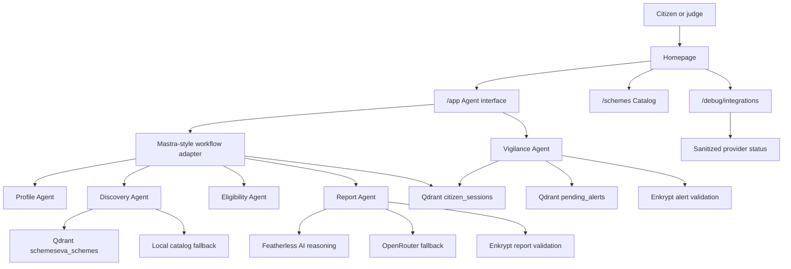

# SchemeSeva Technical Documentation

## 1. Title Page

**Project name:** SchemeSeva

**Tagline:** Find government schemes you may likely qualify for - and get alerted when new matches appear.

**Live demo:** https://scheme-seva-agent.vercel.app/

**GitHub repository:** https://github.com/YellankiKaushik/Scheme-Seva-Agent

**Author / team:** Kaushik / YellankiKaushik

**Role:** Full-stack developer and AI agent builder

**Hackathon context:** Independent SchemeSeva hackathon submission using the mandatory Mastra, Qdrant, and Enkrypt AI stack.

## 2. Executive Summary

SchemeSeva is a TypeScript-native civic AI agent that helps Indian citizens discover government schemes they may likely qualify for. The system combines guided profile intake, a verified Central + Telangana scheme catalog, Qdrant retrieval and memory, Featherless AI as the primary open-source reasoning provider, OpenRouter fallback reasoning, Enkrypt AI validation, Gemini embeddings, Langfuse observability, Upstash Redis rate limiting, and a deployed Vercel application.

The current implementation is designed for an honest hackathon demo. It includes 28 verified schemes, five demo personas, a source-grounded Farmer report flow, and a Vigilance Agent that can surface a PM-KUSUM alert after a saved session is scanned. The output is explicitly guidance only. The app does not claim an official government decision, does not collect Aadhaar numbers, does not collect bank account numbers, and does not submit applications automatically.

## 3. Background And Motivation

Indian citizens often need support from government schemes but may not know which schemes exist, which portal to use, or which rules apply to their situation. Eligibility can depend on state, district, age, gender, social category, income, occupation, landholding, document status, family status, disability status, and other details. This creates a discovery gap: a citizen may be eligible for useful support but still miss it because the information is fragmented or difficult to interpret.

SchemeSeva addresses this gap by creating a guided, source-grounded discovery workflow. It aims to help citizens and field workers move from "I do not know where to search" to "Here are schemes I may likely qualify for, why they match, what documents I need, and where to confirm details officially."

## 4. Problem Statement

Government scheme discovery has four major barriers:

1. **Fragmentation:** Scheme information is spread across central portals, state portals, department pages, and official announcements.
2. **Complex eligibility:** Rules are hard to interpret for non-specialists and often depend on multiple profile facts.
3. **Reactive search:** Existing tools usually require the citizen to come back and search again.
4. **Trust and safety risk:** AI-generated civic guidance must not invent benefits, guarantee eligibility, or imply an official government decision.

SchemeSeva therefore focuses on source-grounded recommendations, visible provider diagnostics, careful wording, and proactive follow-up through Vigilance.

## 5. Target Users

### Farmer

Farmers can discover agriculture, crop insurance, irrigation, income support, and Telangana farmer schemes. The Farmer demo is the main judge path because it shows Qdrant retrieval, Qdrant memory, Enkrypt validation, and a Vigilance alert.

### Student

Students can discover scholarship, fee reimbursement, and education support programs. The Student demo uses age, category, state, income, and occupation signals.

### Woman Entrepreneur

Women entrepreneurs can discover credit, livelihood, and business-support schemes. The demo includes gender, widow status, occupation, income, and state fields.

### Elderly Pensioner

Elderly citizens can check likely pension and social assistance matches with source links and last verified dates.

### Unemployed Youth

Unemployed youth can find skilling, employment, and self-employment programs such as PMKVY-style support.

### NGO / Field Worker

NGOs and field workers can use SchemeSeva as a repeatable, source-grounded guide while helping citizens who may not know how to navigate multiple portals.

## 6. Proposed Solution

From a product perspective, SchemeSeva is a no-login demo flow where users can pick a demo persona or enter basic non-sensitive profile details. The app returns a clear report with likely matches, reasons, documents, next steps, official source URLs, and last verified dates.

From a technical perspective, SchemeSeva is a multi-step agent workflow:

1. Normalize citizen profile details.
2. Retrieve candidate schemes from Qdrant or fallback catalog.
3. Apply deterministic eligibility checks.
4. Generate a plain-language report with Featherless AI, OpenRouter fallback, or local grounded fallback.
5. Validate the report with Enkrypt AI or a visible fallback.
6. Save session memory.
7. Run a Vigilance scan to find unseen matches.
8. Validate and display proactive alerts.

## 7. Scope Of Current Implementation

The current implementation includes:

- 28 verified Central + Telangana schemes.
- Guided profile flow and plain-language intake.
- Five demo personas: Farmer, Student, Woman entrepreneur, Elderly pensioner, and Unemployed youth.
- Source-grounded reports with `sourceUrl` and `lastVerified`.
- Deterministic likely eligibility checks.
- Featherless AI reasoning for report explanations and Vigilance alert reasons.
- Qdrant scheme retrieval and session memory.
- Qdrant pending alert storage when configured.
- Enkrypt validation for reports and alerts when configured.
- Vigilance demo alerts, including the Farmer PM-KUSUM path.
- Integration diagnostics at `/debug/integrations`.
- Live Vercel deployment.

## 8. Out Of Scope

The current implementation does not provide:

- Government eligibility decisions.
- Final eligibility certification.
- Automatic application submission.
- A full national scheme database.
- Collection of Aadhaar numbers.
- Collection of bank account numbers.
- Full production authentication or user accounts.
- Full scheduled notification delivery.
- Multilingual support.

## 9. System Architecture

SchemeSeva is built as a TanStack Start application with React routes and server functions. The route layer calls a Mastra-style workflow adapter, which delegates to server functions and provider adapters in `src/lib`.

```text
React routes
  -> Mastra-style workflow adapter
  -> TanStack Start server functions
  -> Qdrant retrieval / memory
  -> deterministic eligibility
  -> Featherless AI report reasoning
  -> OpenRouter / local fallback if needed
  -> Enkrypt validation
  -> Langfuse tracing
  -> Upstash rate limiting
```



## 10. Module-Wise Breakdown

### Homepage / Landing Page

Implemented in `src/routes/index.tsx`. It explains the problem, agent workflow, features, target users, trust and safety posture, and quick links to `/app`, `/schemes`, `/architecture`, and `/debug/integrations`.

### Agent Interface

Implemented in `src/routes/app.tsx`. It provides guided intake, plain-language input, five demo profiles, report rendering, status badges, and the Vigilance scan button. It uses a browser-generated session key stored in local storage.

### Scheme Catalog

Implemented in `src/routes/schemes.tsx` and backed by `listSchemes`. It displays the 28-scheme catalog with search, scope filters, source URLs, and last verified dates.

### Architecture Page

Implemented in `src/routes/architecture.tsx`. It explains the five-agent architecture and gives judges stack verification cues.

### Integration Diagnostics

Implemented in `src/routes/debug.integrations.tsx` and `src/lib/integrations-status.functions.ts`. It performs sanitized status checks for Mastra adapter mode, Qdrant, Featherless AI, Enkrypt AI, OpenRouter, Gemini, Langfuse, Upstash, demo mode, retrieval provider, reasoning provider, safety provider, memory provider, and optional Supabase fallback.

### Profile Agent

Implemented in `src/mastra/agents/profileAgent.ts` and `extractProfile`. It extracts or accepts structured `CitizenProfile` data and asks for one follow-up when required fields are missing.

### Discovery Agent

Implemented in `src/mastra/agents/discoveryAgent.ts` and `src/lib/qdrantSearch.ts`. It builds query angles from the profile and searches Qdrant vector retrieval first, then Qdrant keyword retrieval, then local fallback.

### Eligibility Agent

Implemented in `src/mastra/agents/eligibilityAgent.ts` and `src/lib/schemeseva-eligibility.ts`. It checks deterministic rules and returns high, medium, or none confidence.

### Report Agent

Implemented in `src/mastra/agents/reportAgent.ts`, `src/lib/featherless.ts`, and `runDiscovery`. It asks Featherless AI to generate the source-grounded markdown report first. If Featherless is disabled, missing credentials/model, times out, or returns an incomplete report, the flow falls back to OpenRouter and then the existing local grounded report. Enkrypt validation runs after the final report is selected.

### Vigilance Agent

Implemented in `src/mastra/agents/vigilanceAgent.ts`, `src/lib/featherless.ts`, and `runVigilance`. It loads a saved session, scans unseen schemes, asks Featherless AI to write the short alert reason, falls back to OpenRouter/local text if needed, validates the alert with Enkrypt, writes alert memory where possible, and returns diagnostics.

### Qdrant Integration

Implemented in `src/lib/qdrant.ts`, `src/lib/qdrantSearch.ts`, `src/lib/qdrantMemory.ts`, and `scripts/seed-qdrant.ts`. It uses the Qdrant REST API directly.

### Enkrypt Integration

Implemented in `src/lib/enkrypt.ts` and `src/lib/safetyValidator.ts`. It checks health, tries detect payload variants, normalizes detector responses, and returns safety status.

### Langfuse Integration

Implemented in `src/lib/observability.ts`. It sends traces and observations via Langfuse REST ingestion when configured and no-ops safely otherwise.

### Upstash Rate Limiting

Implemented in `src/lib/ratelimit.ts`. It enforces discovery and Vigilance limits when Upstash is configured and falls back to allow-all mode for local demo resilience.

## 11. AI Agent Workflow

1. **Input:** The user picks a demo profile, completes the guided form, or enters plain-language text.
2. **Profile normalization:** The Profile Agent extracts or receives a structured `CitizenProfile`.
3. **Retrieval:** The Discovery Agent searches Qdrant or a fallback catalog for candidate schemes.
4. **Eligibility matching:** The Eligibility Agent applies deterministic rules and filters non-matches.
5. **Report generation:** The Report Agent generates a markdown report or uses a local report fallback.
6. **Safety validation:** Enkrypt AI validates the report when configured. Otherwise the app reports a fallback provider.
7. **Memory write:** Session data is written to Qdrant `citizen_sessions` when possible and to local memory for demo continuity.
8. **Vigilance scan:** The Vigilance Agent loads the saved session and scans unseen schemes.
9. **Alert validation:** Enkrypt AI validates the alert before display.
10. **Alert storage:** Pending alerts are written to Qdrant `pending_alerts` when configured and to local memory for demo continuity.

## 12. Mastra Orchestration Design

SchemeSeva uses a Mastra-style TypeScript adapter in `src/mastra`. The adapter is honest about runtime constraints: the code mirrors Mastra Agent/Workflow shapes, but does not claim that the full Mastra npm runtime is running in production.

The adapter exposes:

- `mastra.agents.profile`
- `mastra.agents.discovery`
- `mastra.agents.eligibility`
- `mastra.agents.report`
- `mastra.agents.vigilance`
- `mastra.workflows.schemeDiscovery`
- `mastra.workflows.vigilance`

The workflow mode is surfaced as `adapter` in reports and on `/debug/integrations`. This keeps the architecture clear for judges while keeping the app compatible with the deployed runtime. The adapter can be migrated to full Mastra APIs on a compatible Node host because the UI already calls workflow-level methods.

## 13. Qdrant Design

### Embeddings

Gemini is the primary embeddings provider. `src/lib/embeddings.ts` calls Gemini `embedContent` and uses `QDRANT_VECTOR_SIZE`, defaulting to 768.

### Vector Size

The default vector size is 768. `scripts/seed-qdrant.ts` creates Qdrant collections with this size and cosine distance.

### Collections

- `schemeseva_schemes`: embedded scheme catalog for retrieval.
- `citizen_sessions`: session memory for saved profiles and found schemes.
- `pending_alerts`: pending Vigilance alert memory.

### Retrieval Strategy

The retrieval order is:

1. Qdrant vector search when Qdrant and Gemini are configured.
2. Qdrant payload keyword scroll when Qdrant is reachable but embeddings are unavailable.
3. Local static catalog keyword/attribute fallback.

### Memory Design

Session memory stores safe profile details, found schemes, provider metadata, summary text, and timestamps. Alert memory stores alert metadata, not application submissions or private identity numbers.

### Privacy Considerations

Profile memory may include demographic and eligibility signals, so it is treated carefully. Observability sanitizes profile data, session identifiers are shortened in traces, and the demo avoids collecting Aadhaar or bank account numbers.

## Featherless AI Reasoning Design

Featherless AI is the primary open-source reasoning provider for generated civic explanations. The implementation is in `src/lib/featherless.ts` and uses the OpenAI-compatible chat completions API:

- Base URL: `https://api.featherless.ai/v1`
- Chat endpoint: `/v1/chat/completions`
- Request path used by the app: `${FEATHERLESS_BASE_URL}/chat/completions`
- Temperature: `0.2`
- Health timeout: `8000ms`
- Report and alert timeout: `15000ms`

Environment variables are placeholders only and must be set outside the repository:

```bash
FEATHERLESS_API_KEY=
FEATHERLESS_BASE_URL=https://api.featherless.ai/v1
FEATHERLESS_MODEL=
FEATHERLESS_ENABLED=true
```

If `FEATHERLESS_ENABLED` is not `true`, or the API key/model is missing, the provider reports `configured=false` and the caller continues to fallback logic. Errors are sanitized so API keys are never logged or returned to the UI.

### Report Generation Role

During discovery, Qdrant retrieves candidate schemes and deterministic rules identify likely matches. Featherless then writes the source-grounded report explanation using only the profile, eligibility reasons, documents, next steps, `sourceUrl`, and `lastVerified` values supplied by the app. If Featherless fails, the report flow uses OpenRouter. If OpenRouter fails or returns an incomplete report, SchemeSeva uses the existing local grounded report generator.

### Vigilance Alert Reasoning Role

During a Vigilance scan, saved-session context and the scheme catalog identify a likely unseen match. Featherless writes a short alert reason. If Featherless fails, OpenRouter/local fallback writes the reason. Enkrypt validates the final alert text before display, and Qdrant `pending_alerts` stores the validated alert when configured.

### Fallback And Safety Order

The reasoning order is:

1. Featherless AI.
2. OpenRouter fallback.
3. Local grounded fallback.
4. Enkrypt validation after the final text is selected.

## 14. Enkrypt AI Safety Design

Enkrypt AI is the primary safety layer for citizen-facing text.

### Report Validation

`validateReport` sends report text and source context to Enkrypt when configured. It returns status, provider, note, raw status, schema used, and detections.

### Alert Validation

`validateAlert` sends Vigilance alert text and source context through the same guardrail path before the alert is displayed.

### Guardrails

The Enkrypt adapter enables detectors for toxicity, bias, hallucination, factuality, factual accuracy, policy violation, and PII where supported. The policy requires source grounding, respectful language, no guaranteed eligibility claims, and official-source confirmation.

### Fallback Behavior

If Enkrypt is missing or unreachable, SchemeSeva uses an OpenRouter fallback validator when available or passthrough mode when no provider is configured. The provider is shown in badges and debug output.

## 15. Data Design

### Scheme

```ts
interface Scheme {
  id: string;
  schemeName: string;
  ministry: string;
  benefitType: string;
  benefitAmount: string;
  description: string;
  eligibility: SchemeEligibilityRules;
  keywords: string[];
  documentsRequired: string[];
  applicationSteps: string[];
  applicationUrl: string | null;
  applicationMode: string;
  sourceUrl: string;
  lastVerified: string;
  lastUpdated: string;
  stateScope: string;
}
```

### Citizen Profile

```ts
interface CitizenProfile {
  state?: string | null;
  district?: string | null;
  age?: number | null;
  gender?: "male" | "female" | "other" | null;
  category?: "general" | "sc" | "st" | "obc" | "ebc" | "minority" | null;
  annualIncome?: number | null;
  occupation?: string | null;
  landAcres?: number | null;
  hasAadhaar?: boolean | null;
  hasBankAccount?: boolean | null;
  hasBPL?: boolean | null;
  isDisabled?: boolean | null;
  isWidow?: boolean | null;
  isMinority?: boolean | null;
}
```

### Discovery Report

```ts
interface DiscoveryReport {
  sessionKey: string;
  profile: CitizenProfile;
  eligible: EligibilityResult[];
  schemes: Scheme[];
  reportMarkdown: string;
  safety: { status: "safe" | "warning"; note: string; provider: string };
  retrievalProvider: string;
  reasoningProvider?: "featherless" | "openrouter-fallback" | "local-fallback";
  memoryProvider?: "qdrant" | "local" | "optional-supabase" | "unavailable";
  memoryWrite?: "success" | "failed" | "skipped-local";
  workflowMode?: "adapter" | "runtime" | "fallback";
}
```

### Session Memory

```ts
{
  sessionId: "s_demo_session",
  profile: {
    state: "telangana",
    age: 48,
    category: "sc",
    occupation: "farmer",
    hasAadhaar: true,
    hasBankAccount: true
  },
  foundSchemes: [
    { schemeId: "pm-kisan-001", confidence: "high" }
  ],
  retrievalProvider: "qdrant-vector",
  reasoningProvider: "featherless",
  safetyProvider: "enkrypt",
  updated_at: "2026-07-10T00:00:00.000Z"
}
```

### Pending Alert

```ts
{
  alertId: "local-123",
  sessionId: "s_demo_session",
  schemeId: "pm-kusum-004",
  schemeName: "PM-KUSUM",
  reason: "Matches your saved profile.",
  urgency: "high",
  reasoningProvider: "featherless",
  safetyProvider: "enkrypt",
  retrievalProvider: "saved-session+scheme-catalog"
}
```

## 16. API / Server Function Design

SchemeSeva uses TanStack Start server functions for app actions. It should not be documented as having REST endpoints for discovery or Vigilance.

| Function / route | Purpose | Input | Output | Auth |
| --- | --- | --- | --- | --- |
| `extractProfile` | Extract structured profile from plain text. | `{ text: string }` | `{ profile, followUp }` | No login; server function. |
| `runDiscovery` | Discovery, eligibility, report, safety, memory. | `{ sessionKey, profile }` | `DiscoveryReport` | No login; browser session key. |
| `runVigilance` | Scan saved session for unseen matches. | `{ sessionKey }` | Alerts, counts, diagnostics. | No login; browser session key. |
| `listSchemes` | Load catalog for `/schemes`. | None | `{ schemes, count }` | Public. |
| `getIntegrationsStatus` | Return sanitized integration status. | None | Status object. | Public debug page. |
| `deleteCitizenData` | Best-effort session data deletion. | `{ sessionKey }` | Delete status object. | Session key required. |
| `/api/privacy/delete` | HTTP wrapper for privacy deletion. | JSON `{ sessionKey }` | `{ ok, ...result }` | Session key required. |

## 17. Frontend Implementation

The frontend uses React with TanStack Start file routes:

- `/`: homepage.
- `/app`: guided agent interface.
- `/schemes`: catalog page.
- `/architecture`: architecture explanation.
- `/debug/integrations`: live integration diagnostics.
- `/api/privacy/delete`: raw HTTP privacy delete route.

The app UI uses status badges for retrieval, memory, safety, and workflow mode. Reports render markdown with `ReactMarkdown`, and scheme cards keep source URLs and last verified dates visible.

## 18. Backend / Server Implementation

The backend logic lives in server functions and provider adapters:

- `src/lib/schemeseva.functions.ts`: main server functions.
- `src/lib/qdrantSearch.ts`: retrieval logic.
- `src/lib/qdrantMemory.ts`: session and alert memory.
- `src/lib/safetyValidator.ts`: report and alert validation.
- `src/lib/enkrypt.ts`: Enkrypt REST adapter.
- `src/lib/observability.ts`: Langfuse tracing.
- `src/lib/ratelimit.ts`: Upstash rate limiting.
- `src/lib/privacy.functions.ts`: privacy deletion.

Provider calls are wrapped in fallbacks so local demo mode remains usable without every external service.

## 19. Privacy And Security

SchemeSeva follows a data-minimization approach:

- It does not collect Aadhaar numbers.
- It does not collect bank account numbers.
- It uses booleans such as `hasAadhaar` and `hasBankAccount`.
- It does not request passwords or document uploads.
- API keys are read from environment variables.
- Debug output sanitizes tokens and sensitive error text.
- Langfuse traces redact secret-like keys and summarize profile data.
- Upstash rate limiting protects discovery and Vigilance workflows when configured.
- Enkrypt AI validates citizen-facing reports and alerts.
- Guidance always directs citizens to official portals for final confirmation.

## 20. Deployment Architecture

The app is deployed to Vercel at https://scheme-seva-agent.vercel.app/.

`vercel.json` configures:

- `pnpm install --frozen-lockfile`
- `pnpm build`
- `NITRO_PRESET=vercel`

External services are configured through Vercel environment variables:

- Qdrant for retrieval and memory.
- Featherless AI for primary open-source reasoning.
- Enkrypt AI for safety validation.
- OpenRouter for fallback reasoning.
- Gemini for embeddings.
- Langfuse for observability.
- Upstash Redis for rate limiting.
- Supabase only as optional fallback.

## 21. Testing And Validation

Recommended validation commands:

```bash
pnpm typecheck
pnpm build
pnpm run smoke:local
pnpm audit
pnpm run lint
```

`scripts/smoke-local.ts` validates the five demo persona paths against the local catalog and checks that key routes load when a local server is available. Manual live testing should verify the Farmer demo report, Qdrant retrieval/memory badges, Featherless reasoning badge when configured, Enkrypt safety badge, and Vigilance PM-KUSUM alert.

## 22. User Demo Walkthrough

1. Open https://scheme-seva-agent.vercel.app/.
2. Open `/schemes` and verify 28 Central + Telangana schemes.
3. Open `/debug/integrations` and confirm provider cards.
4. Open `/app`.
5. Select the Farmer demo profile.
6. Run discovery.
7. Check the report badges and source-grounded output, including `Reasoning: featherless` when configured.
8. Confirm `sourceUrl` and `lastVerified` appear.
9. Run the Vigilance scan.
10. Confirm the PM-KUSUM alert appears with Featherless reasoning and safety validation when live providers are active.

## 23. Challenges And Solutions

| Challenge | Solution |
| --- | --- |
| Mastra runtime/package constraints | Implemented an honest Mastra-style TypeScript adapter around server functions. |
| Qdrant vector setup | Added `scripts/seed-qdrant.ts` to create collections and seed 768-dimensional Gemini embeddings. |
| Qdrant fallback behavior | Added vector search, keyword scroll, and local catalog fallback with visible diagnostics. |
| Enkrypt schema variation | Tried multiple detect payload variants and normalized responses. |
| Safety overclaims | Required likely eligibility language and official-source confirmation. |
| Deployment differences | Built provider fallbacks and `/debug/integrations` for live stack visibility. |
| Privacy modeling | Stored eligibility booleans instead of Aadhaar or bank account numbers. |
| Observability safety | Sanitized secrets and summarized profile data before Langfuse ingestion. |
| Rate limiting resilience | Used Upstash when configured and no-op fallback when unavailable. |

## 24. Limitations

- Current catalog is 28 verified Central + Telangana schemes.
- Not a government eligibility decision system.
- Does not submit applications automatically.
- Does not provide production user accounts.
- Vigilance is demo-triggered from the UI, not a complete scheduled notification service.
- No multilingual support yet.
- External provider availability affects whether live badges show primary or fallback paths.
- Final eligibility and application steps must be confirmed on official portals.

## 25. Future Scope

- Add more states and a larger verified catalog.
- Add multilingual support.
- Add WhatsApp/SMS alert delivery.
- Add scheduled Vigilance scans.
- Add an NGO/field-worker dashboard.
- Add PDF report export.
- Add human-in-the-loop scheme verification.
- Add an admin scheme verification dashboard.
- Add assisted application workflows that still keep final submission on official portals.
- Add production-grade authentication and user-controlled data management.

## 26. Conclusion

SchemeSeva demonstrates how an AI agent can support civic welfare discovery while staying source-grounded, transparent, and careful about user trust. The project retrieves verified schemes, reasons over profile data, remembers sessions, validates outputs with Enkrypt AI, and acts through a Vigilance Agent. Its current scope is intentionally limited, but the architecture creates a clear path toward broader coverage, multilingual access, scheduled alerts, and field-worker support.
